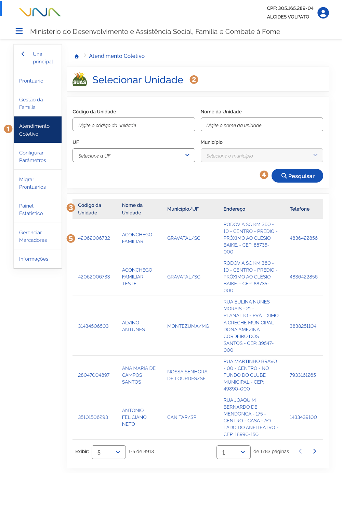
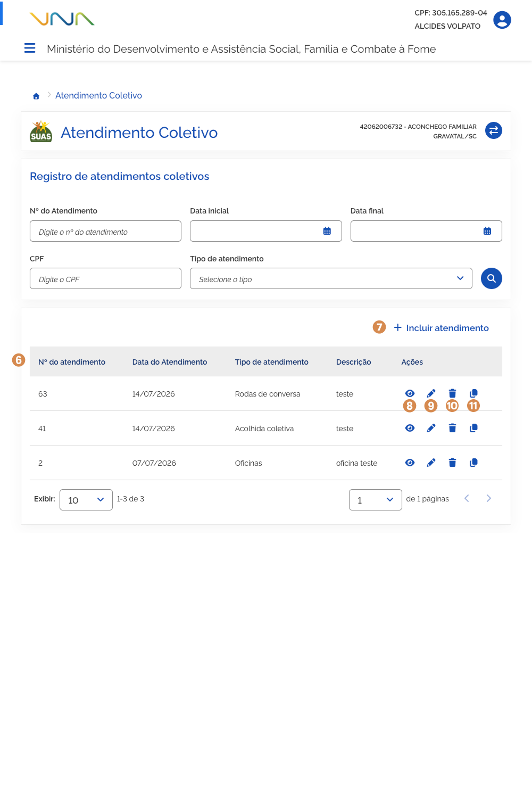
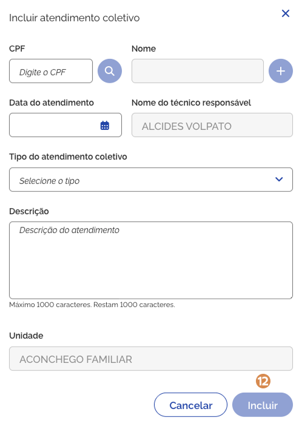
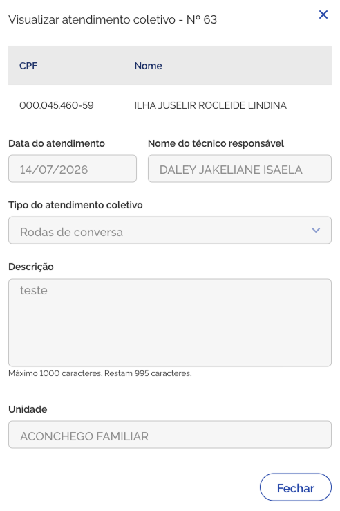
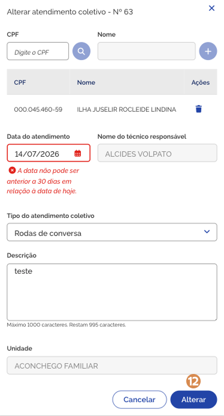
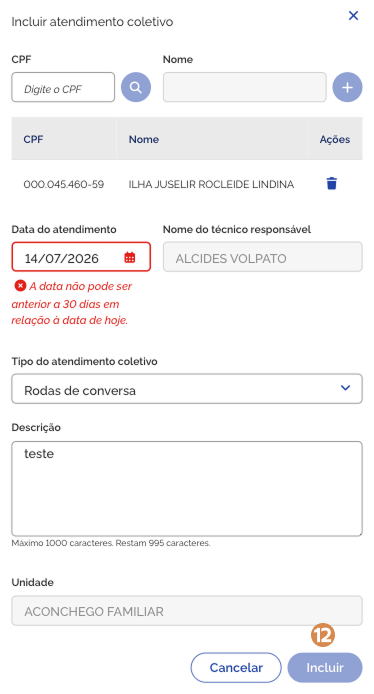

# Prontuário: Atendimento Coletivo

Para visualizar ou realizar o atendimento coletivo de uma pessoa ou família, acione o menu <kbd>1</kbd> **Atendimento Coletivo**.

---

## Selecionar unidade

O sistema apresentará a funcionalidade <kbd>2</kbd> **Selecionar unidade**, listando todas as unidades atribuídas ao usuário conforme perfil (CadSUAS).

A <kbd>3</kbd> **lista de atendimento coletivo** é composta por:

- **Código da Unidade** – coluna que apresenta o código da unidade de atendimento;
- **Nome da Unidade** – coluna que informa o nome da unidade de atendimento;
- **Município/UF** – coluna que informa o município e o estado de localização da unidade de atendimento;
- **Endereço** – coluna que informa o endereço da unidade de atendimento;
- **Telefone** – coluna que informa o telefone da unidade de atendimento.

O refinamento da lista de resultado de unidades pode ser feito informando os parâmetros e acionando a opção <kbd>4</kbd> **Pesquisar**.

Para visualizar ou adicionar atendimento coletivo, acione o <kbd>5</kbd> **registro na lista**.

---

## Lista de atendimentos coletivos

O sistema apresentará a funcionalidade **Atendimento Coletivo** com a <kbd>6</kbd> **lista de atendimentos coletivos** realizados pela unidade.

A lista de atendimento coletivo é composta por:

- **N.º do atendimento** – campo que informa o número do atendimento coletivo;
- **Data do Atendimento** – campo que informa a data em que o atendimento coletivo foi adicionado ou atualizado;
- **Tipo de atendimento** – campo que informa o tipo de atendimento coletivo ofertado para a pessoa ou a família;
- **Descrição** – campo que informa a descrição do atendimento coletivo;
- **Ações** – coluna que exibe ícones para realizar ações, como por exemplo: Visualizar registro.

---

## Incluir atendimento coletivo

Para adicionar um atendimento coletivo, acione a opção <kbd>7</kbd> **Incluir atendimento**, então o sistema vai apresentar a janela para cadastro. Preencha os dados solicitados e acione a opção **Incluir**, em seguida o sistema fecha a janela, atualiza a lista de atendimento coletivo da unidade e apresenta a mensagem _"Atendimento coletivo incluído com sucesso"_.

A janela <kbd>7</kbd> **Incluir atendimento coletivo** contém os seguintes dados:

- **CPF** – campo para informar o CPF da pessoa atendida;
- **Buscar pessoa** – opção que ao ser acionada busca a pessoa na base de dados do cadastro único;
- **Nome** – campo que informa o nome da pessoa atendida;
- **Adicionar pessoa** – opção que ao ser acionada adiciona a pessoa na lista de pessoas atendidas;
- **Excluir** – opção que ao ser acionada exclui a pessoa da lista de pessoas atendidas;
- **Data do atendimento** – campo para informar a data em que o atendimento foi realizado;
- **Nome do técnico responsável** – campo que informa o nome do técnico responsável pelo registro do atendimento;
- **Tipo de atendimento coletivo** – campo para informar o tipo de atendimento coletivo a ser ofertado;
  - **Domínio** – oficinas do PAIF; Acolhida em Grupo; Ações Comunitárias (eventos, campanhas temáticas e rodas de conversa);
- **Descrição** – campo para informar a descrição do atendimento;
- **Unidade** – campo que informa o nome da unidade de atendimento;
- **Cancelar** – opção que, ao ser acionada, cancela a ação e fecha a janela;
- **Incluir** – opção que, ao ser acionada, salva o atendimento.

---

## Visualizar atendimento coletivo

Para visualizar o atendimento coletivo, acione a opção <kbd>8</kbd> **Visualizar atendimento coletivo** na coluna ação, então o sistema vai apresentar a janela com as informações.

A janela <kbd>8</kbd> **Visualizar atendimento coletivo** contém os seguintes dados:

- **CPF** – coluna que informa o CPF da(s) pessoa(s) atendida(s);
- **Nome** – coluna que informa o nome da(s) pessoa(s) atendida(s);
- **Data do atendimento** – campo que informa a data em que o atendimento foi realizado;
- **Nome do técnico responsável** – campo que informa o nome do técnico responsável pelo registro do atendimento;
- **Tipo de atendimento coletivo** – campo que informa o tipo de atendimento coletivo ofertado;
- **Descrição** – campo que informa a descrição do atendimento;
- **Unidade** – campo que informa o nome da unidade de atendimento;
- **Fechar** – opção que, ao ser acionada, fecha a janela.

---

## Editar atendimento coletivo

Para editar o registro de atendimento coletivo, acione a opção <kbd>9</kbd> **Alterar atendimento coletivo** na coluna ação, então o sistema vai apresentar a janela com os campos habilitados.

Informe os ajustes e acione a opção **Alterar**, em seguida o sistema fecha a janela, atualiza a lista e apresenta a mensagem _"Atendimento coletivo alterado com sucesso"_.

A janela <kbd>9</kbd> **Alterar atendimento coletivo** possui os seguintes campos:

- **CPF** – campo para informar o CPF da pessoa atendida;
- **Buscar pessoa** – opção que ao ser acionada busca a pessoa na base de dados do cadastro único;
- **Nome** – campo que informa o nome da pessoa atendida;
- **Adicionar pessoa** – opção que ao ser acionada adiciona a pessoa na lista de pessoas atendidas;
- **Excluir** – opção que ao ser acionada exclui a pessoa da lista de pessoas atendidas;
- **Data do atendimento** – campo para informar a data em que o atendimento foi realizado;
- **Nome do técnico responsável** – campo que informa o nome do técnico responsável pelo registro do atendimento;
- **Tipo de atendimento coletivo** – campo para informar o tipo de atendimento coletivo a ser ofertado. As alternativas são:
  - Oficinas;
  - Acolhida coletiva;
  - Ações comunitárias;
  - Rodas de conversa;
  - Arranjos participativos.
- **Descrição** – campo para informar a descrição do atendimento;
- **Unidade** – campo que informa o nome da unidade de atendimento;
- **Cancelar** – opção que, ao ser acionada, cancela a ação e fecha a janela;
- **Alterar** – opção que, ao ser acionada, salva a alteração realizada para o atendimento.

---

## Excluir atendimento coletivo

Para excluir o registro de atendimento coletivo, acione a opção **Excluir atendimento coletivo**, e o sistema solicitará a confirmação da ação. Caso confirmada, o sistema exclui o registro, atualiza a lista e apresenta a mensagem _"Atendimento coletivo excluído com sucesso"_.

---

## Duplicar atendimento coletivo

Para duplicar o registro de atendimento coletivo, acione a opção **Clonar atendimento coletivo** na coluna ação, então o sistema vai apresentar a janela com os campos habilitados.

Informe os ajustes e acione a opção **Incluir**, em seguida o sistema fecha a janela, atualiza a lista e apresenta a mensagem _"Atendimento coletivo alterado com sucesso"_.

A janela **Incluir atendimento coletivo** possui os seguintes campos:

- **CPF** – campo para informar o CPF da pessoa atendida;
- **Buscar pessoa** – opção que ao ser acionada busca a pessoa na base de dados do cadastro único;
- **Nome** – campo que informa o nome da pessoa atendida;
- **Adicionar pessoa** – opção que ao ser acionada adiciona a pessoa na lista de pessoas atendidas;
- **Excluir** – opção que ao ser acionada exclui a pessoa da lista de pessoas atendidas;
- **Data do atendimento** – campo para informar a data em que o atendimento foi realizado;
- **Nome do técnico responsável** – campo que informa o nome do técnico responsável pelo registro do atendimento;
- **Tipo de atendimento coletivo** – campo para informar o tipo de atendimento coletivo a ser ofertado. As alternativas são:
  - Oficinas;
  - Acolhida coletiva;
  - Ações comunitárias;
  - Rodas de conversa;
  - Arranjos participativos.
- **Descrição** – campo para informar a descrição do atendimento;
- **Unidade** – campo que informa o nome da unidade de atendimento;
- **Cancelar** – opção que, ao ser acionada, cancela a ação e fecha a janela;
- **Incluir** – opção que, ao ser acionada, salva a alteração realizada para o atendimento.
