

Manual do Prontuário Eletrônico

Dezembro de 2025

---

# Sumário

**Apresentação** ... 3

**Conceitos gerais** ... 5

* Profissionais do SUAS responsáveis pelo registro de atendimento ... 6

* A quem se destina o atendimento ... 6

* Principais conceitos vinculados à operação do sistema ... 6

* Estrutura do sistema ... 8

**Acesso ao Prontuário Eletrônico do SUAS** ... 9

* CadSUAS e as permissões do prontuário SUAS ... 10

* Login no sistema ... 13

* Termo de uso ... 15

**Prontuário: Atendimento individual e familiar** ... 16

* Realizar atendimento ... 17

* Aspectos globais do módulo Prontuário ... 19

* Informações do Prontuário ... 22

* Migrar Prontuário ... 23

* Excluir Prontuário ... 26

* Identificação da pessoa de referência e endereço da família ... 27

* Informações da família ... 30

* Composição familiar ... 31

* Forma de ingresso na unidade e motivo do primeiro atendimento ... 32

* Composição familiar ... 40

* Condições habitacionais da família ... 42

* Condições educacionais da família ... 49

* Condições de saúde da família ... 51

* Condições de trabalho e rendimento da família ... 56

**Registro de atendimentos socioassistenciais** ... 59

* Acesso a benefícios eventuais ... 66

* Convivência familiar e comunitária ... 72

* Situações de vulnerabilidades e desproteções sociais da família ... 73

* Situações de violência e violação de direitos ... 83

* Planejamento e evolução do acompanhamento familiar ... 84

* Participação em serviços, programas e projetos ... 92

* Histórico de cumprimento de medidas socioeducativas ... 93

* Histórico de acolhimento institucional ... 101

* Formulário de controle de encaminhamentos ... 102

* Relatório de participação em atendimentos coletivos ... 113

* Relatório simplificado dos atendimentos ... 116

**Prontuário: Atendimento Coletivo** ... 117

**Prontuário: Migrar Prontuário** ... 129

**Prontuário: Painel Estatístico** ... 140

---

# Apresentação

---

Este manual possui o objetivo de auxiliar os profissionais (técnicos e gestores) do Sistema Único de Assistência Social (SUAS), com atuação no Centro de Referência de Assistência Social (CRAS), na utilização do Prontuário Eletrônico, como ferramenta de trabalho cotidiano.

O Prontuário Eletrônico busca organizar e qualificar o conjunto de informações necessárias ao registro, diagnóstico, planejamento e acompanhamento do trabalho social realizado com pessoas e famílias, como direito de cidadania, conforme os princípios e diretrizes da Política Nacional de Assistência Social (PNAS, 2004).

Por meio do Sistema Prontuário Eletrônico é possível o registro dos atendimentos e acompanhamentos a pessoas e famílias no SUAS, por meio da busca pelo nome, ano ou data de nascimento, Cadastro de Pessoa Física (CPF), Número de Identificação Social (NIS), Benefício de Prestação Continuada (BPC), dentre outras formas de busca.

A ferramenta permite o registro dos motivos apresentados por pessoas e famílias que demandam as unidades, bem como o registro qualificado dos atendimentos e acompanhamentos realizados. Os dados armazenados no Prontuário Eletrônico permitem identificar o perfil dos (as) usuários (as), os tipos de demandas, os tipos de atendimentos, dentre outros dados, e mapear a cobertura da rede de serviços socioassistenciais.

As informações registradas são processadas em indicadores que possibilitam analisar a relação de articulação dos CRAS com a rede socioassistencial do SUAS e com as políticas públicas existentes no território de abrangência. Ademais, subsidiam o planejamento e a execução de ações relativas ao trabalho social com pessoas e famílias, no âmbito do Serviço de Proteção e Atendimento Integral à Família (PAIF).

O Prontuário Eletrônico possui uma interface com outros sistemas nacionais como o Cadastro de Pessoa Física (CPF), Cadastro Único (CadÚnico), Benefício de Prestação Continuada (BPC), Programa Bolsa Família (PBF) e com sistemas internos do Ministério. Assim, é uma ferramenta que oferece ao técnico de nível superior das equipes de referência dos CRAS, um conjunto de informações relevantes para a análise da situação de vulnerabilidade social do (a) usuário (a).

Ademais, o sistema Prontuário Eletrônico possibilita o mapeamento da trajetória da família no SUAS, ou seja, o fluxo de referência e a contrarreferência dessas unidades, uma vez que os registros inseridos, em qualquer território ou em qualquer outro município, permanecem no Sistema.

As informações inseridas no Prontuário Eletrônico são sigilosas e podem ser acessadas, exclusivamente, pelos profissionais do SUAS, apenas para as finalidades pertinentes. Portanto, todos os profissionais devem estar cientes de suas responsabilidades no acesso e uso das informações. Técnicos e gestores que possuem senha de acesso aos sistemas da Rede SUAS declaram concordar com as obrigações derivadas e ficam sujeitos a sanções administrativas e penais, caso desrespeitem os preceitos éticos no uso das informações.

Com isto, o acesso ao sistema Prontuário Eletrônico deve ser restrito aos profissionais do SUAS, em especial, aos técnicos de nível superior das equipes de referência, de acordo com os perfis de acesso.

---

# Conceitos gerais

---

## Profissionais do SUAS responsáveis pelo registro de atendimento

**Técnico:** profissional do SUAS, com escolaridade mínima de nível superior, com formação em serviço social, psicologia e/ou outra profissão que compõe o SUAS (dependendo do número de famílias referenciadas ao CRAS e porte do município, conforme a NOB-RH/SUAS).

**Gestor:** pessoa com escolaridade mínima de nível superior, concursado, com experiência em gestão pública; domínio da legislação referente à política nacional de assistência social e direitos sociais; conhecimento dos serviços, programas, projetos e/ou benefícios socioassistenciais; experiência de coordenação de equipes, com habilidade de comunicação, de estabelecer relações e negociar conflitos; com boa capacidade de gestão, em especial para lidar com informações, planejar, monitorar e acompanhar os serviços socioassistenciais, bem como de gerenciar a rede socioassistencial local.

Com isto, o acesso ao sistema Prontuário Eletrônico deve ser restrito aos profissionais do SUAS, em especial, aos técnicos de nível superior das equipes de referência, de acordo com os perfis de acesso.

## A quem se destina o atendimento

**Pessoas e famílias:** potenciais usuários (as) do SUAS, de acordo com os princípios e diretrizes da Política Nacional de Assistência Social (PNAS, 2004).

## Principais conceitos vinculados à operação do sistema

Nesse tópico você conhecerá conceitos importantes que auxiliarão na operação do Sistema Prontuário Eletrônico SUAS e na gestão dos dados nele inseridos e armazenados.

* **Atendimento:** no âmbito do SUAS, uma ação imediata de prestação ou oferta de atenção, ou seja, a participação das famílias, um, ou mais de seus membros, nas ações de acolhida, ações particularizadas, oficinas, ações comunitárias e/ou encaminhamentos. Assim, o atendimento pode se encerrar na resolução de uma demanda específica dos indivíduos ou famílias, com ou sem retorno, ou pode dar início a um processo de acompanhamento familiar.
* **Acompanhamento familiar:** no âmbito do SUAS, é o conjunto de atividades desenvolvidas por meio de atendimentos sistemáticos e planejados, com objetivos estabelecidos, que possibilitem às famílias/indivíduos o acesso a um espaço onde possam refletir sobre sua realidade, construir novos projetos de vida e transformar suas relações, sejam elas familiares ou comunitárias. Trata-se, portanto, de um processo de caráter continuado e planejado, por período determinado, no qual, a partir da compreensão das vulnerabilidades, demandas e potencialidades apresentadas pela família, são definidas estratégias de ação e objetivos a serem alcançados. O acompanhamento familiar pode materializar-se a partir do atendimento sistemático e planejado de um ou mais membros do grupo familiar.

---

* **Família:** na Política Nacional de Assistência Social (PNAS), a família não é constituída apenas pelos laços consanguíneos, mas também por laços afetivos e de solidariedade. De acordo com a PNAS (2004, p. 40), a matricialidade sociofamiliar deve ser a base do trabalho social com famílias. Trata-se da superação da focalização, ancorada no pressuposto de que para a família prevenir, proteger, promover e incluir seus membros é necessário, em primeiro lugar, garantir condições de sustentabilidade para tal.
* **Domicílio:** local de moradia da família.
* **Referência Familiar:** pessoa de referência, responsável pelas informações socioeconômicas e culturais sobre a família e suas necessidades e demandas socioassistenciais.
* **Membro da composição familiar:** pessoa que tem o domicílio como local habitual de residência e nele reside na data do atendimento.
* **Técnico:** profissional com escolaridade mínima de nível superior, com formação em serviço social, psicologia e/ou outra profissão que compõe o SUAS (dependendo do número de famílias referenciadas ao CRAS e porte do município, conforme a NOB-RH); com experiência de atuação e/ou gestão em programas, projetos, serviços e/ou benefícios socioassistenciais; conhecimento da legislação referente à Política Nacional de Assistência Social; domínio sobre os direitos sociais; experiência de trabalho em grupos e atividades coletivas; experiência em trabalho interdisciplinar; conhecimento da realidade do território e boa capacidade relacional e de escuta das famílias. Pessoa responsável pela coleta de dados, por meio de entrevista com a Referência Familiar em uma Unidade CRAS.
* **Gestor:** profissional com escolaridade mínima de nível superior, concursado, com experiência em gestão pública; domínio da legislação referente à política nacional de assistência social e direitos sociais; conhecimento dos serviços, programas, projetos e/ou benefícios socioassistenciais; experiência de coordenação de equipes, com habilidade de comunicação, de estabelecer relações e negociar conflitos; com boa capacidade de gestão, em especial para lidar com informações, planejar, monitorar e acompanhar os serviços socioassistenciais, bem como de gerenciar a rede socioassistencial local.
* **Território:** refere-se à centralidade do território como fator determinante para a compreensão das situações de vulnerabilidade e riscos sociais, bem como para seu enfrentamento. A adoção da perspectiva da territorialização se materializa a partir da descentralização da Política Nacional de Assistência Social e consequente oferta dos serviços socioassistenciais em locais próximos aos seus usuários. O território constitui um espaço humano, habitado, pois é nos espaços coletivos que se expressam a solidariedade, a extensão das relações familiares para além da consanguinidade, o fortalecimento da cumplicidade de vizinhança e o desenvolvimento do sentimento de pertença e identidade.
* **NIS:** número de Identificação Social, código pessoal e único, de 11 dígitos, que é atribuído a todos os brasileiros, em algum momento de sua vida, podendo ser habilitado para recebimento de programas diversos como o Bolsa Família.

---

## Estrutura do sistema

### Prontuário Eletrônico da Família

O Prontuário Eletrônico é o espaço onde a unidade registra, de forma simples e sintética, todos os atendimentos realizados com a família que procura o serviço. Ele organiza e centraliza as principais informações do acompanhamento, facilitando o trabalho da equipe, garantindo continuidade entre atendimentos e promovendo maior qualidade na oferta dos serviços. Por meio do prontuário, é possível visualizar rapidamente o histórico da família, registrar novas ações e apoiar decisões de forma segura e integrada. Além disso, todos os blocos do prontuário possuem blocos de observação onde o profissional pode escrever as anotações que considerar pertinente trazendo flexibilidade no sistema para o trabalho social realizado no CRAS.

### Atendimento Coletivo

Possibilita a Unidade de Atendimento, incluir a família em grupos de atividades coletivas oferecidos pela unidade, como oficinas, encontros, rodas de conversa ou ações socioeducativas de forma otimizada. No lugar de precisar registrar as atividades individualmente no prontuário de cada participante, o módulo de atendimento coletivo permite realizar um registro único, listando apenas o CPF dos participantes. Esse registro é inserido automaticamente no prontuário de cada participante.

## Migrar Prontuário

Possibilita que a equipe gerencie as migrações de prontuários quando as famílias mudam o seu CRAS de referência. Nesse módulo é possível tanto registrar o pedido de transferência do prontuário eletrônico de uma família para outra unidade de atendimento quanto receber prontuários enviados por outras unidades. Dessa forma, a família sempre estará vinculada ao serviço mais adequado ao seu território ou necessidade, mantendo a continuidade do acompanhamento.

### Painel Estatístico

O Painel Estatístico apresenta uma visão clara, organizada e agregada dos atendimentos realizados pelas unidades, reunindo indicadores que ajudam a acompanhar o volume, o perfil e a evolução das ações ofertadas. Por meio dos parâmetros de refinamento, o usuário pode filtrar as informações conforme sua necessidade — como período, tipo de atendimento, unidade, público atendido, entre outros.

---

# Acesso ao Prontuário Eletrônico do SUAS

---

[QR Code image](qr-codes/qr-code1.png)
[Clique aqui](https://www.mylink.com) ou escaneie o QR Code para acessar o vídeo explicativo.

---

## CadSUAS e as permissões do prontuário SUAS

### Prontuário Eletrônico do SUAS

O Prontuário Eletrônico do SUAS é a versão digital do prontuário utilizado no atendimento socioassistencial. Ele registra os atendimentos de forma organizada e sintética, centralizando informações para apoiar o trabalho das equipes e a gestão das unidades.

Mantém a estrutura do formulário físico, com recursos adicionais que garantem mais segurança, agilidade e continuidade no acompanhamento das famílias.

### CadSUAS

É o sistema que centraliza e gerencia as informações da rede socioassistencial em todo o país. Suas principais funções são:

* Cadastro e gestão de informações sobre prefeituras, órgãos gestores, fundos, conselhos, unidades da rede (CRAS, CREAS, acolhimento) e trabalhadores do SUAS.
* Integração de dados com outros sistemas da Rede SUAS, garantindo informações atualizadas e sem duplicidades.
* Apoio à gestão e ao planejamento, oferecendo uma base de dados unificada para monitoramento e tomada de decisão.
* Fortalecimento do controle social, permitindo o acompanhamento e a fiscalização das ações da assistência social.

O CadSUAS é essencial para organizar e padronizar as informações do SUAS em todo o país. O acesso é realizado pelo portal do MDS.

### Perfis de Acesso

### Administrador Federal

Responsável pela gestão nacional do Prontuário Eletrônico do SUAS. Suas atribuições são:

* Gerenciar acessos e perfis na Rede SUAS.
* Coordenar e integrar o sistema em todo o país.
* Definir normas e diretrizes nacionais de uso.
* Apoiar monitoramento e planejamento com dados agregados.

### Gestor Municipal

Responsável pela administração dos acessos e permissões no Prontuário SUAS no âmbito municipal. Suas atribuições são:

* Acompanhar o uso do sistema, garantindo consistência e qualidade dos registros.
* Utilizar dados consolidados para gestão estratégica (sem acesso a prontuários individuais).

### Técnico da Gestão Municipal

Atua no acompanhamento do Prontuário SUAS em nível municipal, assegurando a qualidade das informações. Suas atribuições são:

* Apoiar o planejamento municipal com dados agregados.
* Oferecer suporte e capacitação ao município.
* Definir normas e rotinas de uso do sistema.

Apenas profissionais vinculados ao órgão gestor e cadastrados no CadSUAS como "TÉCNICO(A) DE NÍVEL SUPERIOR" ou "COORDENADOR(A)/DIRIGENTE" possuem acesso a esse perfil.

### Gestor Estadual

Responsável pela gestão macro das informações do Prontuário SUAS no estado, apoiando e orientando os municípios. Suas atribuições são:

* Monitorar e avaliar ações municipais com base em dados consolidados.
* Planejar ações estratégicas a partir das informações do sistema.
* Prestar apoio técnico aos municípios.
* Garantir a qualidade e segurança dos dados em nível estadual (sem acesso a prontuários individuais).

### Técnico da Gestão Estadual

Atua no acompanhamento do Prontuário SUAS em nível estadual, assegurando a qualidade das informações. Suas atribuições são:

* Monitorar dados registrados pelos municípios.
* Apoiar o planejamento estadual com dados agregados.
* Oferecer suporte e capacitação aos municípios.
* Definir normas e rotinas de uso do sistema.

Apenas profissionais vinculados ao órgão gestor e cadastrados no CadSUAS como "TÉCNICO(A) DE NÍVEL SUPERIOR" ou "COORDENADOR(A)/DIRIGENTE" possuem acesso a esse perfil.

### Conselheiro

Atua na gestão e no controle social, sem acesso a dados individualizados. Suas atribuições são:

* Fiscalizar políticas públicas por meio de relatórios e dados agregados.

### Apoio Administrativo – CRAS

Auxilia na organização dos prontuários e no suporte às equipes do CRAS. Suas atribuições são:

* Inserir informações básicas nos sistemas do SUAS.
* Apoiar processos relacionados ao CadÚnico.
* Emitir documentos e relatórios.
* Apoiar os fluxos internos de atendimento.

### Coordenador – CRAS

Responsável pela gestão operacional do sistema e pela supervisão dos atendimentos. Suas atribuições são:

* Supervisionar registros e atendimentos realizados pela equipe.
* Garantir sigilo e segurança das informações.
* Planejar e avaliar ações com base em dados do sistema.
* Articular comunicação interna e com a rede socioassistencial.

### Psicólogo – CRAS

Registra, planeja e acompanha ações socioassistenciais no Prontuário SUAS. Suas atribuições são:

* Realizar acolhimento e atendimentos especializados.
* Fortalecer vínculos familiares e comunitários.
* Orientar e encaminhar para serviços e benefícios da rede.
* Atuar em equipe multiprofissional.
* Realizar intervenções individuais, grupais e comunitárias.
* Emitir documentos técnicos quando necessário.

### Assistente Social – CRAS

Registra, planeja e acompanha ações socioassistenciais no Prontuário SUAS. Suas atribuições são:

* Realizar acolhimento e atendimentos especializados.
* Fortalecer vínculos familiares e comunitários.
* Orientar e encaminhar para serviços e benefícios da rede.
* Atuar em equipe multiprofissional.
* Realizar intervenções individuais, grupais e comunitárias.
* Emitir documentos técnicos quando necessário.

### Educador Social – CRAS

Registra as ações socioeducativas e o acompanhamento de usuários, garantindo organização e continuidade do atendimento. Suas atribuições são:

* Produzir relatórios e pareceres.
* Registrar oficinas, grupos e atividades socioeducativas.
* Documentar atendimentos, orientações e encaminhamentos.
* Contribuir com o plano de acompanhamento familiar, registrando metas e evolução.
* Identificar e registrar riscos e vulnerabilidades.
* Manter registros claros e alinhados às normas do SUAS.
* Registrar articulações com a rede de serviços.

### Técnico de Nível Superior – CRAS

Registra, planeja e acompanha ações socioassistenciais no Prontuário SUAS. Suas atribuições são:

* Realizar acolhimento e atendimentos especializados.
* Fortalecer vínculos familiares e comunitários.
* Orientar e encaminhar para serviços e benefícios da rede.
* Atuar em equipe multiprofissional.
* Realizar intervenções individuais, grupais e comunitárias.
* Emitir documentos técnicos quando necessário.

### Técnico de Nível Médio – CRAS

Registra as ações socioeducativas e o acompanhamento de usuários, garantindo organização e continuidade do atendimento. Suas atribuições são:

* Produzir relatórios e pareceres.
* Registrar oficinas, grupos e atividades socioeducativas.
* Documentar atendimentos, orientações e encaminhamentos.
* Contribuir com o plano de acompanhamento familiar, registrando metas e evolução.
* Identificar e registrar riscos e vulnerabilidades.
* Manter registros claros e alinhados às normas do SUAS.
* Registrar articulações com a rede de serviços.

---

## Login no sistema

O *login* do sistema é realizado por meio das contas ouro ou prata do sistema gov.br. A conta é gratuita e permite a identificação do usuário para acessar serviços digitais do governo federal.

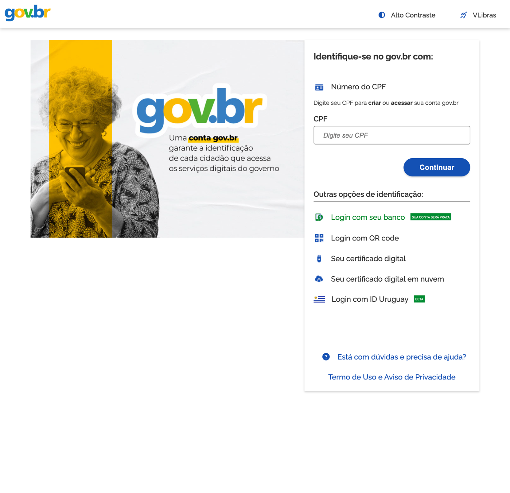

1. Na tela do *login* gov.br, informe o número do CPF (número pessoal e único de 11 dígitos), senha e acione a opção <kbd>2</kbd> **Continuar**.

O sistema apresenta a tela Autorização de uso de dados pessoais:

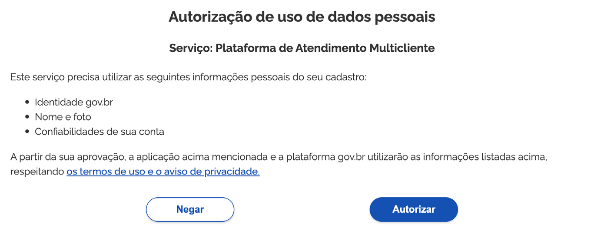

Ao <kbd>3</kbd> **autorizar** o uso dos dados pessoais, o sistema apresenta a janela para seleção da unidade de atendimento e o perfil que você deseja conectar. Ao informar os dados, acione a opção <kbd>4</kbd> **Confirmar**:

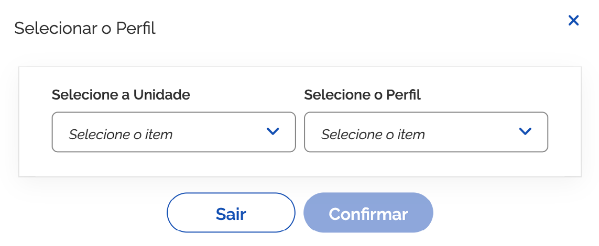

---

### Login no sistema (Continuação)

Ao confirmar, o sistema do prontuário eletrônico apresenta a tela inicial conforme permissões atribuídas ao usuário e perfil no CadSUAS.

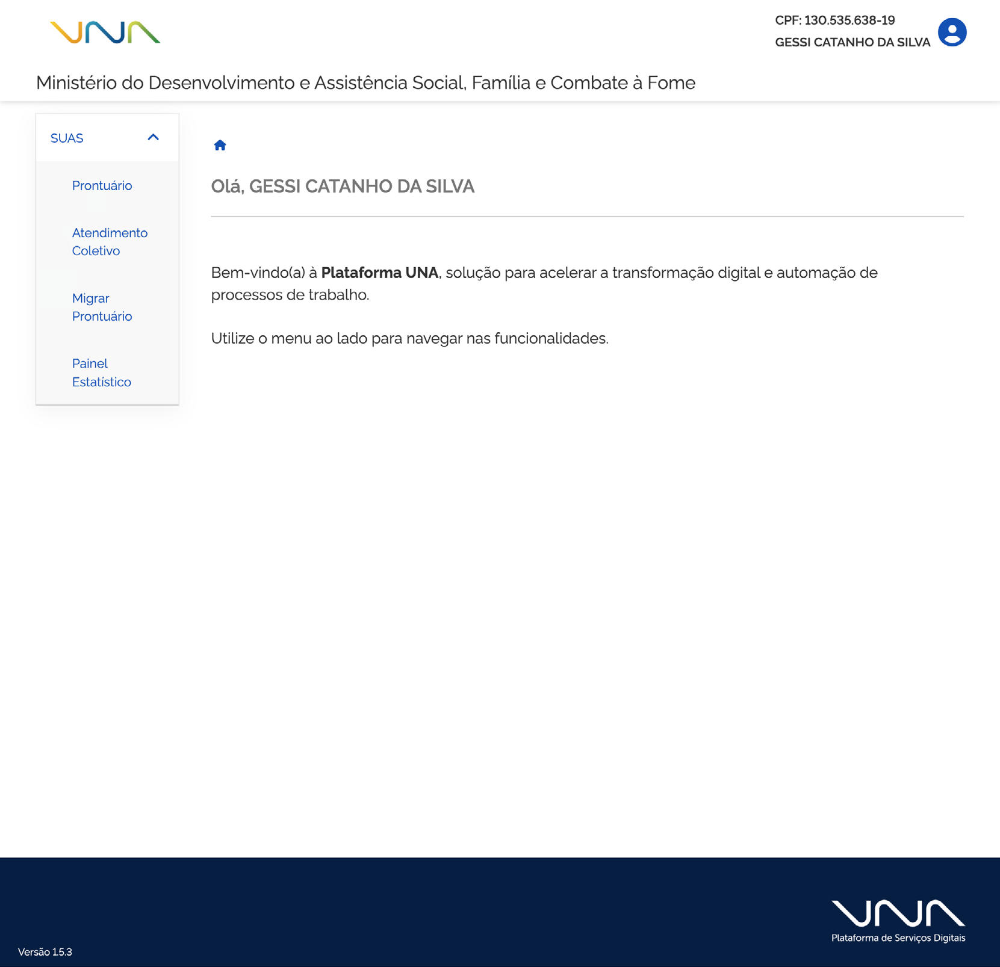

Uma vez realizada a autenticação no sistema, você pode verificar <kbd>1</kbd> **no canto superior da tela inicial**, o CPF, o nome e o *avatar* do usuário logado.

Ao acionar o <kbd>2</kbd> **ícone do avatar**, é possível verificar a <kbd>3</kbd> **unidade de atendimento** e o <kbd>4</kbd> **perfil**. Nesta funcionalidade, também é possível <kbd>5</kbd> **trocar de perfil** (caso o usuário possua mais de um perfil) ou <kbd>6</kbd> **sair do sistema** (*logout*).

Do lado esquerdo da tela, você pode visualizar o <kbd>7</kbd> **menu principal** (SUAS) e o(s) <kbd>8</kbd> **submenu(s)**.

---

## Termo de uso

No primeiro acesso ao sistema, é obrigatório o preenchimento e aceite do **Termo de Uso**.

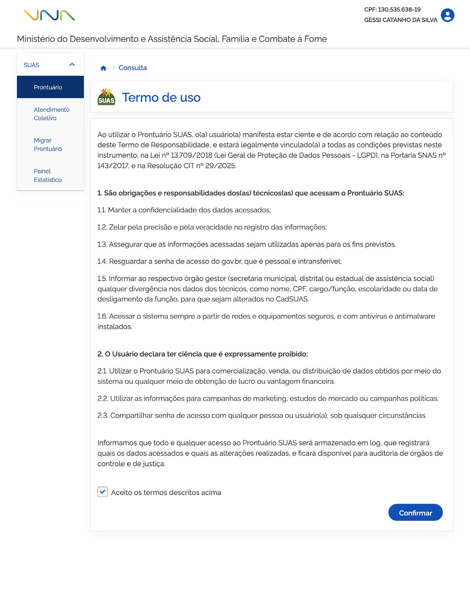

Esse procedimento tem como objetivo garantir o uso responsável, seguro e ético das informações registradas e acessadas no sistema.

Ao ler e aceitar o Termo de Uso, o usuário se compromete a:

* Manter a confidencialidade dos dados acessados, preservando o sigilo das informações pessoais e institucionais;
* Registrar informações com precisão e veracidade, assegurando a qualidade e a integridade dos dados inseridos;
* Acessar o sistema por meios seguros, evitando o uso de dispositivos ou redes não confiáveis;
* Contribuir para a manutenção e atualização dos dados, informando eventuais inconsistências ou falhas identificadas;
* Comunicar divergências ou irregularidades aos órgãos competentes, de forma ética e responsável.

> O aceite do Termo de Uso é condição indispensável para liberar o acesso às funcionalidades do sistema.

---

# Prontuário: Atendimento individual e familiar

---

Clique aqui ou escaneie o QR Code para acessar o vídeo explicativo.

---

## Realizar atendimento

Para **visualizar ou realizar** o atendimento de uma pessoa e/ou família, acione o menu <kbd>1</kbd> **Prontuário**. Caso o perfil possua mais de uma unidade cadastrada, o sistema apresentará a funcionalidade <kbd>2</kbd> **Selecionar unidade**, listando todas as unidades atribuídas ao usuário conforme perfil (CadSUAS).

O refinamento da lista de resultados de unidades pode ser feito informando os parâmetros e acionando a opção <kbd>3</kbd> **Pesquisar**.

Para selecionar a unidade responsável pelo atendimento da pessoa, acione o <kbd>4</kbd> **registro na lista**. O sistema apresenta a funcionalidade para busca do cadastro único da pessoa atendida. Se o perfil possuir apenas uma unidade de atendimento, esse passo não será necessário e o usuário acessará diretamente a funcionalidade de busca do cadastro único da pessoa atendida.

### Consulta simples:

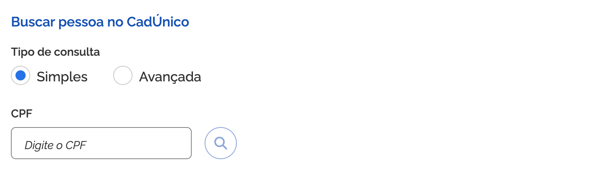

Para consultar o cadastro único da pessoa atendida na consulta simples, informe o **CPF** e acione a opção <kbd>5</kbd> **Pesquisar**.

---

### Consulta avançada:

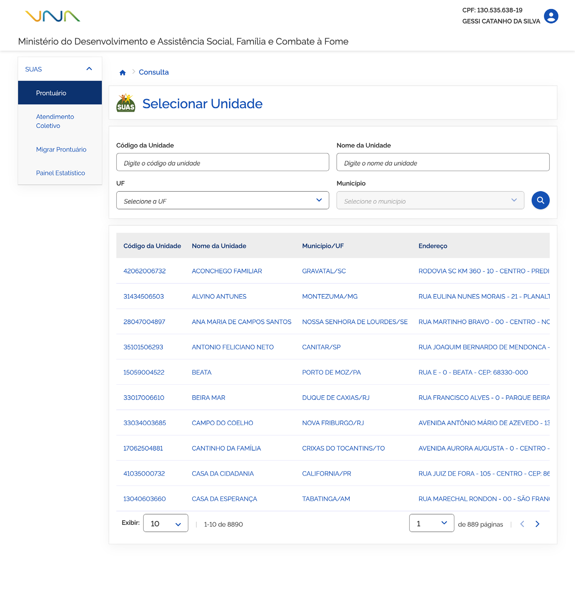

Para consultar o cadastro único da pessoa atendida na consulta avançada, informe o **nome**, **data de nascimento** e **nome da mãe** e acione a opção <kbd>6</kbd> **Pesquisar**.

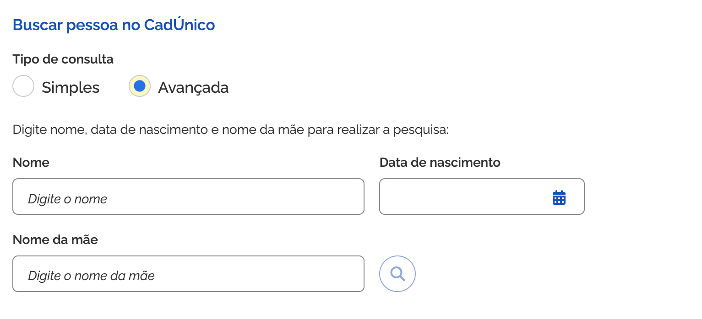

---

## Aspectos globais do módulo Prontuário

### Registro de observações

É possível registrar observações textuais em todos os blocos do Prontuário SUAS.

Para adicionar uma observação, acione a opção <kbd>1</kbd> **Incluir observação**, então o sistema vai apresentar a janela para cadastro.

A janela <kbd>1</kbd> **Incluir observação**, contém os seguintes dados:

* **Data da ação** – campo para informar a data em que o atendimento foi realizado;
* **Observação** – campo para registrar informações adicionais;
* **Cancelar** – opção que, ao ser acionada, cancela a ação e fecha a janela.
* **Incluir** – opção que, ao ser acionada, salva o registro e atualiza a lista.

Preencha os dados solicitados e acione a opção <kbd>5</kbd> **Incluir**, em seguida o sistema fecha a janela, atualiza a lista de observações e apresenta a mensagem *"Observação incluída com sucesso"*.

Para **visualizar o registro de observação**, acione a opção <kbd>2</kbd> **Visualizar observação**, então o sistema vai apresentar a janela com as informações.

---

### Visualizar e Alterar observação

A janela <kbd>2</kbd> **Visualizar observação**, contém os seguintes dados:

* **Data da ação** – campo que informa a data em que o atendimento foi realizado;
* **Observação** – campo que apresenta informações adicionais;
* **Fechar** – opção que, ao ser acionada, fecha a janela.

Para **editar a observação**, acione a opção <kbd>3</kbd> **Alterar observação**, então o sistema vai apresentar a janela com os campos habilitados. Informe os ajustes e acione a opção <kbd>6</kbd> **Alterar**, em seguida o sistema fecha a janela, atualiza a lista de atendimentos e apresenta a mensagem *"Observação alterada com sucesso"*.

Para **excluir o registro de observação da lista**, acione a opção <kbd>4</kbd> **Excluir observação**, e o sistema solicitará a confirmação da ação. Caso confirmada, o sistema atualiza a lista e apresenta a mensagem *"Observação excluída com sucesso"*.

> **Observação:** as funcionalidades de registro, visualização e exclusão de observações estão disponíveis apenas para perfis da equipe técnica de nível superior e o coordenador do CRAS. As observações do bloco "Planejamento e evolução do acompanhamento familiar" estão disponíveis apenas para a equipe técnica de nível superior.

---

### Regras e Limites

### Limite de caracteres

Os **campos de observação** possuem um limite de até 3.000 caracteres. Caso a observação registrada necessite ser registrada em mais caracteres que o limite indicado, recomenda-se fracionar a observação em dois ou mais registros.

Outros **campos abertos**, por sua vez, possuem um limite de 2.000 caracteres. Nesses casos, recomenda-se evitar registros duplicados. Ou seja, caso sejam necessários mais de 2.000 caracteres para o registro da informação, sugere-se a abreviação dos termos e/ou resumo do conteúdo.

### Janela temporal para inserções e alterações

Os registros submetidos ao Prontuário possuem uma janela temporal de **30 dias** para inserções e alterações.

Desta forma, só podem ser adicionados novos registros com a data de ação de até 30 dias anteriores. Após esse período, o sistema não permitirá a adição de informações. Além disso, edições de informações serão permitidas apenas até 30 dias após a submissão do registro. Após esse período, o sistema não apresentará a opção de editar.

### Expansão e retração de todos os blocos de atendimento

Na página de blocos de atendimento, clique em <kbd>1</kbd> **Expandir todos** para expandir todos os blocos simultaneamente. Para retraí-los, clique em **Recolher todos**.

### Registro de pessoa e família

Os benefícios ofertados pela assistência social têm como objetivo garantir proteção, promover o bem-estar e fortalecer os vínculos familiares e comunitários. Eles podem ser destinados à família como um todo ou a um de seus membros em particular, conforme a situação identificada no atendimento.

* **Benefícios voltados à família:** são aqueles que consideram as necessidades do núcleo familiar de forma integrada, buscando melhorar suas condições de vida de maneira coletiva. Exemplos incluem benefícios que apoiam a renda familiar, a moradia ou o acesso a serviços essenciais, fortalecendo a estrutura e a autonomia da família como um todo.
* **Benefícios voltados a um membro específico:** destinam-se a atender situações particulares de um integrante da família, quando há uma vulnerabilidade individual que requer atenção diferenciada — como uma pessoa idosa, com deficiência, gestante, criança ou adolescente em situação de risco.

---

## Informações do Prontuário

No agrupamento <kbd>1</kbd> **Informações do Prontuário**, você pode verificar as informações referentes a abertura do Prontuário.

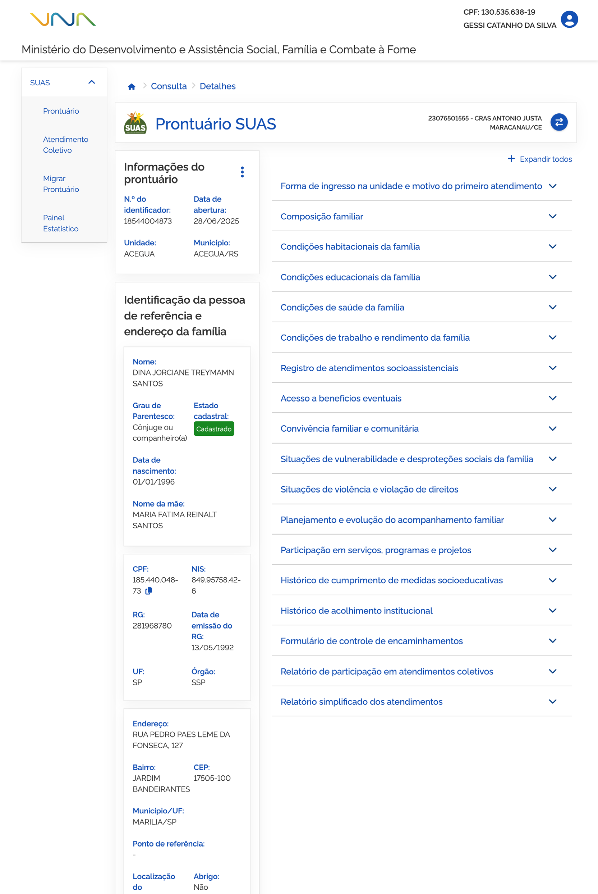

Conforme representado na tela ao lado, o agrupamento é composto pelos campos:

* **Opções** – opção que ao ser acionada possibilita a migração do prontuário e exclusão do prontuário;
* **N.º do identificador** – campo que informa o número de identificação do prontuário de atendimento da pessoa;
* **Data de abertura** – campo que informa a data em que o prontuário de atendimento da pessoa foi criado;
* **Unidade** – campo que informa o nome da unidade CRAS responsável pelo cadastro do prontuário de atendimento da pessoa;
* **Município/ UF** – campo que informa o município e estado onde está localizada a unidade CRAS responsável pelo cadastro do prontuário de atendimento da pessoa.

Caso exista solicitação de migração para o prontuário eletrônico da pessoa/ família, será apresentada a mensagem: *"Existe solicitação de migração em andamento para a unidade <<cód. e nome da unidade de destino>>"*.

---

## Migrar Prontuário

Para migrar o prontuário eletrônico para outra unidade de atendimento, acione o ícone <kbd>2</kbd> **opções** e em seguida <kbd>3</kbd> **Migrar prontuário**, então o sistema vai apresentar a janela:

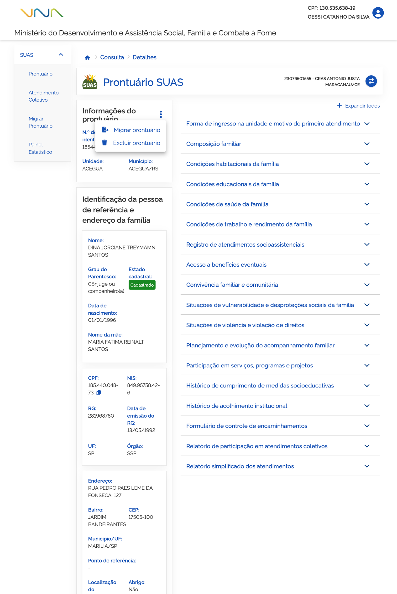

Conforme representado na janela representada na página anterior, o agrupamento é composto pelos campos:

* **Texto informativo** – Ao confirmar a operação, será criada uma solicitação de migração do prontuário da pessoa e demais membros da família para a unidade de destino.

### Informações do Prontuário

* **N.º do prontuário** – campo que informa o número do prontuário da pessoa;
* **Data de abertura** – campo que informa a data da abertura do prontuário da pessoa;
* **Unidade atual** – campo que informa o nome da unidade de atendimento atual;
* **Município** – campo que informa o município e estado da unidade de atendimento atual;

---

## Identificação da pessoa de referência e endereço da família

* **Nome** – campo que informa o nome da pessoa;
* **CPF** – campo que informa o número do CPF da pessoa;
* **Grau de parentesco** – campo que informa o grau de parentesco da pessoa em relação ao responsável familiar;
* **Situação cadastral** – campo que informa o código da família;
* **Código familiar** – campo que informa o código da família;
* **Data de nascimento** – campo que informa a data de nascimento da pessoa;
* **Nome da mãe** – campo que informa o nome da mãe da pessoa;
* **NIS** – campo que informa o número de identificação social – NIS da pessoa;
* **RG** – campo que informa o número do registro geral - RG (também conhecido como carteira de identidade) da pessoa;
* **Data de emissão do RG** – campo que informa a data de emissão do registro geral;
* **Órgão** – campo que informa o órgão expedidor do registro geral;
* **UF** – campo que informa o estado do órgão expedidor;
* **Endereço** – campo que informa o endereço da residência da pessoa/ família;
* **Bairro** – campo que informa o bairro da residência da pessoa/ família;
* **Município/UF** – campo que informa o município/ UF da residência da pessoa/ família;
* **CEP** – campo que informa o número do CEP da residência da pessoa/ família;

---

### Campos de preenchimento

* **Migrar para** – campo que informa a migração para outra unidade;
* **Nome do técnico responsável** – campo que informa o nome do técnico responsável pela solicitação;
* **UF** – campo para informar a uf da unidade de destino;
* **Município** – campo para informar o município conforme uf da unidade de destino;
* **Motivo** – campo para informar o motivo da solicitação de migração do prontuário da pessoa/ família. O sistema listará as unidades conforme UF/ município informado anteriormente;
* **Cancelar** – opção que ao ser acionada, cancela a ação e fecha a janela;
* **Confirmar** – opção que, ao ser acionada, salva a solicitação de migração do prontuário eletrônico.

---

## Excluir Prontuário

Para excluir o prontuário eletrônico da pessoa/ família, acione o ícone <kbd>2</kbd> **opções** e em seguida <kbd>4</kbd> **Excluir prontuário**, então o sistema vai apresentar a janela.

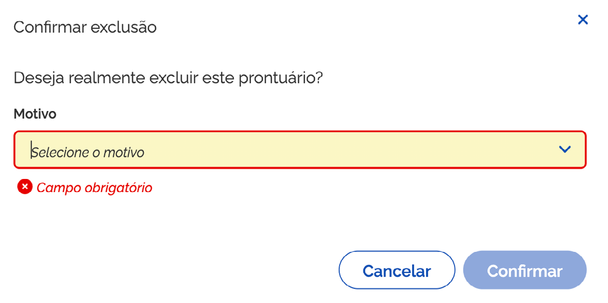

Conforme representado na janela acima, o agrupamento é composto pelos campos:

* **Motivo** – campo para informar o motivo da exclusão do prontuário eletrônico da pessoa/ família. As alternativas são:
    * Prontuário duplicado
    * Retificação no registro por parte da equipe técnica;
    * Informações comprovadamente inverídicas;
    * Falecimento de toda a família;
    * Solicitação formal.
* **Cancelar** – opção que ao ser acionada, cancela a ação e fecha a janela;
* **Confirmar** – opção que ao ser acionada, realiza a exclusão do prontuário eletrônico da pessoa/ família.

---

## Identificação da pessoa de referência e endereço da família

No agrupamento <kbd>5</kbd> **Identificação da pessoa de referência e endereço da família**, você pode verificar informações pessoais, endereço e composição da família de acordo com o Cadastro Único, à qual o prontuário pertence.

Conforme tela representada ao lado, o agrupamento é composto pelos campos:

* **Nome** – campo que informa o nome da pessoa ao qual pertence o prontuário;
* **Grau de Parentesco** – campo que informa o grau de parentesco (Pessoa Responsável pela Unidade Familiar – RF, Cônjuge ou companheiro(a), Filho(a), Enteado(a), Neto(a) ou bisneto(a), Pai ou mãe, Sogro(a), Irmão ou irmã, Genro ou nora, Outro parente e Não parente) da pessoa em relação a Referência Familiar – RF;
* **Situação Cadastral** – Campo que informa a situação (Em Cadastramento, Sem Registro Civil, Cadastrado, Excluído, Aguardando NIS e Validando NIS) do cadastro da pessoa no Cadastro Único;
* **Data de Nascimento** – Campo que informa a data de nascimento da pessoa;
* **Nome da Mãe** – Campo que informa o nome da mãe da pessoa;

---

### Dados Pessoais

Conforme tela ao lado, a funcionalidade **Dados Pessoais** é composta pelos campos:

* **CPF** – campo que informa o número do cadastro de pessoa física – CPF da pessoa;
    * Para copiar o número do CPF, acione o ícone <kbd>6</kbd> **Copiar**.
* **NIS** – campo que informa o número de identificação social - NIS da pessoa;
* **RG** – campo que informa o número do registro geral - RG (também conhecido como carteira de identidade) da pessoa;
* **Data de Emissão do RG** – campo que informa a data de emissão do registro geral;
* **Órgão** – campo que informa o órgão expedidor do registro geral;
* **UF** – campo que informa o estado do órgão expedidor.

---

### Dados do Endereço

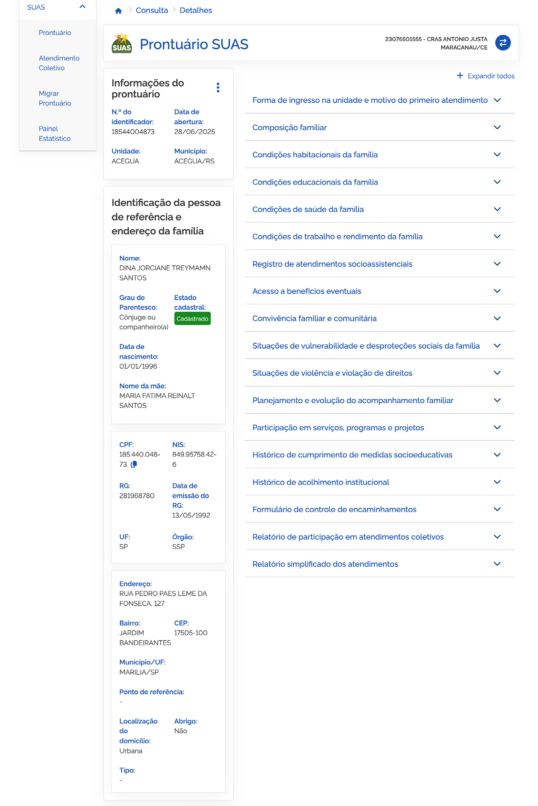

Conforme tela ao lado, a funcionalidade **Dados do Endereço** é composta pelos campos:

* **Endereço** – campo que informa o endereço da residência da pessoa/ família;
* **Bairro** – campo que informa o bairro da residência da pessoa/ família;
* **CEP** – campo que informa o CEP da residência da pessoa/ família;
* **Município/ UF** – campo que informa o município/ UF da residência da pessoa/ família;
* **Ponto de Referência** – campo que informa o ponto de referência da residência da pessoa/ família;
* **Localização do Domicílio** – Campo que informa o local (urbana ou rural) onde está situada a residência da pessoa/ família;
* **Abrigo** – Campo que informa se o domicílio é um abrigo;
* **Tipo** – Campo que informa o tipo de domicílio;

> **Observação:** As informações acima são apenas para consulta, não sendo possível alterá-las por meio do Prontuário Eletrônico.

---

## Informações da família

No agrupamento <kbd>7</kbd> **Informações da Família**, você pode verificar os dados cadastrais da família à qual a pessoa pertence, de acordo com o **Cadastro Único**.

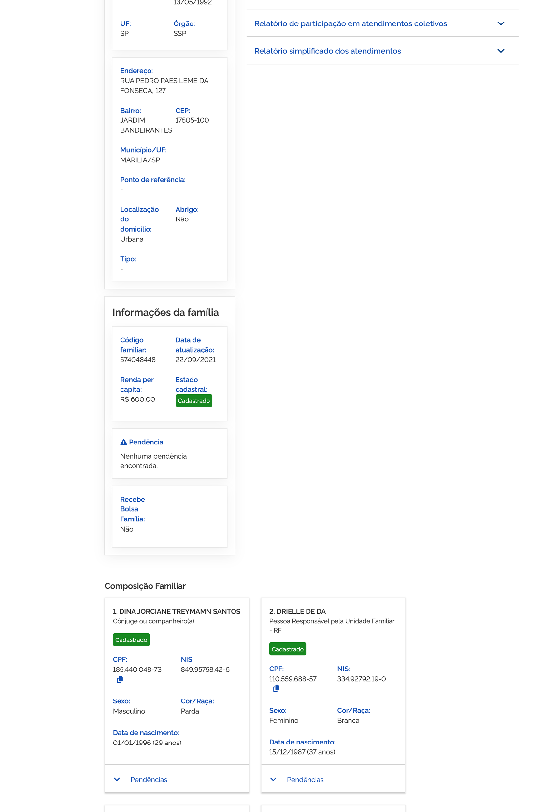

Conforme tela ao lado, o agrupamento é composto pelos campos:

* **Código Familiar** – Campo que informa o código do cadastro da família no Cadastro Único;
* **Data de Atualização** – Campo que informa a data da última atualização da Cadastro Único;
* **Renda Per Capita** – Campo que informa o valor da renda média (per capita) da família;
* **Estado Cadastral** – Campo que informa o estado (Em cadastramento, Sem Registro Civil, Cadastrado e Excluído) do cadastro da família no Cadastro Único;
* **Recebe Bolsa Família** – Campo que informa se a família é beneficiária do Programa Bolsa Família;

> **Observação:** As informações acima são apenas para consulta, não sendo possível alterá-las por meio do Prontuário Eletrônico.

---

## Composição familiar

No agrupamento <kbd>8</kbd> **Composição Familiar**, você pode verificar os dados cadastrais dos membros que compõem o núcleo familiar da pessoa, de acordo com o **Cadastro Único**.

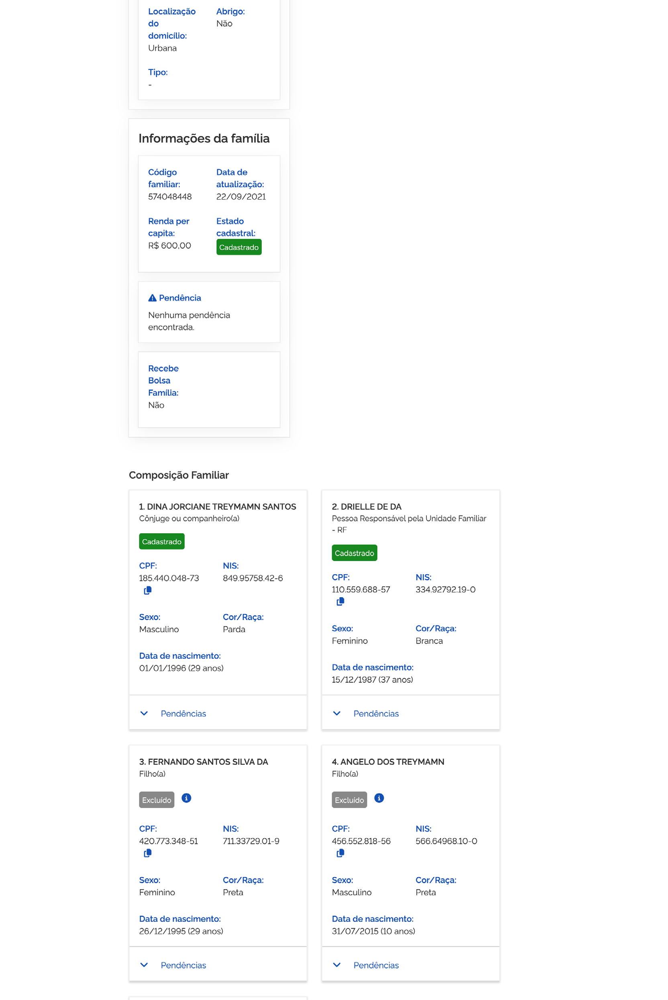

Conforme imagem ao lado, o agrupamento é composto pelos campos:

* **Nome** – campo que informa o nome do membro da composição familiar;
* **Situação cadastral** – Campo que informa a situação (Em Cadastramento, Sem Registro Civil, Cadastrado, Excluído, Aguardando NIS e Validando NIS) do cadastro do membro da composição familiar no Cadastro Único;
* **CPF** – campo que informa o número do cadastro de pessoa física - CPF do membro da composição familiar;
* **NIS** – campo que informa o número de identificação social - NIS do membro da composição familiar;
* **Sexo** – campo que informa o sexo do membro da composição familiar;
* **Cor/ raça** – campo que informa o sexo do membro da composição familiar;
* **Data de nascimento** – campo que informa a data de nascimento do membro da composição familiar.
* **Ocorrências e pendências** – opção que ao ser acionada, expande apresentado ocorrências e pendencias para o cadastro do membro da composição familiar. Não havendo ocorrências e pendencias, será apresentada a mensagem: *"Nenhuma ocorrência ou pendência encontrada."*

---

## Forma de ingresso na unidade e motivo do primeiro atendimento

Ao acionar o bloco <kbd>1</kbd> **Forma de ingresso na unidade e motivo do primeiro atendimento**, para expandir as informações, você pode consultar e cadastrar a forma de acesso da pessoa na unidade CRAS, com o objetivo de subsidiar o trabalho social a ser realizado.

A **lista de registro de atendimentos** é composta por:

* **Data da ação** – a coluna informa a data em que a pessoa buscou atendimento na unidade;
* **Forma de ingresso** – a coluna informa como a pessoa acessou a unidade para seu primeiro atendimento;
* **Unidade** – a coluna informa o nome da unidade onde o atendimento foi realizado.
* **Ações** – coluna que exibe ícones para realizar ações, como por exemplo: Visualizar registro.

### Adicionar registro

Para **adicionar novo registro**, acione a opção <kbd>2</kbd> **Incluir forma de ingresso**, então o sistema vai apresentar a janela para cadastro.

Preencha os dados solicitados e acione a opção <kbd>7</kbd> **Incluir**, em seguida o sistema fecha a janela, atualiza a lista de atendimentos e apresenta a mensagem *"Registro de atendimento incluído com sucesso"*.

A janela <kbd>2</kbd> **Incluir forma de ingresso**, contém os seguintes dados:

* **Pessoa(s)** – campo que informa o(s) nome(s) da(s) pessoa(s) atendida(s);
* **Data do atendimento** – campo que informa a data em que o atendimento foi realizado;
* **Número do prontuário físico** – informa o número do prontuário físico da pessoa/família;
* **De que forma a família acessou a unidade para o primeiro atendimento** – informa como a pessoa/família acessou a unidade para o primeiro atendimento;
* **Razões que motivaram o primeiro atendimento** – campo que apresenta as informações adicionais ao atendimento;
* **Cancelar** – opção que, ao ser acionada, cancela a ação e fecha a janela.
* **Incluir** – opção que, ao ser acionada, salva o registro e atualiza a lista.

---

### Visualizar registro

Para **visualizar o registro do atendimento**, acione a opção <kbd>3</kbd> **Visualizar forma de ingresso**, então o sistema vai apresentar a janela com as informações.

A janela <kbd>3</kbd> **Visualizar forma de ingresso**, contém os seguintes dados:

* **Pessoa(s)** – campo que informa o(s) nome(s) da(s) pessoa(s) atendida(s);
* **Data do atendimento** – campo que informa a data em que o atendimento foi realizado;
* **Número do prontuário físico** – informa o número do prontuário físico da pessoa/família;
* **De que forma a família acessou a Unidade para primeiro atendimento?** – informa como a pessoa/família acessou a Unidade para primeiro atendimento;
* **Razões que motivaram o primeiro atendimento** – campo que apresenta as informações adicionais ao atendimento;
* **Cancelar** – opção que, ao ser acionada, cancela a ação e fecha a janela.
* **Alterar** – opção que, ao ser acionada, salva a alteração realizada para o atendimento.

---

### Editar registro

Para **editar o registro de atendimento**, acione a opção <kbd>4</kbd> **Alterar forma de ingresso**, então o sistema vai apresentar a janela com os campos habilitados.

Informe os ajustes e acione a opção <kbd>7</kbd> **Alterar**, em seguida o sistema fecha a janela, atualiza a lista de atendimentos e apresenta a mensagem *"Forma de ingresso na unidade alterada com sucesso"*.

A janela <kbd>4</kbd> **Alterar forma de ingresso**, contém os seguintes dados:

* **Pessoa(s)** – campo que informa o(s) nome(s) da(s) pessoa(s) atendida(s);
* **Data do atendimento** – campo que informa a data em que o atendimento foi realizado;
* **Número do prontuário físico** – informa o número do prontuário físico da pessoa/família;
* **De que forma a família acessou a Unidade para o primeiro atendimento?**
    * Por demanda espontânea
    * Em decorrência de Busca Ativa realizada pela equipe da unidade
    * Em decorrência de encaminhamento realizado por outros serviços/unidades da Proteção Social Básica
    * Em decorrência de encaminhamento realizado por outros serviços/unidades da Proteção Social Especial
    * Em decorrência de encaminhamento realizado pela área da saúde
    * Em decorrência de encaminhamento realizado pela área da educação
    * Em decorrência de encaminhamento realizado por outras políticas setoriais
    * Em decorrência de encaminhamento realizado pelo Conselho Tutelar
    * Em decorrência de encaminhamento realizado pelo Poder Judiciário
    * Em decorrência de encaminhamento realizado pelo Sistema de Garantia de Direitos (Defensoria Pública, Ministério Público, Delegacias)
    * Outros encaminhamentos
* **Razões que motivaram o primeiro atendimento** – campo que apresenta as informações adicionais ao atendimento;
* **Cancelar** – opção que, ao ser acionada, cancela a ação e fecha a janela.
* **Alterar** – opção que, ao ser acionada, salva a alteração realizada para o atendimento.

### Excluir registro

Para **excluir o registro da lista**, acione a opção <kbd>5</kbd> **Excluir forma de ingresso**, e o sistema solicitará a confirmação da ação. Caso confirmada, o sistema atualiza a lista e apresenta a mensagem *"Forma de ingresso excluída com sucesso"*.

---

## Composição familiar (Detalhamento)

Ao acionar o bloco <kbd>1</kbd> **Composição familiar**, ao expandir as informações, você pode consultar o perfil etário do grupo familiar, especificidades sociais, étnicas e culturais.

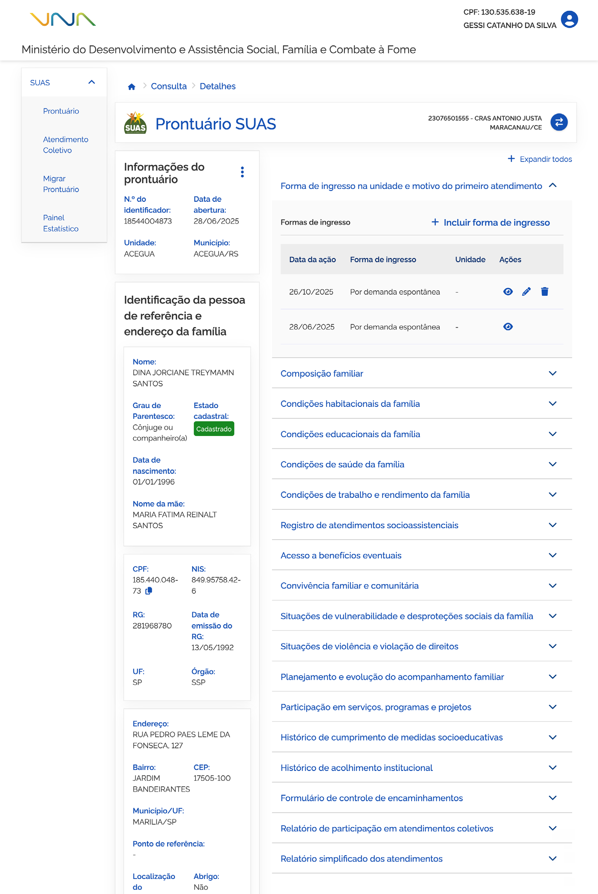

### Perfil etário do grupo familiar

O agrupamento de campos do <kbd>2</kbd> **do perfil etário do grupo familiar** é composto por:

* **Perfil etário do grupo familiar** – campo que informa a quantidade de pessoas por faixa etária e o total de pessoas que compõem a família;

### Especificidades sociais, étnicas ou culturais da família

O agrupamento de campos das <kbd>3</kbd> **especificidades sociais, étnicas ou culturais da família** é composto por:

* **Família indígena** – campo que informa se a família é indígena;
* **Povo indígena** – campo que informa o nome do povo indígena ao qual a família pertence;
* **Terra ou reserva indígena** – campo que informa se a família reside em terra ou reserva indígena;
* **Família quilombola** – campo que informa se a família é quilombola;
* **Comunidade quilombola** – campo que informa o nome da comunidade quilombola ao qual a família pertence;
* **Grupos tradicionais e específicos** – campo que informa o(s) família faz parte de grupos tradicionais e específicos e qual(is) grupo(s);
* **Família em situação de rua** – campo que informa se a família está em situação de rua;

### Observações da composição familiar

Para mais informações sobre <kbd>4</kbd> **registro de observações**, consulte a página 19 deste manual.

Para **retrair ou reexibir** as informações contidas no bloco, acione o <kbd>5</kbd> **ícone**.

---

## Condições habitacionais da família

No bloco <kbd>1</kbd> **Condições habitacionais da família**, ao acionar para expandir as informações, você pode consultar as características do domicílio, adicionar condições habitacionais da família e observações complementares.

### Características do Domicílio

O agrupamento de campos <kbd>2</kbd> **características do domicílio**, é composto por:

* **Espécie de domicílio** – campo que informa a espécie de habitação;
* **Total de cômodos** – campo que informa o total de cômodos da habitação;
* **Comodo como dormitório** – campo que informa a quantidade de dormitórios da habitação;
* **Material das paredes externas** – campo que informa o material das paredes externas da habitação;
* **Tipo de iluminação** – campo que informa o tipo de iluminação da habitação;
* **Forma de abastecimento de água** – campo que informa a forma de abastecimento de água da habitação;
* **Água canalizada** – campo que informa se a habitação possui água canalizada;
* **Escoamento sanitário** – campo que informa se a habitação possui escoamento sanitário;
* **Coleta de lixo** – campo que informa se a habitação possui coleta de lixo.

---

O agrupamento de campos <kbd>3</kbd> **condições habitacionais da família** é composto por:

* **Número médio de pessoas por dormitório** – campo que informa a média de pessoas da composição família por dormitório;
* **Possui acessibilidade para pessoas com dificuldade de locomoção** – campo que informa se a habitação está localizada em área de locomoção;
* **Localizado em área de risco de desabamento ou alagamento** – campo que informa se a habitação está localizada em área de risco de desabamento ou alagamento;
* **Localizado em área de difícil acesso geográfico** – campo que informa se a habitação está localizada em área de difícil acesso geográfico;
* **Localizado em área com forte presença de conflito/violência** – campo que informa se a habitação está localizada em área com forte presença de conflito/violência.

---

### Incluir habitação

Para **adicionar informações de habitação**, acione a opção <kbd>4</kbd> **Incluir habitação**, então o sistema vai apresentar a janela para cadastro. Preencha os dados solicitados e acione a opção <kbd>8</kbd> **Incluir**, em seguida o sistema fecha a janela, apresenta as Condições habitacionais da família e a mensagem *"Condições habitacionais incluída com sucesso"*.

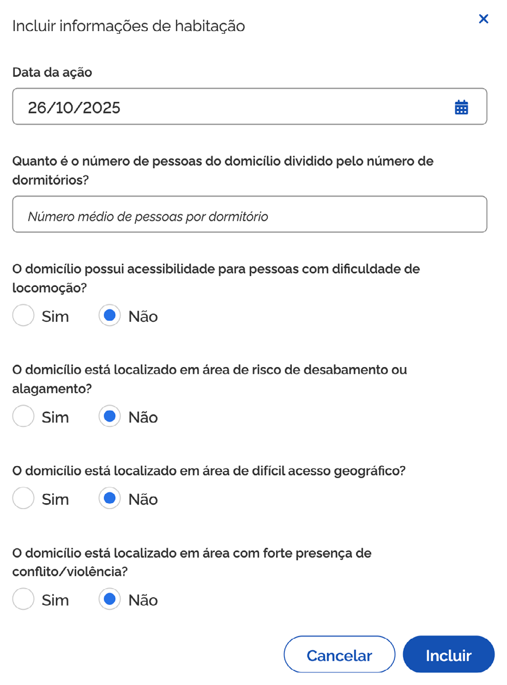

A janela <kbd>4</kbd> **Incluir informações de habitação**, representada na página anterior, contém os seguintes dados:

* **Data do atendimento** – campo para informar a data em que o atendimento foi realizado;
* **Quanto é o número de pessoas do domicílio dividido pelo número de dormitórios?** – campo para informar a quantidade de pessoas por dormitório;
* **O domicílio possui acessibilidade para pessoas com dificuldade de locomoção?** – campo para informar se o domicílio possui acessibilidade para pessoas com dificuldade de locomoção;
* **O domicílio está localizado em área de risco de desabamento ou alagamento?** – campo para informar se o domicílio está localizado em área de risco de desabamento ou alagamento;
* **O domicílio está localizado em área de difícil acesso geográfico?** – campo para informar se o domicílio está localizado em área de difícil acesso geográfico;
* **O domicílio está localizado em área com forte presença de conflito/violência?** – campo para informar se o domicílio está localizado em área com forte presença de conflito/violência;
* **Cancelar** – opção que, ao ser acionada, cancela a ação e fecha a janela.
* **Incluir** – opção que, ao ser acionada, salva o atendimento.

---

### Atualizar habitação

Para **editar as informações de habitação**, acione a opção <kbd>5</kbd> **Atualizar habitação**, então o sistema vai apresentar a janela com os campos habilitados. Informe os ajustes e acione a opção <kbd>8</kbd> **Incluir**, em seguida o sistema fecha a janela, atualiza as Condições habitacionais da família e apresenta a mensagem *"Condições habitacionais atualizadas com sucesso"*.

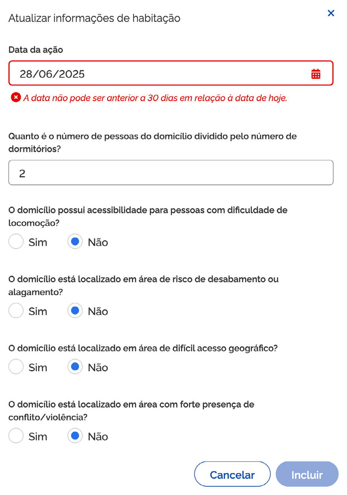

A janela <kbd>5</kbd> **Atualizar informações de habitação**, representada na página anterior, contém os seguintes dados:

* **Data do atendimento** – campo para informar a data em que o atendimento foi realizado;
* **Quanto é o número de pessoas do domicílio dividido pelo número de dormitórios?** – campo para informar a quantidade de pessoas por dormitório;
* **O domicílio possui acessibilidade para pessoas com dificuldade de locomoção?** – campo para informar se o domicílio possui acessibilidade para pessoas com dificuldade de locomoção;
* **O domicílio está localizado em área de risco de desabamento ou alagamento?** – campo para informar se o domicílio está localizado em área de risco de desabamento ou alagamento;
* **O domicílio está localizado em área de difícil acesso geográfico?** – campo para informar se o domicílio está localizado em área de difícil acesso geográfico;
* **O domicílio está localizado em área com forte presença de conflito/violência?** – campo para informar se o domicílio está localizado em área com forte presença de conflito/violência;
* **Cancelar** – opção que, ao ser acionada, cancela a ação e fecha a janela.
* **Incluir** – opção que, ao ser acionada, salva o atendimento.

---

### Observações das condições habitacionais da família

Para mais informações sobre <kbd>6</kbd> **registro de observações**, consulte a página 19 deste manual.

Para **retrair ou reexibir** as informações contidas no bloco, acione o <kbd>7</kbd> **ícone**.

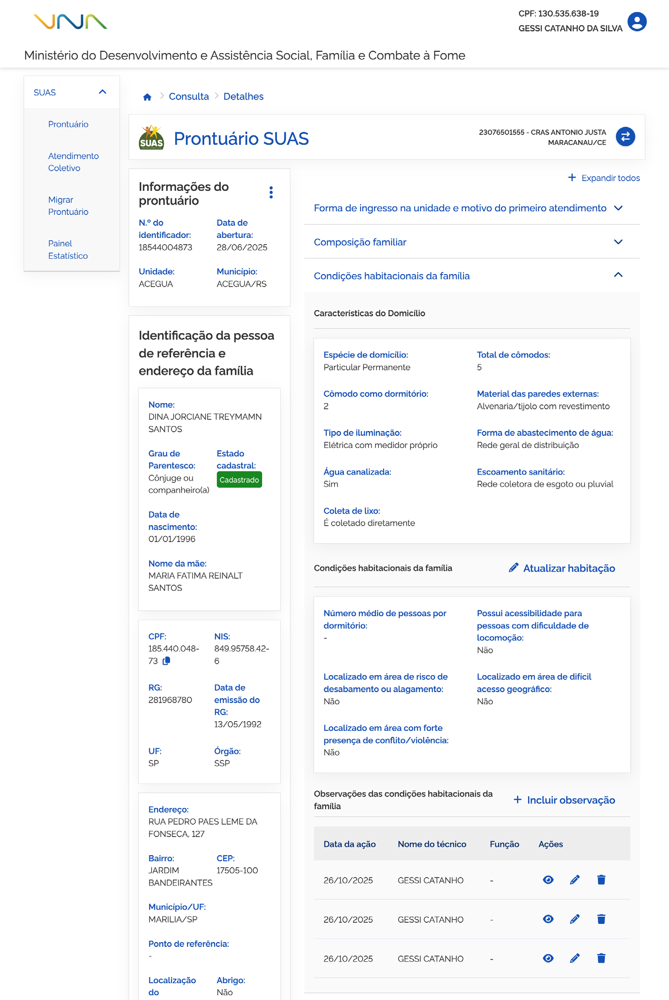

---

## Condições educacionais da família

No bloco <kbd>1</kbd> **Condições educacionais da família**, ao acionar para expandir as informações, você pode consultar, por membro da composição familiar, a condição educacional, vulnerabilidade e observações complementares.

### Condições educacionais

A <kbd>2</kbd> **lista das condições educacionais** é composta por:

* **Pessoa** – a coluna informa o nome do membro da composição familiar;
* **Idade** – a coluna informa a idade do membro da composição familiar;
* **Sabe ler e escrever** – a coluna informa se membro da composição familiar sabe ler e escrever;
* **Frequenta escola** – a coluna informa se membro da composição familiar está frequentando a escola ou creche.

### Identificação de vulnerabilidade educacional

O <kbd>3</kbd> **agrupamento de campos da identificação de vulnerabilidade educacional** é composto por:

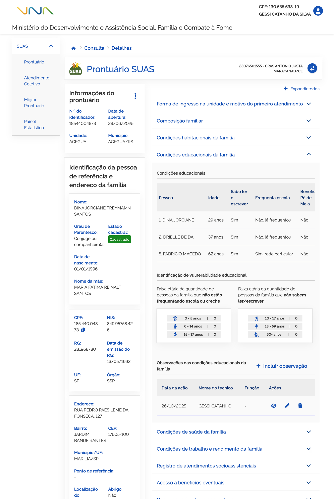

* **Faixa etária da quantidade de pessoas da família que não estão frequentando escola ou creche** – campo que informa a quantidade de pessoas por faixa etária, que não estão frequentando escola ou creche;
* **Faixa etária da quantidade de pessoas da família que sabem ler/ escrever** – campo que informa a quantidade de pessoas por faixa etária, que sabem ler/ escrever.

---

### Observações das condições educacionais da família

Para mais informações sobre <kbd>4</kbd> **registro de observações**, consulte a página 19 deste manual.

Para **retrair ou reexibir** as informações contidas no bloco, acione o <kbd>5</kbd> **ícone**.

---

## Condições de saúde da família

Ao acionar o bloco <kbd>1</kbd> **Condições de saúde da família**, para expandir as informações, você pode consultar, por membro da composição familiar, as marcações de saúde e observações complementares.

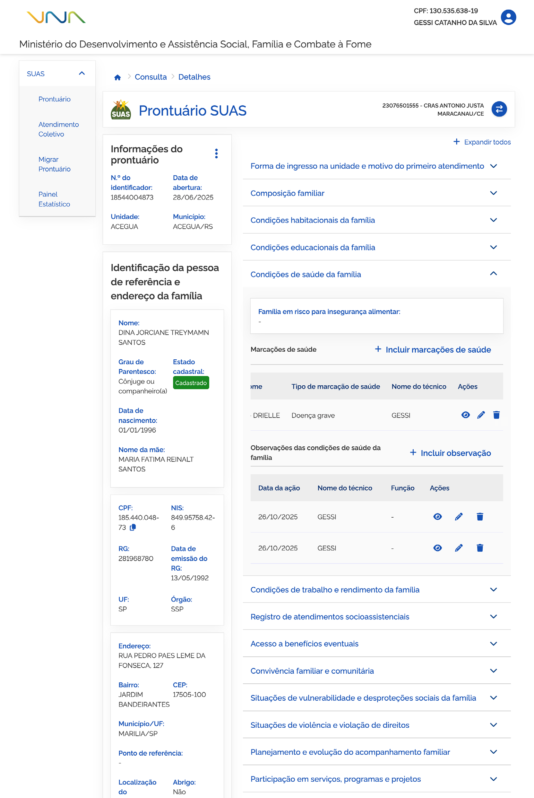

### Marcações de saúde

A <kbd>2</kbd> **lista das marcações de saúde da família** é composta por:

* **Data do atendimento** – a coluna informa a data em que a marcação foi incluída;
* **Nome** – a coluna informa o nome do membro da composição familiar ao qual a marcação de saúde pertence;
* **Tipo de marcação de saúde** – a coluna informa o tipo da marcação de saúde. Os tipos são:
    * Doença grave
    * Remédios controlados para transtornos mentais
    * Uso abusivo de álcool
    * Uso abusivo de drogas
* **Nome do técnico** – a coluna informa o nome do técnico responsável pelo atendimento.
* **Ações** – coluna que exibe ícones para realizar ações, como por exemplo: Visualizar registro.

---

### Incluir marcações de saúde

Para **adicionar marcação de saúde para a família**, acione a opção <kbd>3</kbd> **Incluir marcações de saúde**, então o sistema vai apresentar a janela para cadastro.

Preencha os dados solicitados e acione a opção <kbd>9</kbd> **Incluir**, em seguida o sistema fecha a janela, atualiza a lista de marcações e apresenta a mensagem *"Condição de saúde incluída com sucesso"*.

A janela <kbd>3</kbd> **Incluir marcação de saúde**, representada na página anterior, contém os seguintes dados:

* **Data da ação** – campo para informar a data em que o atendimento foi realizado;
* **Pessoa** – campo para informar o nome da pessoa atendida;
* **Tipo de marcação de saúde** – campo para informar o tipo da marcação de saúde;
* **Cancelar** – opção que, ao ser acionada, cancela a ação e fecha a janela.
* **Incluir** – opção que, ao ser acionada, salva o atendimento.

---

### Visualizar marcações de saúde

Para **visualizar o registro marcação de saúde**, acione a opção <kbd>4</kbd> **Visualizar marcação**, então o sistema vai apresentar a janela com as informações.

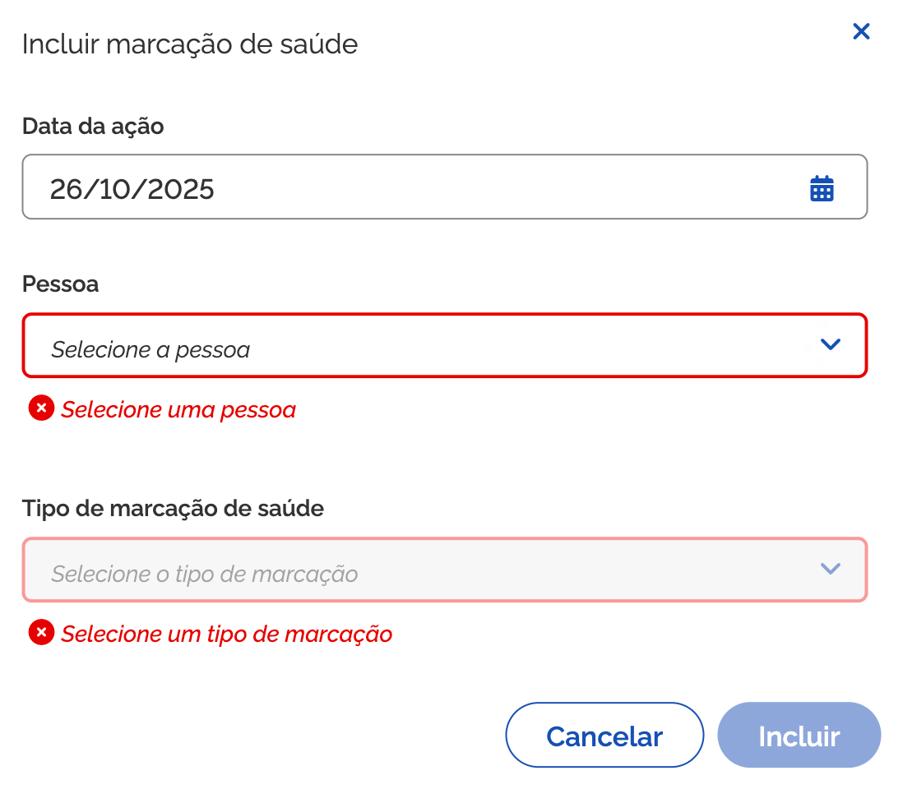

A janela <kbd>4</kbd> **Visualizar marcação de saúde**, representada na página anterior, contém os seguintes dados:

* **Data da ação** – campo que informa a data em que o atendimento foi realizado;
* **Pessoa** – campo que informa o nome da pessoa atendida;
* **Tipo de marcação de saúde** – campo que apresenta o tipo da marcação de saúde;
* **Fechar** – opção que, ao ser acionada, fecha a janela.

---

### Editar marcações de saúde

Para **editar o registro marcação de saúde**, acione a opção <kbd>4</kbd> **Alterar marcação**, então o sistema vai apresentar a janela com os campos habilitados.

Informe os ajustes e acione a opção <kbd>9</kbd> **Atualizar**, em seguida o sistema fecha a janela, atualiza a lista de marcações e apresenta a mensagem *"Condição de saúde alterada com sucesso"*.

A janela <kbd>5</kbd> **Alterar marcação de saúde**, representada na página anterior, contém os seguintes dados:

* **Data da ação** – campo para informar a data em que o atendimento foi realizado;
* **Pessoa** – campo para informar o nome da pessoa atendida;
* **Tipo de marcação de saúde** – campo para informar o tipo da marcação de saúde;
* **Cancelar** – opção que, ao ser acionada, cancela a ação e fecha a janela.
* **Atualizar** – opção que, ao ser acionada, salva a alteração realizada para o atendimento.

---

### Excluir marcação de saúde

Para **excluir marcação de saúde**, acione a opção <kbd>6</kbd> **Excluir marcação**, e o sistema solicitará a confirmação da ação. Caso confirmada, o sistema atualiza a lista e apresenta a mensagem *"Marcação excluída com sucesso."*.

### Observações das condições de saúde da família

Para mais informações sobre o <kbd>7</kbd> **registro de observações**, consulte a página 19 deste manual.

Para **retrair ou reexibir** as informações contidas no bloco, acione o <kbd>8</kbd> **ícone**.

---

## Condições de trabalho e rendimento da família

Ao acionar o bloco <kbd>1</kbd> **Condições de trabalho e rendimento da família**, para expandir as informações, você pode consultar, por membro da composição familiar, a condição de trabalho, valores recebidos por programa e observações complementares.

### Condições de trabalho da família

A lista das <kbd>2</kbd> **condições de trabalho da família** é composta por:

* **Pessoa** – a coluna informa o nome do membro da composição familiar;
* **Idade** – a coluna informa a idade do membro da composição familiar;
* **N.º da CTPS** – a coluna informa o número da carteira de trabalho e previdência social do membro da composição familiar.

---

### Valores recebidos por Programas Sociais

O <kbd>3</kbd> **agrupamento de campos dos valores recebidos por Programas Sociais** é composto por:

* **Recebe Bolsa Família** – campo que informa se a família recebe o Bolsa Família;
* **Nome** – campo que informa o nome do membro da composição familiar;
* **Parentesco** – campo que informa o parentesco do membro da composição familiar em relação ao Responsável pela Unidade Familiar - RF;
* **Aposentadoria pensão ou BPC/ LOAS** – campo que informa se o membro da composição familiar recebe aposentadoria, pensão ou BPC/ LOAS;
* **Ajuda/ doação regular de não morador** – campo que informa se o membro da composição familiar recebe ajuda/ doação regular de pessoa não moradora da residência;
* **Seguro-desemprego** – campo que informa se o membro da composição familiar está recebendo seguro-desemprego;
* **Pensão alimentícia** – campo que informa o recebimento e valor da pensão alimentícia pelo membro da composição familiar;

---

### Observações das condições de trabalho e rendimento da família

Para mais informações sobre o <kbd>4</kbd> **registro de observações**, consulte a página 19 deste manual.

Para **retrair ou reexibir** as informações contidas no bloco, acione o <kbd>5</kbd> **ícone**.

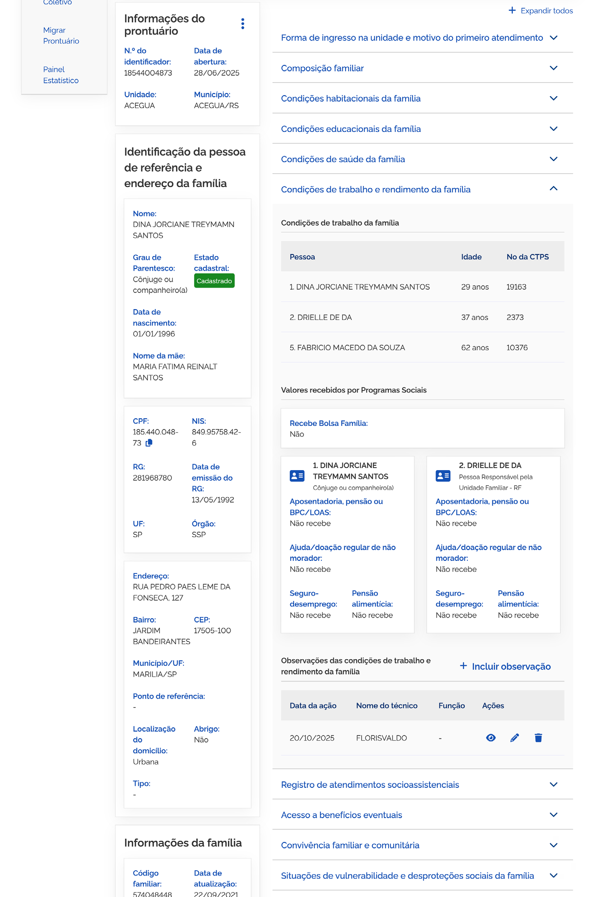

---

# Registro de atendimentos socioassistenciais

---

Ao acionar o bloco <kbd>1</kbd> **Registro de atendimentos socioassistenciais**, para expandir as informações, você pode consultar ou cadastrar o registro de atendimento, de acordo com a demanda da família ou membro da composição familiar.

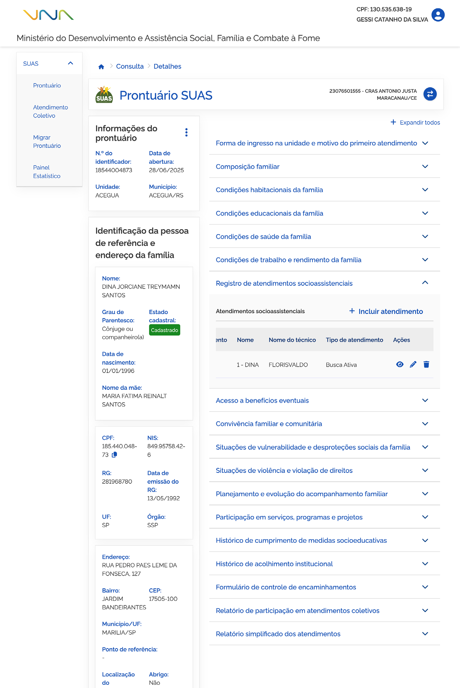

### Atendimentos socioassistenciais

A lista de <kbd>2</kbd> **Registro de atendimentos socioassistenciais** é composta por:

* **Data do atendimento** – a coluna informa a data em que a Referência Familiar ou membro da composição família foi atendido na Unidade;
* **Nome** – a coluna informa o nome do membro da composição familiar atendido;
* **Nome do técnico** – a coluna informa o nome do técnico responsável pelo registro do atendimento no Prontuário Eletrônico;
* **Tipo de atendimento** – a coluna informa o tipo de atendimento requerido pela pessoa atendida. Pode haver um ou mais atendimentos. Os tipos são:
    * Acolhida particularizada
    * Atendimento socioassistencial individualizado
    * Busca ativa
    * Visita domiciliar PAIF
    * Atendimento Serviço Proteção Social Básica no Domicílio – Pessoa idosa.
    * Atendimento Serviço Proteção Social Básica no Domicílio - Pessoa com Deficiência.
    * Atendimento Serviço Proteção Social Básica no Domicílio – Gestantes e Primeira Infância.
    * Atendimento Serviço de Convivência e Fortalecimento de Vínculos.
    * Outros
* **Ações** – coluna que exibe ícones para realizar ações, como por exemplo: Visualizar registro.

---

### Incluir atendimento

Para **adicionar novo atendimento**, acione a opção <kbd>3</kbd> **Incluir atendimento**, então o sistema vai apresentar a janela para cadastro.

Preencha os dados solicitados e acione a opção <kbd>8</kbd> **Incluir**, em seguida o sistema fecha a janela, atualiza a lista de atendimentos e apresenta a mensagem *"Registro de atendimento incluído com sucesso"*.

A janela <kbd>3</kbd> **Incluir atendimento**, representada na página anterior, contém os seguintes dados:

* **Pessoa(s)** – campo para informar o(s) nome(s) da(s) pessoa(s) atendida(s);
* **Data do atendimento** – campo para informar a data em que o atendimento foi realizado;
* **Nome do técnico responsável** – campo que informa o nome do técnico responsável pelo registro do atendimento no Prontuário Eletrônico;
* **Tipo** – campo para informar o tipo do atendimento socioassistencial prestado;
* **Descrição/ resumo do atendimento** – campo para registrar informações adicionais ao atendimento;
* **Cancelar** – opção que ao ser acionada, cancela a ação e fecha a janela.
* **Incluir** – opção que, ao ser acionada, salva o atendimento.

---

### Visualizar atendimento

Para **visualizar o registro do atendimento**, acione a opção <kbd>4</kbd> **Visualizar atendimento**, então o sistema vai apresentar a janela com as informações completas do atendimento:

A janela <kbd>4</kbd> **Visualizar atendimento**, representada acima, contém os seguintes dados:

* **Pessoa(s)** – campo que informa o(s) nome(s) da(s) pessoa(s) atendida(s);
* **Data do atendimento** – campo que informa a data em que o atendimento foi realizado;
* **Nome do técnico responsável** – campo que informa o nome do técnico responsável pelo registro do atendimento no Prontuário Eletrônico;
* **Tipo** – campo que informa o tipo do atendimento socioassistencial realizado;
* **Descrição/ resumo do atendimento** – campo que apresenta informações adicionais ao atendimento;
* **Cancelar** – opção que ao ser acionada fecha a janela.

---

### Editar atendimento

Para **editar o registro de atendimento**, acione a opção <kbd>5</kbd> **Alterar atendimento**, então o sistema vai apresentar a janela com os campos habilitados.

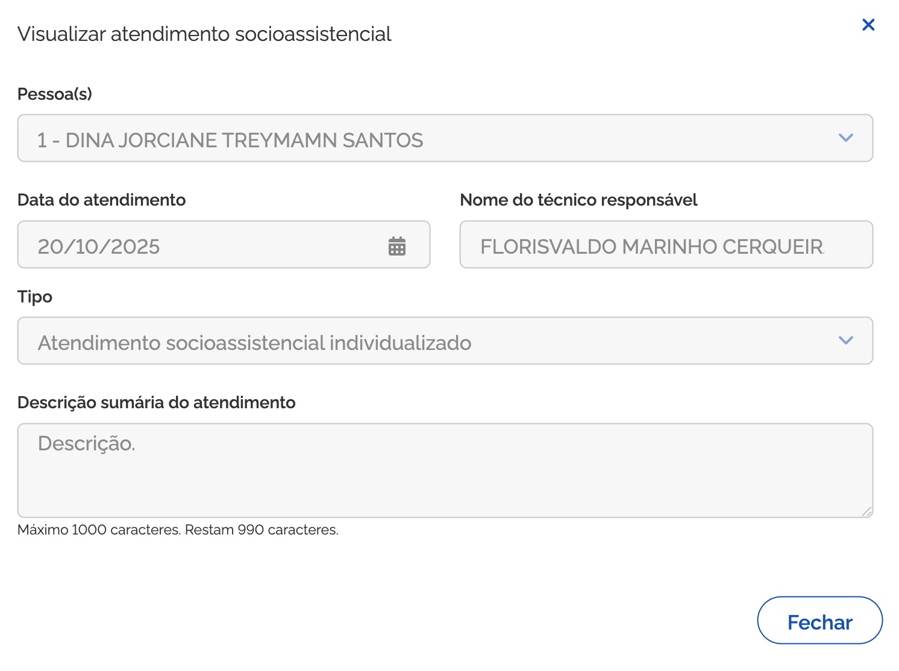

Informe os ajustes e acione a opção <kbd>8</kbd> **Alterar**, em seguida o sistema fecha a janela, atualiza a lista de atendimentos e apresenta a mensagem *"Registro de atendimento alterado com sucesso"*.

A janela <kbd>5</kbd> **Alterar atendimento**, representada na página anterior, contém os seguintes dados:

* **Pessoa(s)** – campo para informar o(s) nome(s) da(s) pessoa(s) atendida(s);
* **Data do atendimento** – campo que informa a data em que o atendimento foi realizado;
* **Nome do técnico responsável** – campo que informa o nome do técnico responsável pelo registro do atendimento no Prontuário Eletrônico;
* **Tipo** – campo que informa o tipo do atendimento socioassistencial realizado;
* **Descrição/ resumo do atendimento** – campo que apresenta informações adicionais ao atendimento;
* **Cancelar** – opção que ao ser acionada, cancela a ação e fecha a janela.
* **Incluir** – opção que, ao ser acionada, salva a alteração realizada para o atendimento.

### Excluir atendimento

Para **excluir o atendimento da lista**, acione a opção <kbd>6</kbd> **Excluir atendimento**, e o sistema solicitará a confirmação da ação. Caso confirmada, o sistema atualiza a lista e apresenta a mensagem *"Registro de atendimento excluído com sucesso"*.

Para **retrair ou reexibir** as informações contidas no bloco, acione o <kbd>7</kbd> **ícone**.

---

## Acesso a benefícios eventuais

Ao acionar o bloco <kbd>1</kbd> **Acesso a benefícios eventuais**, para expandir as informações, você pode consultar, por membro da composição familiar, os benefícios oferecidos e observações complementares.

### Benefícios eventuais concedidos

A <kbd>2</kbd> **lista dos benefícios eventuais concedidos** à família é composta por:

* **Pessoa** – a coluna informa o nome do membro da composição familiar, solicitante do benefício;
* **Benefício** – a coluna informa o benefício solicitado pelo membro da composição familiar;
* **Descrição** - a coluna informa o descritivo do benefício solicitado.
* **Ações** – coluna que exibe ícones para realizar ações, como por exemplo: Visualizar registro.

---

### Incluir benefício eventual

Para **adicionar benefício eventual**, acione a opção <kbd>3</kbd> **Incluir benefício eventual**, então o sistema vai apresentar a janela para cadastro.

Preencha os dados solicitados e acione a opção <kbd>9</kbd> **Incluir**, em seguida o sistema fecha a janela, atualiza a lista de benefícios e apresenta a mensagem *"Benefício eventual incluído com sucesso"*.

---

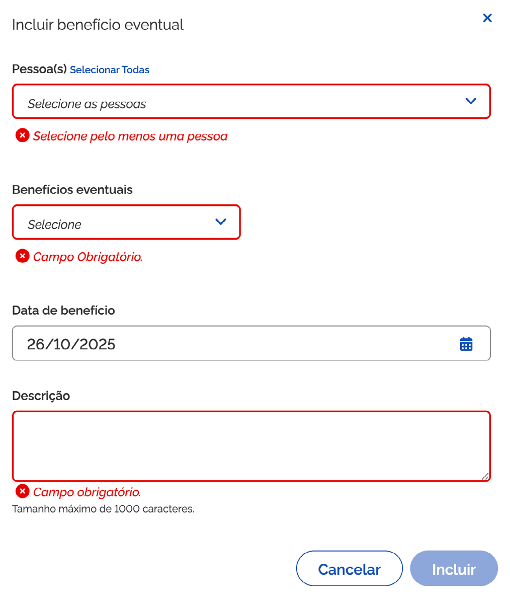

A janela <kbd>3</kbd> **Incluir benefício eventual**, representada na página anterior, contém os seguintes dados:

* **Pessoa(s)** – campo para informar o(s) nome(s) da(s) pessoa(s) atendida(s);
* **Benefício** – campo para informar o(s) benefício(s) concedido(s). As alternativas são:
    * Situação de morte
    * Situação de nascimento
    * Situação de calamidade
    * Situação de vulnerabilidade temporária
* **Descrição** – campo para registrar informações adicionais;
* **Cancelar** – opção que, ao ser acionada, cancela a ação e fecha a janela.
* **Incluir** - opção que ao ser acionada salva o atendimento.

### Visualizar registro do benefício eventual

Para **visualizar o registro do benefício**, acione a opção <kbd>4</kbd> **Visualizar benefício**, então o sistema vai apresentar a janela com as informações.

---

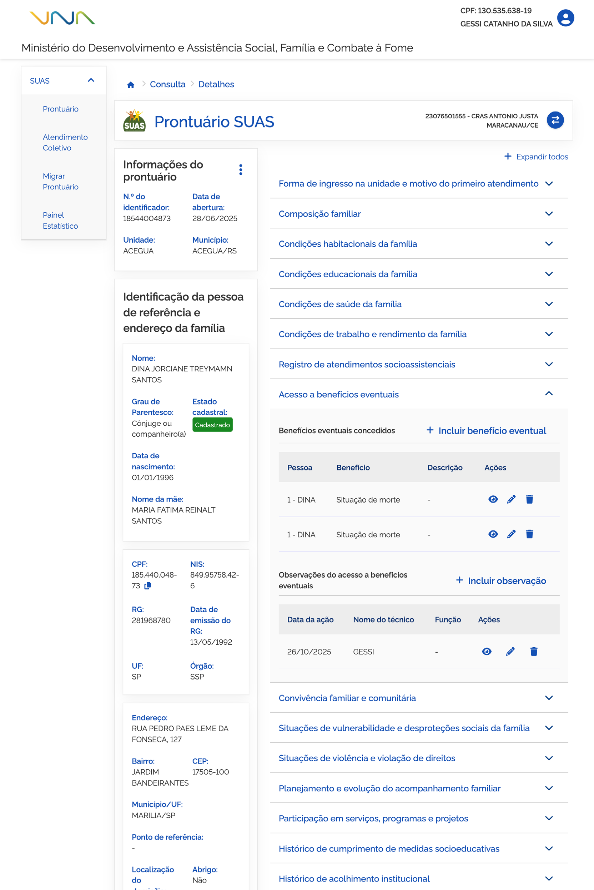

A janela <kbd>4</kbd> **Visualizar benefício eventual**, representada na página anterior, contém os seguintes dados:

* **Pessoa(s)** – campo que informa o(s) nome(s) da(s) pessoa(s) atendida(s);
* **Benefícios eventuais** – campo que informa o(s) benefício(s) eventual(is) concedido(s);
* **Descrição** – campo que apresenta a descrição do(s) benefício(s) concedido(s);
* **Fechar** – opção que, ao ser acionada, fecha a janela.

---

### Editar benefício eventual

Para **editar o registro de benefício eventual**, acione a opção <kbd>5</kbd> **Alterar benefício**, então o sistema vai apresentar a janela com os campos habilitados.

Informe os ajustes e acione a opção <kbd>9</kbd> **Atualizar**, em seguida o sistema fecha a janela, atualiza a lista de benefícios e apresenta a mensagem *"Benefício eventual alterado com sucesso"*.

---

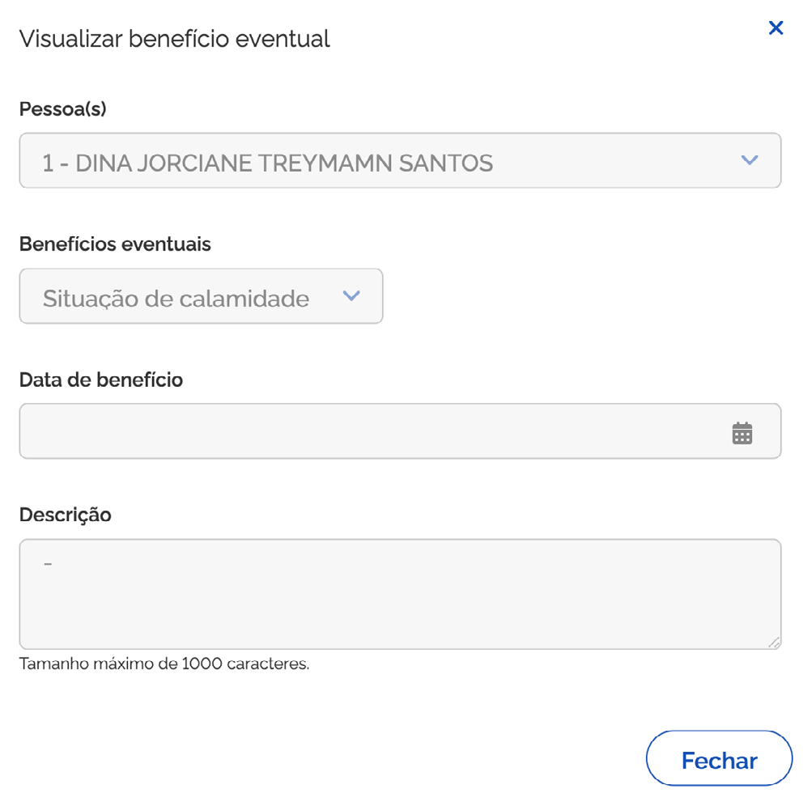

A janela <kbd>5</kbd> **Alterar benefício eventual**, representada na página anterior, contém os seguintes dados:

* **Pessoa(s)** – campo para informar o(s) nome(s) da(s) pessoa(s) atendida(s);
* **Benefícios eventuais** – campo para informar o(s) benefício(s) concedido(s);
* **Descrição** – campo para registrar informações adicionais;
* **Cancelar** – opção que, ao ser acionada, cancela a ação e fecha a janela.
* **Atualizar** – opção que, ao ser acionada, salva a alteração realizada e atualiza a lista.

### Excluir benefício eventual

Para **excluir o benefício da lista**, acione a opção <kbd>6</kbd> **Excluir benefício**, e o sistema solicitará a confirmação da ação. Caso confirmada, o sistema atualiza a lista e apresenta a mensagem *"Benefício eventual excluído com sucesso"*.

### Observações do acesso a benefícios eventuais

Para mais informações sobre o <kbd>7</kbd> **registro de observações**, consulte a página 19 deste manual.

Para **retrair ou reexibir** as informações contidas no bloco, acione o <kbd>8</kbd> **ícone**.

---

## Convivência familiar e comunitária

No bloco <kbd>1</kbd> **Convivência Familiar e Comunitária**, ao expandir as informações, você pode consultar as observações registradas sobre a convivência familiar e comunitária.

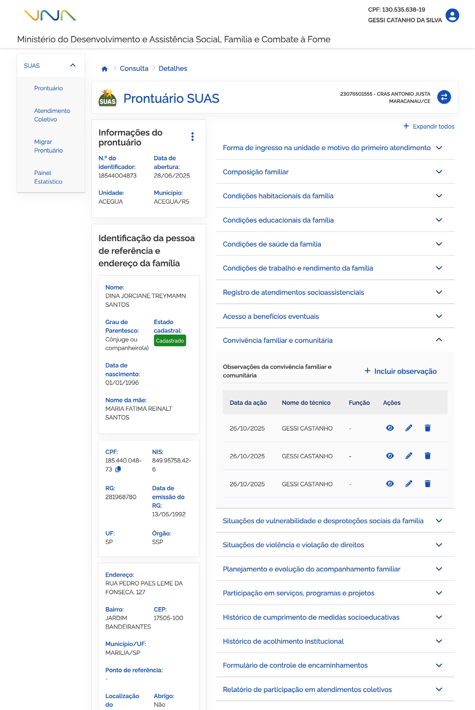

### Observações da convivência familiar e comunitária

Para mais informações sobre o <kbd>2</kbd> **registro de observações**, consulte a página 19 deste manual.

Para **retrair ou reexibir** as informações contidas no bloco, acione o <kbd>3</kbd> **ícone**.

---

## Situações de vulnerabilidades e desproteções sociais da família

No bloco <kbd>1</kbd> **Situações de vulnerabilidades e desproteções sociais da família**, ao expandir as informações, você pode **consultar os indicadores** de vulnerabilidade social identificados para a família.

Os indicadores podem ser gerados automaticamente pelo sistema, com base em informações já registradas ou adicionados manualmente pelo técnico, conforme a escuta e análise técnica realizadas durante o atendimento.

### Indicadores automáticos

Os <kbd>2</kbd> **indicadores automáticos** mostram, de forma rápida, algumas condições que podem representar situações de vulnerabilidade social:

* **Família com pessoas com deficiência** – informa se existe membro da composição familiar com deficiência. As alternativas são:
    * Sim
    * Não
* **Família com pessoa idosa** – informa se existe membro da composição familiar com idade igual ou maior que 60 anos. As alternativas são:
    * Sim
    * Não

---

### Situações de vulnerabilidade e desproteção social da família

A lista <kbd>3</kbd> **Situações de vulnerabilidade e desproteção social da família** apresenta os registros inseridos manualmente pelo técnico responsável, com base na escuta e na análise da realidade familiar. Cada registro contém as seguintes informações:

* **Data da anotação** – mostra a data em que a vulnerabilidade foi registrada ou atualizada.
* **Vulnerabilidade** – indica o tipo de vulnerabilidade identificada para a família.
* **Nome do técnico** – exibe o nome do profissional responsável pelo atendimento e pelo registro das informações.
* **Continua na vulnerabilidade** – informa se a família permanece na situação de vulnerabilidade identificada.

---

### Incluir vulnerabilidade

Para **adicionar uma nova vulnerabilidade**, acione a opção <kbd>4</kbd> **Incluir vulnerabilidade**, então o sistema vai apresentar a janela para cadastro. Preencha os dados solicitados e acione a opção <kbd>11</kbd> **Incluir**, em seguida o sistema salva o registro, fecha a janela, atualiza a lista e apresenta a mensagem *"Situação de vulnerabilidade incluída com sucesso"*.

A janela <kbd>4</kbd> **Situações de vulnerabilidades e desproteções sociais da família**, apresenta os seguintes campos e opções:

* **Data da anotação** – indica a data em que o atendimento foi realizado.
* **Situação** – indica a vulnerabilidade e desproteção social verificada. Valores possíveis:
    * Situação de insegurança alimentar;
    * Situação de vulnerabilidades ou desproteções relacionais;
    * Família com gestante ou criança na primeira infância.
* **Cancelar** – opção que, ao ser acionada, cancela a ação e fecha a janela.
* **Incluir** – opção que, ao ser acionada, salva o registro e atualiza a lista de observações.

---

### Visualizar registro

Para **visualizar o registro de vulnerabilidade**, acione a opção <kbd>5</kbd> **Visualizar vulnerabilidade**, então o sistema vai apresentar a janela com as informações:

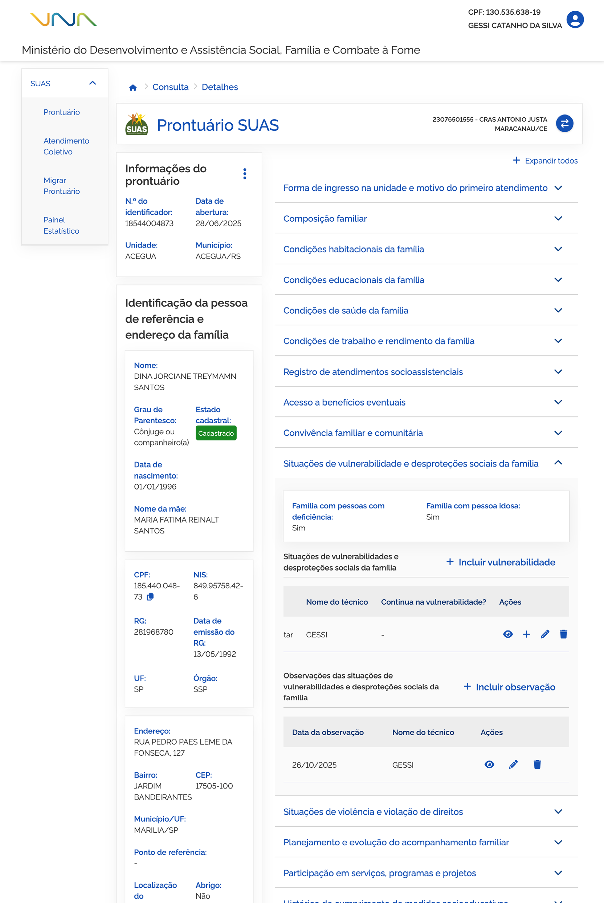

A janela <kbd>5</kbd> **Situações de vulnerabilidades e desproteções sociais da família**, representada acima, apresenta os seguintes campos e opções:

* **Data da anotação** – indica a data em que o atendimento foi realizado.
* **Situação** – indica a vulnerabilidade e desproteção social verificada.
* **Data da atualização** – indica a data em que o registro de vulnerabilidade foi editado.
* **Continua em vulnerabilidade** – indica se a família permanece em situação de vulnerabilidade e desproteção social.
* **Fechar** – opção que, ao ser acionada, fecha a janela.

---

### Editar registro de vulnerabilidade

Para **editar o registro de atualização da lista na janela**, acione a opção <kbd>6</kbd> **Alterar**, então o sistema vai apresentar a janela com as informações registradas anteriormente, permitindo a adição dos dados necessários.

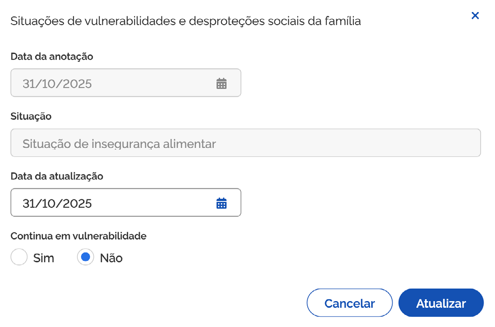

Informe os ajustes e acione a opção <kbd>13</kbd> **Alterar**, em seguida o sistema salva a alteração do registro, atualiza a lista e apresenta a mensagem *"Atualização incluída com sucesso"*.

A janela <kbd>6</kbd> **Situações de vulnerabilidades e desproteções sociais da família**, apresenta os seguintes campos e opções:

* **Data da anotação** – indica a data em que o atendimento foi realizado.
* **Situação** – indica a vulnerabilidade e desproteção social verificada, sem possibilidade de edição.
* **Data da atualização** – campo para inclusão da data em que o registro foi atualizado.
* **Continua em vulnerabilidade** – campo para indicar se a família permanece em situação de vulnerabilidade e desproteção social.
* **Cancelar** – opção que, ao ser acionada, cancela a ação e fecha a janela.
* **Atualizar** – opção que, ao ser acionada, salva a alteração realizada e atualiza a lista.

---

### Excluir registro

Para **excluir o registro** de vulnerabilidade da lista, acione a opção <kbd>8</kbd> **Excluir vulnerabilidade**, e o sistema solicitará a confirmação da ação. Caso confirmada, o sistema atualiza a lista e apresenta a mensagem *"Atualização excluída com sucesso"*.

### Observações das situações de vulnerabilidades e desproteções sociais da família

Para mais informações sobre o <kbd>9</kbd> **registro de observações**, consulte a página 19 deste manual.

Para **retrair ou reexibir** as informações contidas no bloco, acione o <kbd>10</kbd> **ícone**.

---

## Situações de violência e violação de direitos

No bloco <kbd>1</kbd> **Situação de violência e violação de direitos**, ao acionar para expandir as informações, você pode consultar observações de situação de violência e violação de direitos ocorridas com a família ou membro da composição familiar.

### Observações das situações de violência e violação de direitos

Para mais informações sobre o <kbd>2</kbd> **registro de observações**, consulte a página 19 deste manual.

Para **retrair ou reexibir** as informações contidas no bloco, acione o <kbd>3</kbd> **ícone**.

---

## Planejamento e evolução do acompanhamento familiar

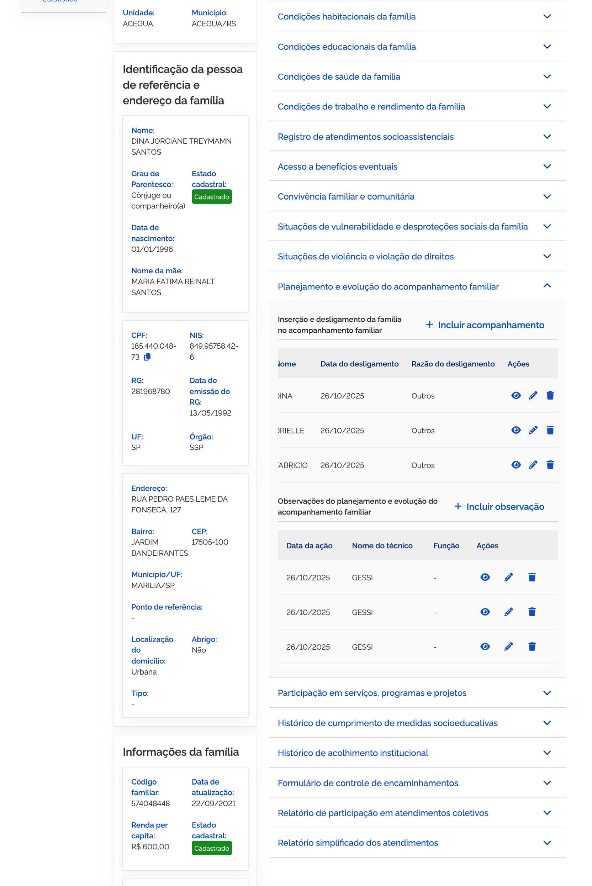

No bloco <kbd>1</kbd> **Planejamento e evolução do acompanhamento familiar**, ao expandir as informações, você pode consultar os registros de acompanhamento da família.

### Inserção e desligamento da família no acompanhamento familiar

A lista <kbd>2</kbd> **Inserção e desligamento da família no acompanhamento familiar**, apresenta as seguintes informações:

* **Data do ingresso** – indica a data em que a composição familiar foi incluída no acompanhamento.
* **Nome** – indica o nome dos membros da composição familiar que estão em acompanhamento.
* **Data do desligamento** – indica a data em que a família foi desvinculada do acompanhamento.
* **Razão do desligamento** – indica o motivo pelo qual a família foi desvinculada do acompanhamento.

---

### Incluir acompanhamento

Para **adicionar a família ao acompanhamento**, acione a opção <kbd>3</kbd> **Incluir acompanhamento**. Então, o sistema vai apresentar a janela para cadastro. Preencha os dados solicitados e acione a opção <kbd>9</kbd> **Incluir**. Em seguida, o sistema salva o registro, fecha a janela, atualiza a lista e apresenta a mensagem *"Acompanhamento familiar incluído com sucesso"*.

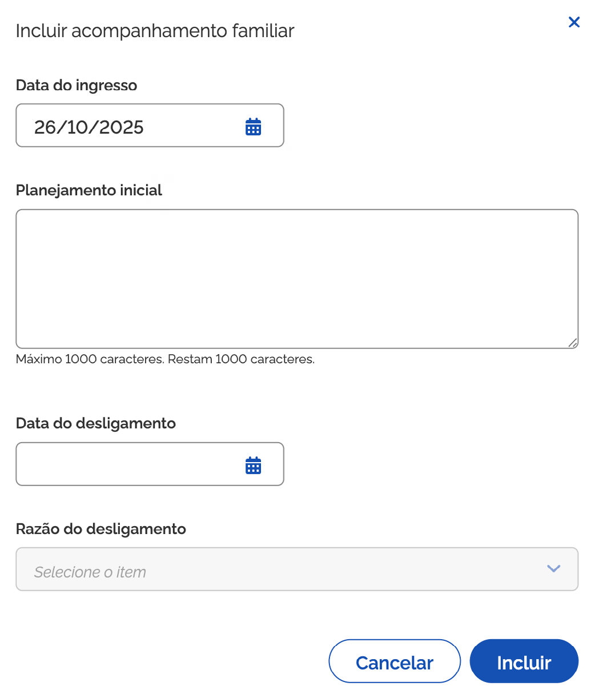

---

A janela <kbd>3</kbd> **Incluir acompanhamento familiar**, apresenta os seguintes campos e opções:

* **Data do ingresso** – indica a data em que a composição familiar foi incluída no acompanhamento.
* **Planejamento inicial** – registra como o técnico pretende organizar e acompanhar as ações planejadas para o atendimento da família, definindo os passos e estratégias que orientarão o acompanhamento.
* **Data do desligamento** – indica a data em que a família foi desvinculada do acompanhamento.
* **Razão do desligamento** – indica o motivo pelo qual a família foi desvinculada do acompanhamento.  
Valores possíveis:
	* Avaliação técnica;
    * Evasão ou recusa da família;
    * Mudança de Município;
    * Outros.
* **Cancelar** – opção que, ao ser acionada, cancela a ação e fecha a janela.
* **Incluir** – opção que, ao ser acionada, salva o registro e atualiza a lista.

---

### Visualizar acompanhamento

Para **visualizar** o registro de acompanhamento da família, acione a opção <kbd>4</kbd> **Visualizar acompanhamento**, então o sistema vai apresentar a janela com as informações:

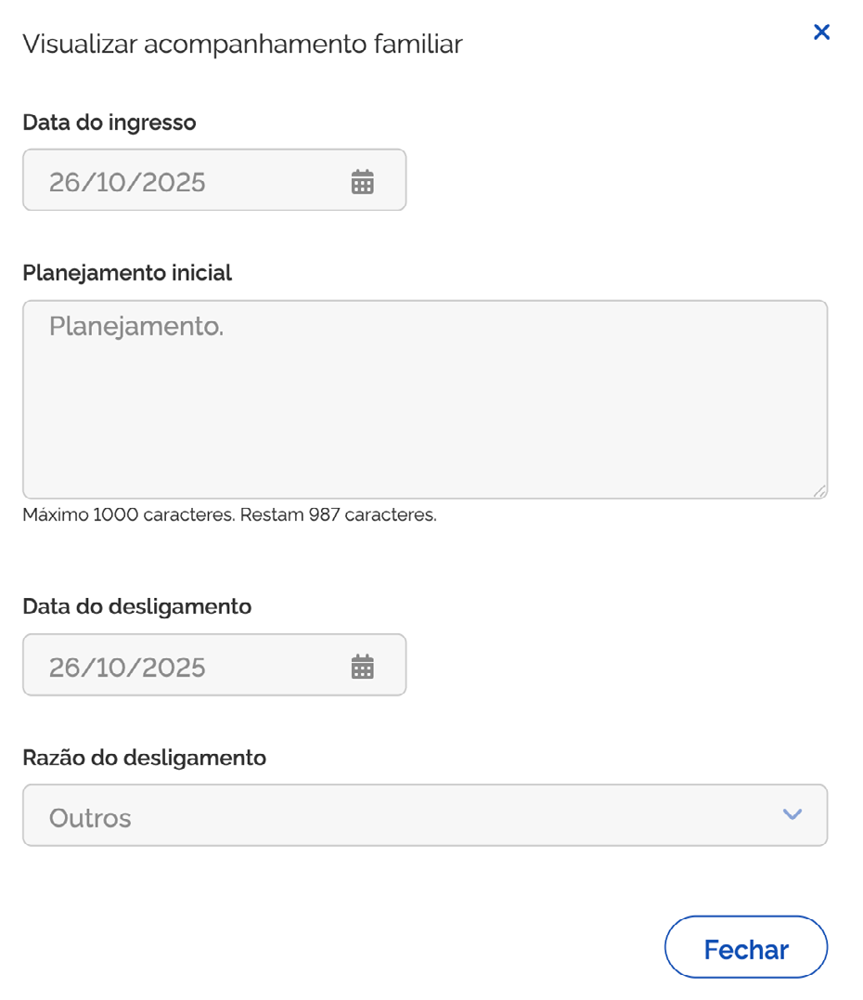

A janela <kbd>4</kbd> **Visualizar acompanhamento familiar**, apresenta os seguintes campos:

* **Data do ingresso** – indica a data em que a composição familiar foi incluída no acompanhamento.
* **Planejamento inicial** – registra como o técnico pretende organizar e acompanhar as ações planejadas para o atendimento da família, definindo os passos e estratégias que orientarão o acompanhamento.
* **Data do desligamento** – indica a data em que a família foi desvinculada do acompanhamento.
* **Razão do desligamento** – indica o motivo pelo qual a família foi desvinculada do acompanhamento.
* **Fechar** – opção que, ao ser acionada, fecha a janela.

### Editar acompanhamento

Para **editar** o registro de acompanhamento da lista, acione a opção <kbd>5</kbd> **Alterar acompanhamento**, então o sistema vai apresentar a janela com as informações registradas anteriormente, permitindo a edição dos dados necessários.

Informe os ajustes e acione a opção <kbd>9</kbd> **Alterar**, em seguida o sistema salva a alteração do registro, fecha a janela, atualiza a lista e apresenta a mensagem *"Acompanhamento familiar alterado com sucesso"*.

---

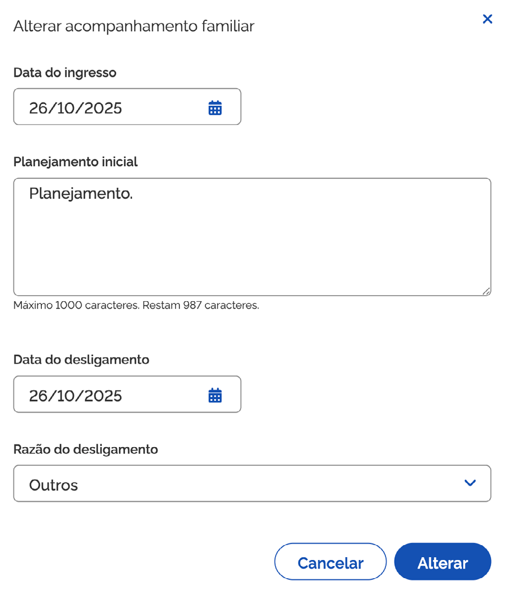

A janela <kbd>5</kbd> **Alterar acompanhamento familiar**, apresenta os seguintes campos e opções:

* **Data do ingresso** – indica a data em que a composição familiar foi incluída no acompanhamento.
* **Planejamento inicial** – registra como o técnico pretende organizar e acompanhar as ações planejadas para o atendimento da família.
* **Data do desligamento** – indica a data em que a família foi desvinculada do acompanhamento.
* **Razão do desligamento** – indica o motivo pelo qual a família foi desvinculada do acompanhamento.
    * Valores possíveis:
        * Avaliação técnica;
        * Evasão ou recusa da família;
        * Mudança de Município;
        * Outros.
* **Cancelar** – opção que, ao ser acionada, cancela a ação e fecha a janela.
* **Atualizar** – opção que, ao ser acionada, salva a alteração realizada e atualiza a lista.

### Excluir acompanhamento

Para **excluir o registro** de acompanhamento familiar da lista, acione a opção <kbd>6</kbd> **Excluir acompanhamento**. O sistema solicitará a confirmação da ação e, caso confirmada, o sistema exclui o registro, atualiza a lista e apresenta a mensagem *"Acompanhamento familiar excluído com sucesso"*.

---

### Observações do planejamento e evolução do acompanhamento familiar

Para mais informações sobre o <kbd>7</kbd> **registro de observações**, consulte a página 19 deste manual.

> **Observação:** As <kbd>7</kbd> **Observações Planejamento e evolução do acompanhamento familiar** estão disponíveis apenas para a equipe técnica de nível superior.

Para **retrair ou reexibir** as informações contidas no bloco, acione o <kbd>8</kbd> **ícone**.

---

## Participação em serviços, programas e projetos

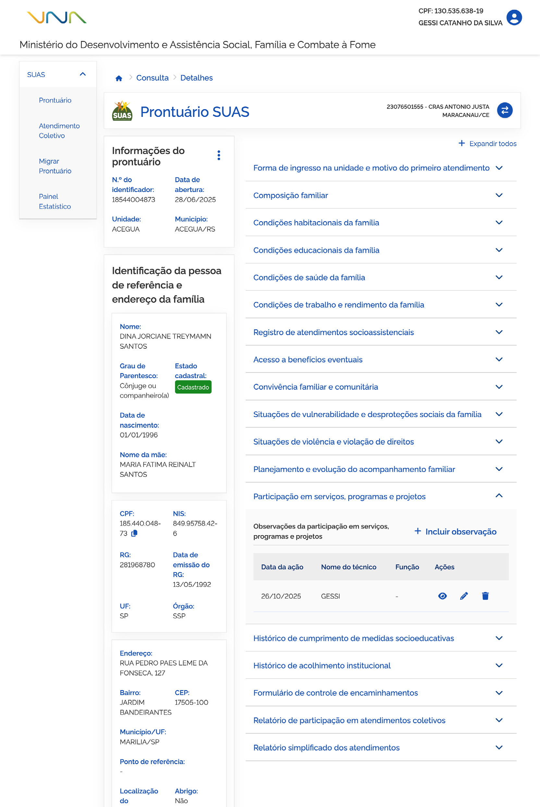

Ao acionar o bloco <kbd>1</kbd> **Participação em serviços, programas e projetos**, para expandir as informações, você pode consultar observações de participação dos membros da família em serviços, programas e projetos.

### Observações da participação em serviços, programas e projetos

Para mais informações sobre o <kbd>2</kbd> **registro de observações**, consulte a página 19 deste manual.

Para **retrair ou reexibir** as informações contidas no bloco, acione o <kbd>3</kbd> **ícone**.

---

## Histórico de cumprimento de medidas socioeducativas

Ao acionar o bloco <kbd>1</kbd> **Histórico de cumprimento de medidas socioeducativas**, para expandir as informações, você pode consultar as medidas socioeducativas para adolescentes (cumpridas e/ou em acompanhamento).

### Medidas Socioeducativas para adolescentes (cumpridas e/ou em acompanhamento)

A <kbd>2</kbd> **lista de medidas socioeducativas para adolescentes (cumpridas e/ou em acompanhamento)** é composta por:

* **Data do atendimento** – coluna que informa a data do atendimento em que foi relatada a medida socioeducativa para o adolescente;
* **Nome** – coluna que informa o nome do adolescente (membro da composição familiar) que está cumprindo e/ ou em acompanhamento de medida socioeducativa;
* **Tipo de medida** – coluna que informa o tipo de medida socioeducativa a ser cumprida;
* **Nome do técnico** – coluna que informa o nome do técnico responsável pelo registro do encaminhamento no Prontuário Eletrônico;
* **Unidade** – coluna que informa o nome da unidade em que o atendimento foi realizado;
* **Ações** – coluna que exibe ícones para realizar ações, como por exemplo: Visualizar registro.

### Incluir medida socioeducativa

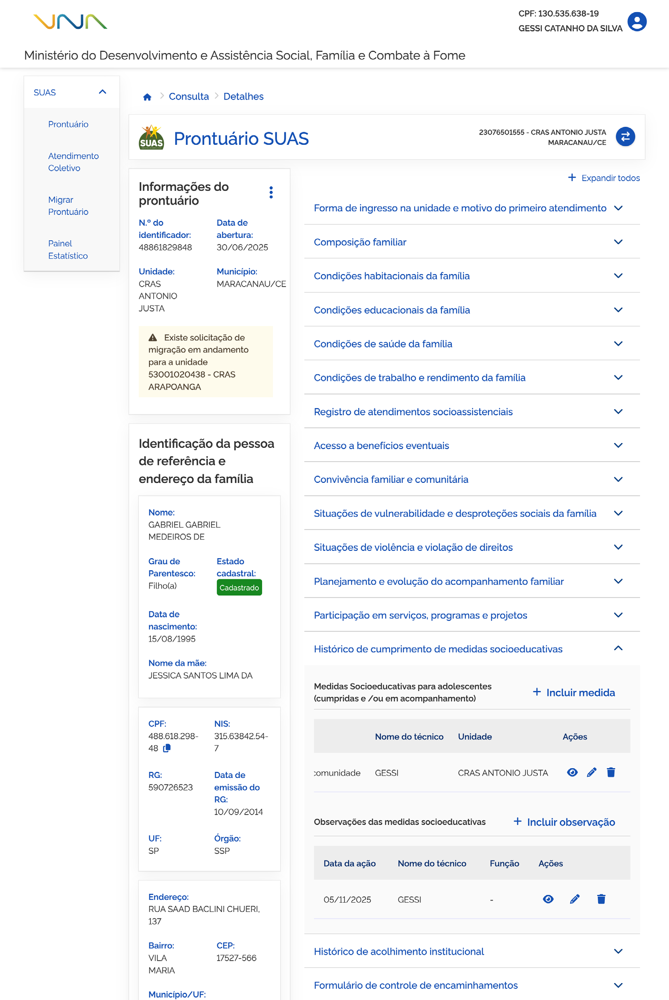

Para adicionar medidas socioeducativas para adolescentes, acione a opção <kbd>3</kbd> **Incluir medida**, então o sistema vai apresentar a janela para cadastro.

Preencha os dados solicitados e acione a opção <kbd>9</kbd> **Incluir**, em seguida o sistema fecha a janela, atualiza a lista de observações e apresenta a mensagem “*Medida socioeducativa incluída com sucesso*”.

A janela <kbd>3</kbd> **Incluir medida socioeducativa**, representada na página anterior, contém os seguintes dados:

* **Pessoa** – campo para informar a pessoa (adolescente) atendida;
* **Número do processo** – campo para informar o número do processo da medida socioeducativa;
* **Nome do técnico responsável** – campo que informa o nome do técnico responsável pelo registro do atendimento;
* **Data de início** – campo para informar a data de início do cumprimento da medida socioeducativa;
* **Data de fim** – campo para informar a data fim do cumprimento da medida socioeducativa;
* **Tipo de medida** – campo para informar o tipo de medida socioeducativa a ser cumprida;
* **Cancelar** – opção que, ao ser acionada, cancela a ação e fecha a janela.
* **Incluir** – opção que, ao ser acionada, salva o atendimento.

### Visualizar medida socioeducativa

Para **visualizar o registro da medida socioeducativa**, acione a opção <kbd>4</kbd> **Visualizar medida**, então o sistema vai apresentar a janela com as informações.

* **Fechar** – opção que, ao ser acionada, fecha a janela.

### Editar medida socioeducativa

Para **editar o registro da medida socioeducativa**, acione a opção <kbd>5</kbd> **Alterar medida**, então o sistema vai apresentar a janela com os campos habilitados.

Informe os ajustes e acione a opção <kbd>9</kbd> **Alterar**, em seguida o sistema fecha a janela, atualiza a lista e apresenta a mensagem “*Medida socioeducativa alterada com sucesso*”.

A janela <kbd>5</kbd> **Alterar medida socioeducativa**, representada na página anterior, contém os seguintes dados:

* **Pessoa** – campo para informar a pessoa (adolescente) atendida;
* **Número do processo** – campo para informar o número do processo da medida socioeducativa;
* **Nome do técnico responsável** – campo que informa o nome do técnico responsável pelo registro do atendimento;
* **Data de início** – campo para informar a data de início do cumprimento da medida socioeducativa;
* **Data de fim** – campo para informar a data fim do cumprimento da medida socioeducativa;
* **Tipo de medida** – campo para informar o tipo de medida socioeducativa a ser cumprida;
* **Cancelar** – opção que, ao ser acionada, cancela a ação e fecha a janela.
* **Alterar** – opção que, ao ser acionada, salva a alteração realizada para o atendimento.

### Excluir medida socioeducativa

Para **excluir o registro de medida socioeducativa**, acione a opção <kbd>6</kbd> **Excluir medida**, e o sistema solicitará a confirmação da ação. Caso confirmada, o sistema atualiza a lista e apresenta a mensagem “*Medida socioeducativa excluída com sucesso*”.

### Observações das medidas socioeducativas

Para mais informações sobre o <kbd>7</kbd> **registro de observações**, consulte a página 19 deste manual.

Para **retrair ou reexibir** as informações contidas no bloco, acione o <kbd>8</kbd> **ícone**.

---

## Histórico de acolhimento institucional

Ao acionar o bloco <kbd>1</kbd> **Histórico de acolhimento institucional**, para expandir as informações, você pode consultar observações do histórico de acolhimento institucional registrado para a família ou membro da composição.

### Observações do histórico de acolhimento institucional

Para mais informações sobre o <kbd>2</kbd> **registro de observações**, consulte a página 19 deste manual.

Para **retrair ou reexibir** as informações contidas no bloco, acione o <kbd>3</kbd> **ícone**.

---

## Formulário de controle de encaminhamentos

Ao acionar o bloco <kbd>1</kbd> **Formulário de controle de encaminhamento**, para expandir as informações, você pode consultar os encaminhamentos registrados para os membros da composição familiar.

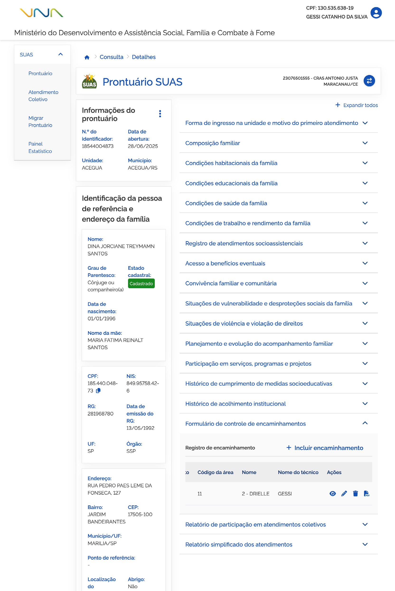

### Registro de encaminhamento

A <kbd>2</kbd> **lista de registro de encaminhamentos** é composta por:

* **Data do encaminhamento** – campo que informa a data do encaminhamento;
* **Código da área** – campo que informa o código da área de encaminhamento;
* **Nome** – campo que informa o membro da composição familiar que foi encaminhado;
* **Nome do técnico** – campo que informa o nome do técnico responsável pelo registro do encaminhamento no Prontuário Eletrônico;
* **Ações** – coluna que exibe ícones para realizar ações, como por exemplo: Visualizar registro.

---

### Incluir encaminhamento

Para adicionar um encaminhamento, acione a opção <kbd>3</kbd> **Incluir encaminhamento**, então o sistema vai apresentar a janela para cadastro.

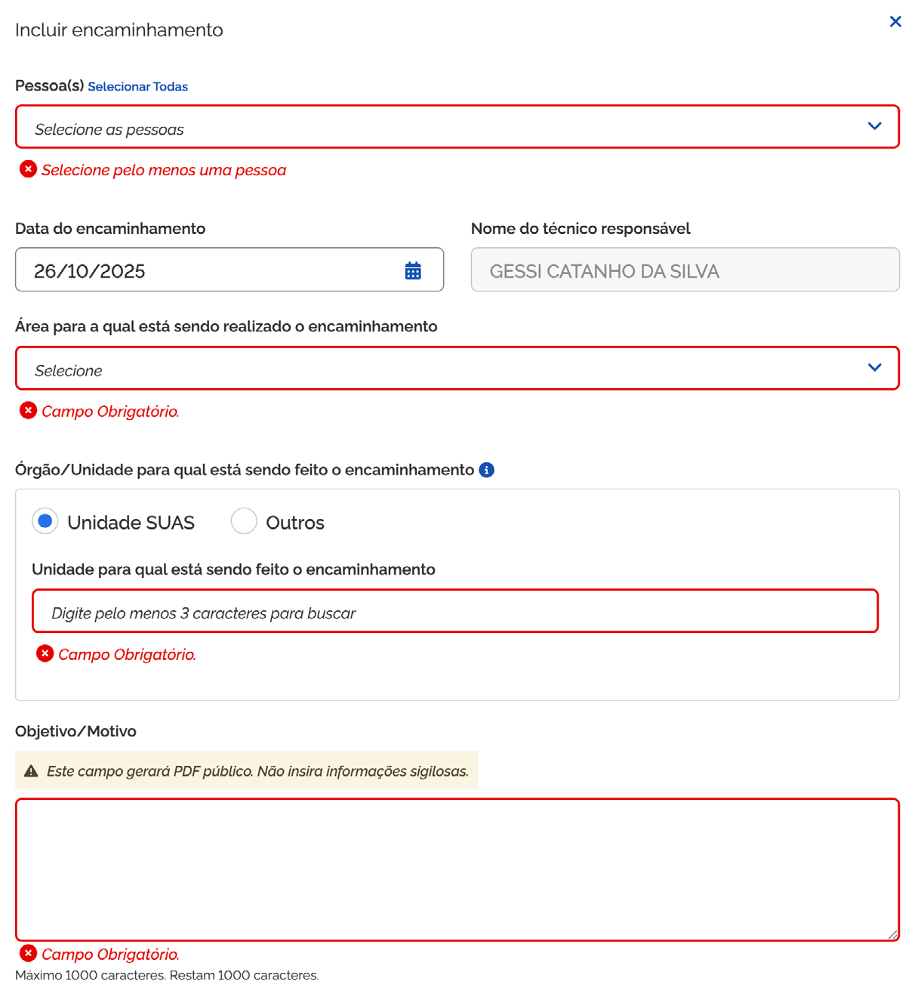

---

Preencha os dados solicitados e acione a opção <kbd>9</kbd> **Incluir**, em seguida o sistema fecha a janela, atualiza a lista de encaminhamentos e apresenta a mensagem “*Encaminhamento incluído com sucesso*”.

A janela <kbd>3</kbd> **Incluir encaminhamento**, representada na página anterior, contém os seguintes dados:

* **Pessoa(s)** – campo para informar o(s) nome(s) da(s) pessoa(s) atendida(s);
* **Data do encaminhamento** – campo para informar a data em que o atendimento foi realizado;
* **Nome do técnico responsável** – campo que informa o nome do técnico responsável pelo registro do atendimento;
* **Área para a qual está sendo realizado o encaminhamento** – campo para informar a área para a qual a(s) pessoa(s) está(ão) sendo encaminhada(s). As alternativas são:
    * 5 - Para Serviços de Convivência e Fortalecimento de Vínculos voltados a crianças e adolescentes
    * 6 - Para Serviços de Convivência e Fortalecimento de Vínculos voltados para idosos
    * 7 - Para atualização cadastral no CadÚnico (inclusive quando realizada nesta própria Unidade)
    * 8 - Para inclusão no CadÚnico (inclusive quando realizada nesta própria Unidade)
    * 9 - Para o INSS, visando acesso ao BPC

---

* 10 - Para o INSS, visando acesso a outros direitos, que não o BPC
* 11 - Para acesso a Benefícios Eventuais
* 12 - Para acesso a Documentação Civil (Certidão de Nascimento, RG, Carteira de Trabalho, etc)
* 13 - Encaminhamento do CRAS para o CREAS (marcação exclusiva para o CRAS)
* 14 - Encaminhamento do CREAS para o CRAS (marcação exclusiva para o CRAS)
* 15 - Encaminhamento para outras unidades/serviços de Proteção Social Especial
* 30 - Para Serviços de Saúde Bucal (por exemplo: Brasil Sorridente)
* 31 - Para Serviços de Saúde Mental
* 32 - Para Serviços de Saúde voltados ao acesso de órteses e próteses para pessoas com deficiência
* 33 - Para Unidades de Saúde da Família
* 34 - Para outros serviços ou unidades do Sistema Único de Saúde
* 40 - Para Educação – Creche e Pré-escola (ensino infantil)
* 41 - Para Educação – Rede regular de ensino (ensino fundamental e ensino médio)

---

* 42 - Para Educação de Jovens Adultos (por exemplo: Brasil Alfabetizado)
* 50 - Para Serviços, Programas ou Projetos voltados à capacitação profissional
* 51 - Para Serviços, Programas ou Projetos voltados à geração de trabalho e renda
* 52 - Para Serviços, Programas ou Projetos voltados à intermediação de mão-de-obra
* 53 - Para acesso a microcrédito
* 54 - Para o Programa BPC-Trabalho
* 55 - Para o Programa ACESSUAS Trabalho
* 60 - Para programa da área de habitação
* 61 - Para acesso à Tarifa Social de Energia Elétrica
* 70 - Para Conselho Tutelar
* 71 - Para Poder Judiciário
* 72 - Para Ministério Público
* 73 - Para Defensoria Pública
* 74 - Para Delegacias (especializadas ou não)
* 85 - Outros encaminhamentos (código livre, a ser utilizado conforme interesse específico de cada município)
* 86 - Outros encaminhamentos (código livre, a ser utilizado conforme interesse específico de cada município)

---

* 87 - Outros encaminhamentos (código livre, a ser utilizado conforme interesse específico de cada município)
* 88 - Outros encaminhamentos (código livre, a ser utilizado conforme interesse específico de cada município)
* 89 - Outros encaminhamentos (código livre, a ser utilizado conforme interesse específico de cada município)
* **Órgão/Unidade para para qual está sendo feito o encaminhamento** – campo para informar o órgão para o qual a(s) pessoa(s) está(ão) sendo encaminhada(s);
* **Unidade para a qual está sendo feito o encaminhamento** – campo para informar a unidade para a qual está sendo feito o encaminhamento;
* **Outros** – campo para informar o órgão para o qual está sendo feito o encaminhamento;
* **Objetivo/ motivo** – campo para informar o objetivo/ motivo do encaminhamento;
* **Cancelar** – opção que, ao ser acionada, cancela a ação e fecha a janela.
* **Incluir** – opção que, ao ser acionada, salva a alteração realizada para o atendimento.

---

### Visualizar encaminhamento

Para visualizar o encaminhamento, acione a opção <kbd>4</kbd> **Visualizar encaminhamento**, então o sistema vai apresentar a janela com as informações.

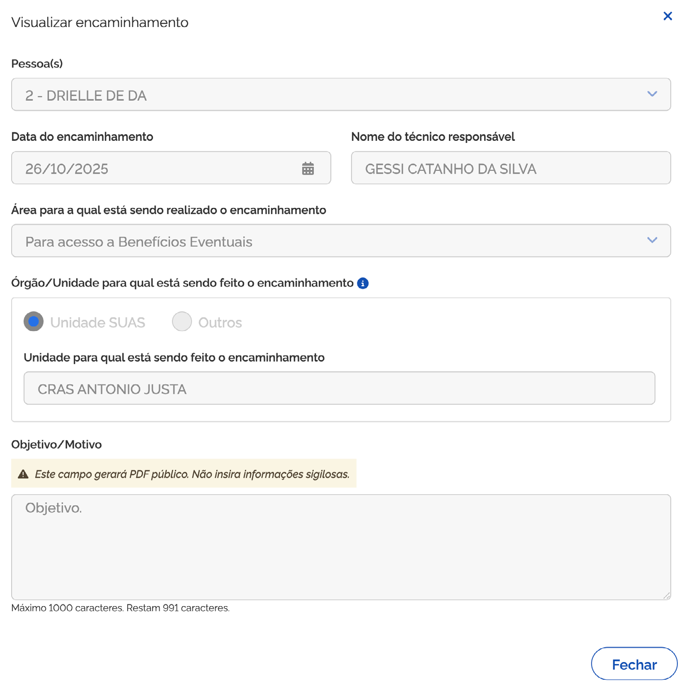

---

A janela <kbd>4</kbd> **Visualizar encaminhamento**, representada na página anterior, contém os seguintes dados:

* **Pessoa(s)** – campo para informar o(s) nome(s) da(s) pessoa(s) atendida(s);
* **Data do encaminhamento** – campo para informar a data em que o atendimento foi realizado;
* **Nome do técnico responsável** – campo que informa o nome do técnico responsável pelo registro do atendimento;
* **Área para a qual está sendo realizado o encaminhamento** – campo para informar a área para a qual a(s) pessoa(s) está(ão) sendo encaminhada(s);
* **Órgão/Unidade para para qual está sendo feito o encaminhamento** – campo para informar o órgão para o qual a(s) pessoa(s) está(ão) sendo encaminhada(s);
* **Unidade para a qual está sendo feito o encaminhamento** – campo para informar a unidade para a qual está sendo feito o encaminhamento;
* **Outros** – campo para informar o órgão para o qual está sendo feito o encaminhamento;
* **Objetivo/ motivo** – campo para informar o objetivo/ motivo do encaminhamento;
* **Fechar** – opção que, ao ser acionada, fecha a janela.

---

### Editar encaminhamento

Para editar o encaminhamento, acione a opção <kbd>5</kbd> **Alterar encaminhamento**, então o sistema vai apresentar a janela com os campos habilitados.

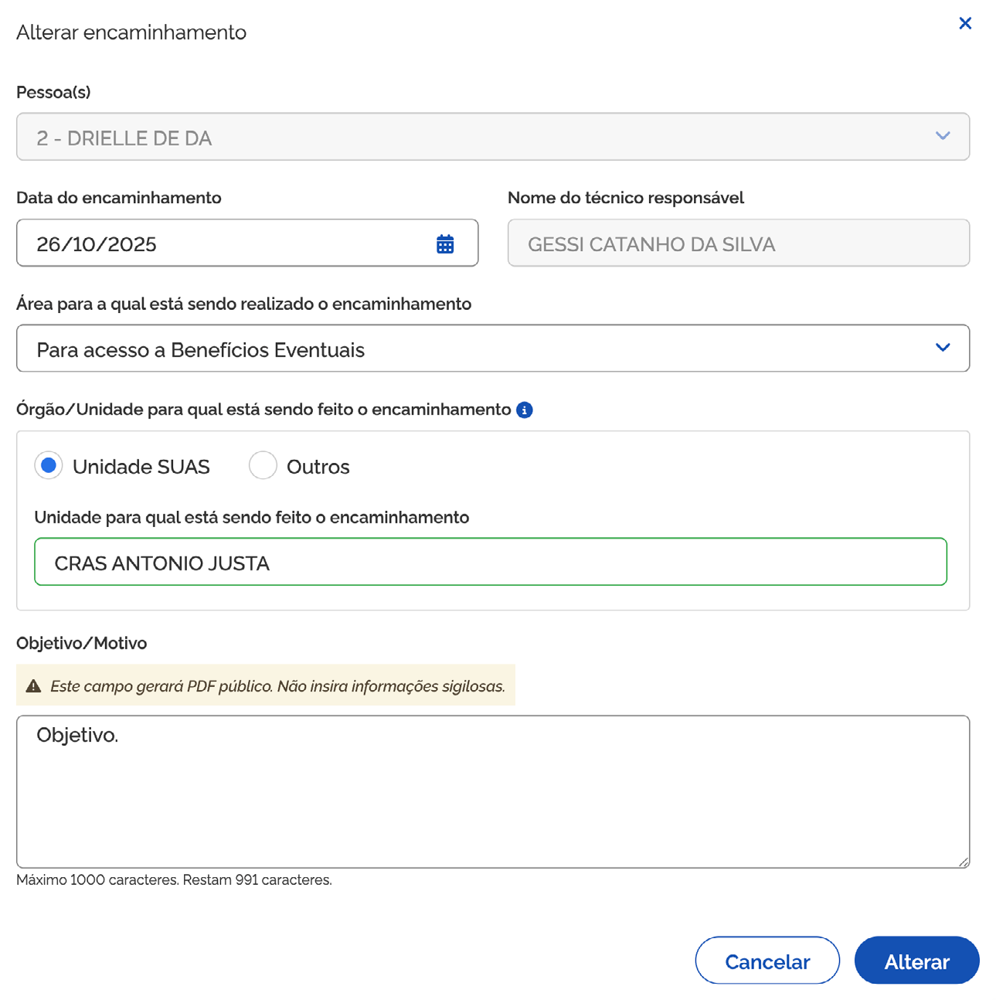

---

Informe os ajustes e acione a opção <kbd>9</kbd> **Alterar**, em seguida o sistema fecha a janela, atualiza a lista e apresenta a mensagem “*Encaminhamento alterado com sucesso*”.

A janela <kbd>5</kbd> **Alterar encaminhamento**, representada na página anterior, contém os seguintes dados:

* **Pessoa** – campo para informar o(s) nome(s) da(s) pessoa(s) atendida(s);
* **Data do encaminhamento** – campo para informar a data em que o atendimento foi realizado;
* **Nome do técnico responsável** – campo que informa o nome do técnico responsável pelo registro do atendimento;
* **Área para a qual está sendo realizado o encaminhamento** – campo para informar a área para a qual a(s) pessoa(s) está(ão) sendo encaminhada(s);
* **Órgão/ Unidade para para qual está sendo feito o encaminhamento** – campo para informar o órgão para o qual a(s) pessoa(s) está(ão) sendo encaminhada(s);
* **Unidade para a qual está sendo feito o encaminhamento** – campo para informar a unidade para a qual está sendo feito o encaminhamento;
* **Outros** – campo para informar o órgão para o qual está sendo feito o encaminhamento;
* **Objetivo/ motivo** – campo para informar o objetivo/ motivo do encaminhamento;
* **Cancelar** – opção que, ao ser acionada, cancela a ação e fecha a janela.

---

* **Alterar** – opção que, ao ser acionada, salva a alteração realizada para o atendimento.

### Excluir encaminhamento

Para excluir o registro de encaminhamento, acione a opção <kbd>6</kbd> **Excluir encaminhamento**, e o sistema solicitará a confirmação da ação. Caso confirmada, o sistema atualiza a lista e apresenta a mensagem “*Encaminhamento excluído com sucesso*”.

Para gerar o PDF do encaminhamento, acione a opção <kbd>7</kbd> **Gerar PDF**, o sistema apresenta a mensagem “*PDF gerado com sucesso*” e disponibiliza o arquivo do encaminhamento em outra aba do navegador.

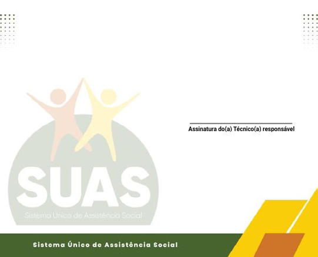

Para retrair ou reexibir as informações contidas no bloco, acione o <kbd>8</kbd> **ícone**.

---

## Relatório de participação em atendimentos coletivos

Ao acionar o bloco <kbd>1</kbd> **Relatório de participação em atendimentos coletivos**, para expandir as informações, você pode consultar os encaminhamentos registrados para os membros da composição familiar.

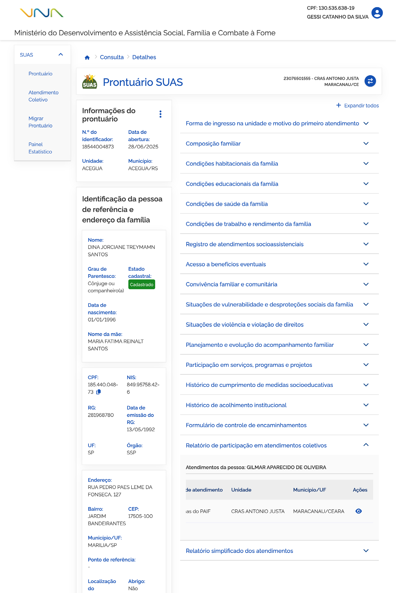

### Atendimentos da pessoa

A <kbd>2</kbd> **lista atendimentos da pessoa** é composta por:

* **Data do atendimento** – campo que informa a data do atendimento da pessoa;
* **Tipo de atendimento** – campo que informa o tipo de atendimento ofertado à pessoa;
* **Unidade** – campo que informa a unidade em que foi realizado o atendimento;
* **Município/UF** – campo que informa o município em que se localiza a Unidade;
* **Ações** – coluna que exibe ícone para realizar a ação Visualizar.

### Visualizar atendimento

Para **visualizar o atendimento coletivo**, acione a opção <kbd>3</kbd> **Visualizar atendimento coletivo**, então o sistema vai apresentar a janela com as informações.

---

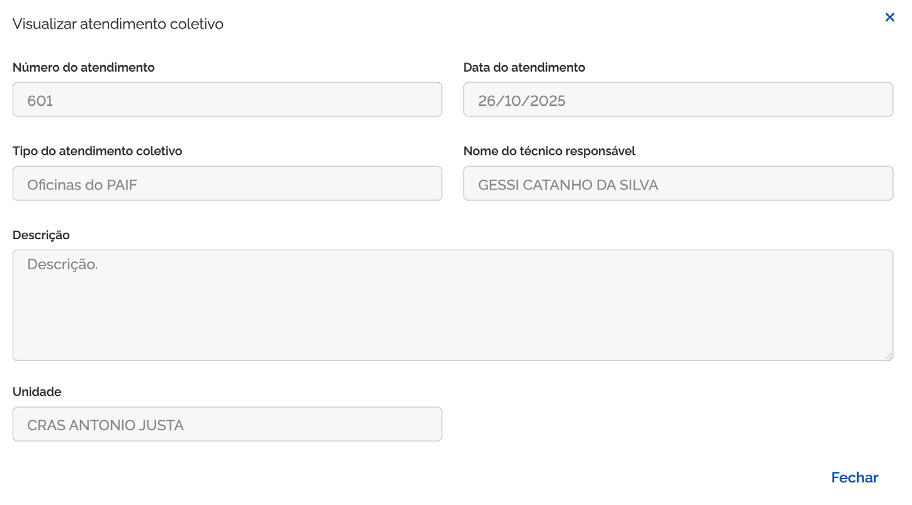

A janela <kbd>3</kbd> **Visualizar atendimento** contém os seguintes dados:

* **Número do atendimento** – campo que informa o número do atendimento coletivo;
* **Data do atendimento** – campo para informar a data em que o atendimento foi realizado;
* **Tipo do atendimento coletivo** – campo que informa o tipo de atendimento coletivo ofertado para a pessoa ou a família;
* **Nome do técnico responsável** – campo que informa o nome do técnico responsável pelo registro do atendimento;
* **Descrição** – campo que informa a descrição do atendimento coletivo;

---

* **Unidade** – campo que informa o nome da unidade de atendimento;
* **Fechar** – opção que, ao ser acionada, fecha a janela.

Para **retrair ou reexibir** as informações contidas no bloco, acione o <kbd>4</kbd> **ícone**.

---

## Relatório simplificado dos atendimentos

Ao acionar o bloco <kbd>1</kbd> **Relatório simplificado dos atendimentos**, para expandir as informações, você pode consultar os atendimentos coletivos ao qual a família participou.

### Atendimentos da pessoa

A <kbd>2</kbd> **lista atendimentos da pessoa** é composta por:

* **Data do atendimento** – coluna que informa a data do atendimento individual ou coletivo em que o membro da composição familiar ou a família participou;
* **Tipo de atendimento** – coluna que informa o tipo de atendimento recebido pelo membro da composição familiar ou pela família;
* **Descrição** – campo que descreve o tipo de atendimento recebido;
* **Unidade** – coluna que informa o nome da unidade em que o atendimento foi realizado;
* **Nome do técnico** – campo que informa o nome do técnico responsável pelo atendimento;
* **Município/ UF** – coluna que informa o município e o estado onde a unidade de atendimento está localizada;

Para **retrair ou reexibir** as informações contidas no bloco, acione o <kbd>3</kbd> **ícone**.

---

# Prontuário: Atendimento Coletivo

---

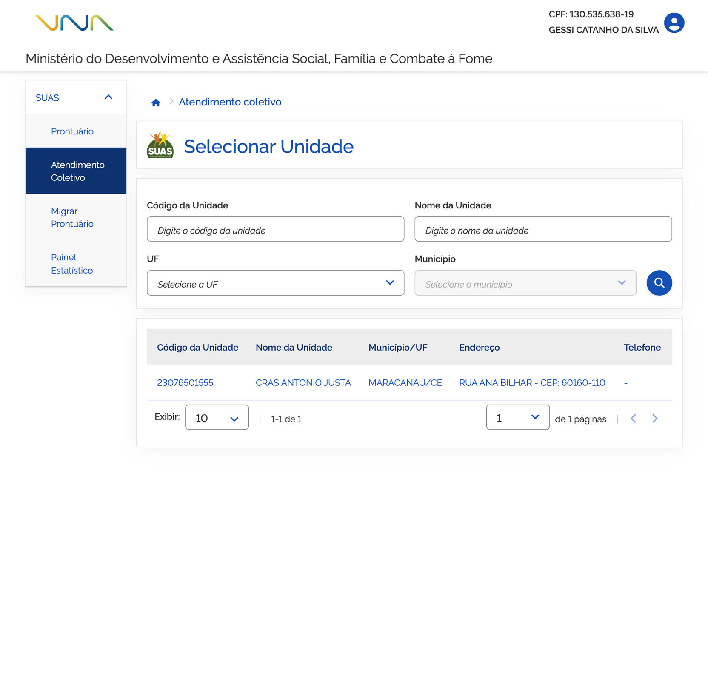

---

### Atendimento coletivo

Para visualizar ou realizar o atendimento coletivo de uma pessoa ou família, acione o menu <kbd>1</kbd> **Atendimento Coletivo**.

### Selecionar unidade

O sistema apresentará a funcionalidade <kbd>2</kbd> **Selecionar unidade**, listando todas as unidades atribuídas ao usuário conforme perfil (CadSUAS).

A <kbd>3</kbd> **lista de atendimento coletivo** é composta por:

* **Código da Unidade** – coluna que apresenta o código da unidade de atendimento;
* **Nome da Unidade** – coluna que informa o nome da unidade de atendimento;
* **Município/UF** – coluna que informa o município e o estado de localização da unidade de atendimento;
* **Endereço** – coluna que informa o endereço da unidade de atendimento;
* **Telefone** – coluna que informa o telefone da unidade de atendimento.

O refinamento da lista de resultado de unidades pode ser feito informando os parâmetros e acionando a opção <kbd>4</kbd> **Pesquisar**.

Para visualizar ou adicionar atendimento coletivo, acione o <kbd>5</kbd> **registro na lista**.

---

### Atendimento coletivo

### Lista de atendimentos coletivos

O sistema apresentará a funcionalidade **Atendimento Coletivo** com a <kbd>6</kbd> **lista de atendimentos coletivos** realizados pela unidade.

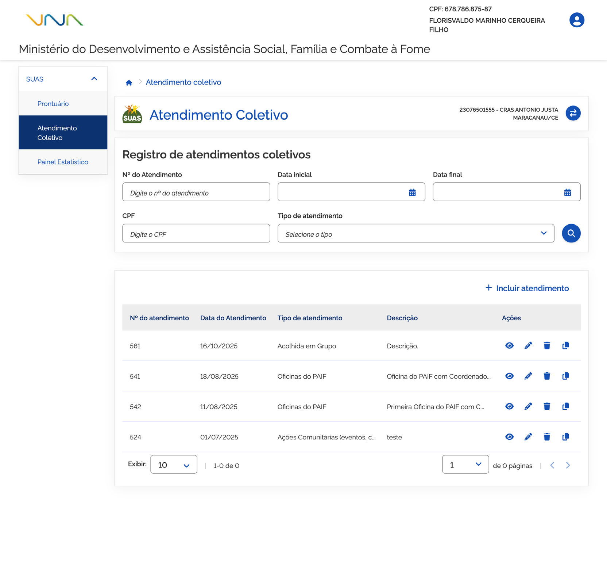

A lista de atendimento coletivo é composta por:

* **N.º do atendimento** – campo que informa o número do atendimento coletivo;
* **Data do Atendimento** – campo que informa a data em que o atendimento coletivo foi adicionado ou atualizado;
* **Tipo de atendimento** – campo que informa o tipo de atendimento coletivo ofertado para a pessoa ou a família;
* **Descrição** – campo que informa a descrição do atendimento coletivo;
* **Ações** – coluna que exibe ícones para realizar ações, como por exemplo: Visualizar registro.

### Incluir atendimento coletivo

Para **adicionar um atendimento coletivo**, acione a opção <kbd>7</kbd> **Incluir atendimento**, então o sistema vai apresentar a janela para cadastro.

Preencha os dados solicitados e acione a opção <kbd>12</kbd> **Incluir**, em seguida o sistema fecha a janela, atualiza a lista de atendimento coletivo da unidade e apresenta a mensagem “*Atendimento coletivo incluído com sucesso*”.

---

### Atendimento coletivo

A janela <kbd>7</kbd> **Incluir atendimento coletivo** contém os seguintes dados:

* **CPF** – campo para informar o CPF da pessoa atendida;
* **Buscar pessoa** – opção que ao ser acionada busca a pessoa na base de dados do cadastro único;
* **Nome** – campo que informa o nome da pessoa atendida;

---

* **Adicionar pessoa** – opção que ao ser acionada adiciona a pessoa na lista de pessoas atendidas;
* **Excluir** – opção que ao ser acionada exclui a pessoa da lista de pessoas atendidas;
* **Data do atendimento** – campo para informar a data em que o atendimento foi realizado;
* **Nome do técnico responsável** – campo que informa o nome do técnico responsável pelo registro do atendimento;
* **Tipo de atendimento coletivo** – campo para informar o tipo de atendimento coletivo a ser ofertado. As alternativas são:
    * Oficinas;
    * Acolhida coletiva;
    * Ações comunitárias;
    * Rodas de conversa;
    * Arranjos participativos.
* **Domínio** – oficinas do PAIF; Acolhida em Grupo; Ações Comunitárias (eventos, campanhas temáticas e rodas de conversa);
* **Descrição** – campo para informar a descrição do atendimento;
* **Unidade** – campo que informa o nome da unidade de atendimento;
* **Cancelar** – opção que, ao ser acionada, cancela a ação e fecha a janela.
* **Incluir** – opção que, ao ser acionada, salva o atendimento.

---

### Atendimento coletivo

### Visualizar atendimento coletivo

Para **visualizar o atendimento coletivo**, acione a opção <kbd>8</kbd> **Visualizar atendimento coletivo** na coluna ação, então o sistema vai apresentar a janela com as informações.

---

A janela <kbd>8</kbd> **Visualizar atendimento coletivo**, representada na página anterior, contém os seguintes dados:

* **CPF** – coluna que informa o CPF da(s) pessoa(s) atendida(s);
* **Nome** – coluna que informa o nome da(s) pessoa(s) atendida(s);
* **Data do atendimento** – campo que informa a data em que o atendimento foi realizado;
* **Nome do técnico responsável** – campo que informa o nome do técnico responsável pelo registro do atendimento;
* **Tipo de atendimento coletivo** – campo que informa o tipo de atendimento coletivo ofertado;
* **Descrição** – campo que informa a descrição do atendimento;
* **Unidade** – campo que informa o nome da unidade de atendimento;
* **Fechar** – opção que, ao ser acionada, fecha a janela.

---

### Atendimento coletivo

### Editar atendimento coletivo

Para **editar o registro de atendimento coletivo**, acione a opção <kbd>9</kbd> **Alterar atendimento coletivo** na coluna ação, então o sistema vai apresentar a janela com os campos habilitados.

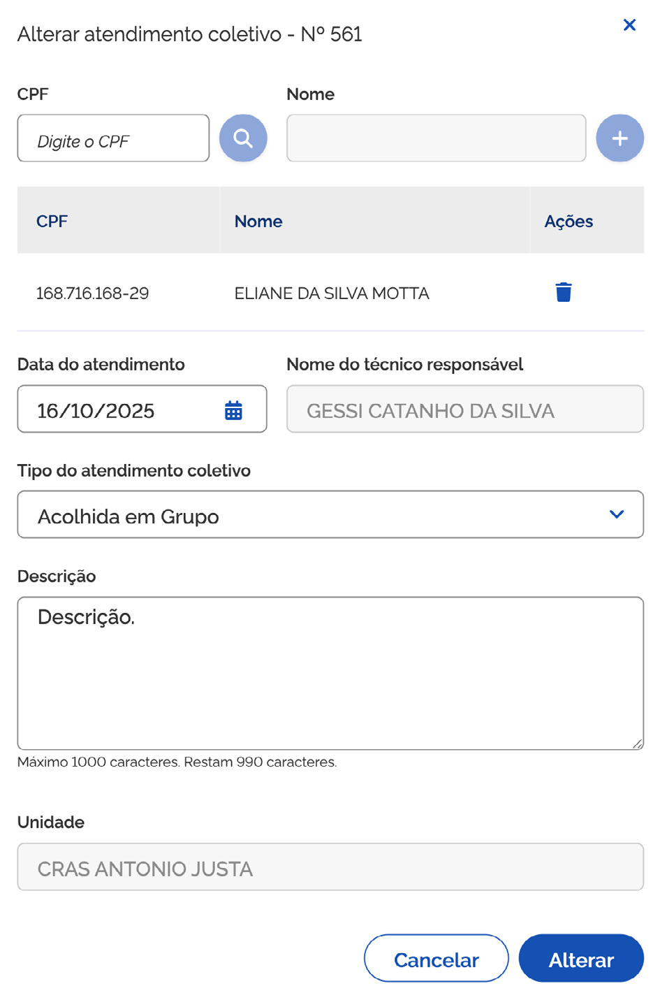

---

Informe os ajustes e acione a opção <kbd>13</kbd> **Alterar**, em seguida o sistema fecha a janela, atualiza a lista e apresenta a mensagem “*Atendimento coletivo alterado com sucesso*”.

A janela <kbd>9</kbd> **Alterar atendimento coletivo**, representada na página anterior, possui os seguintes campos:

* **CPF** - campo para informar o CPF da pessoa atendida;
* **Buscar pessoa** – opção que ao ser acionada busca a pessoa na base de dados do cadastro único;
* **Nome** – campo que informa o nome da pessoa atendida;
* **Adicionar pessoa** – opção que ao ser acionada adiciona a pessoa na lista de pessoas atendidas;
* **Excluir** - opção que ao ser acionada exclui a pessoa da lista de pessoas atendidas;
* **Data do atendimento** – campo para informar a data em que o atendimento foi realizado;
* **Nome do técnico responsável** – campo que informa o nome do técnico responsável pelo registro do atendimento;
* **Tipo de atendimento coletivo** – campo para informar o tipo de atendimento coletivo a ser ofertado. As alternativas são:
    * Oficinas;
    * Acolhida coletiva;
    * Ações comunitárias;
    * Rodas de conversa;
    * Arranjos participativos.

---

* **Descrição** – campo para informar a descrição do atendimento;
* **Unidade** – campo que informa o nome da unidade de atendimento;
* **Cancelar** – opção que, ao ser acionada, cancela a ação e fecha a janela.
* **Alterar** – opção que, ao ser acionada, salva a alteração realizada para o atendimento.

### Excluir atendimento coletivo

Para **excluir o registro de atendimento coletivo**, acione a opção <kbd>10</kbd> **Excluir atendimento coletivo**, e o sistema solicitará a confirmação da ação. Caso confirmada, o sistema atualiza a lista e apresenta a mensagem “*Atendimento coletivo excluído com sucesso*”.

### Duplicar atendimento coletivo

Para **duplicar o registro de atendimento coletivo**, acione a opção <kbd>11</kbd> **Clonar atendimento coletivo** na coluna ação, então o sistema vai apresentar a janela com os campos habilitados.

Informe os ajustes e acione a opção <kbd>12</kbd> **Incluir**, em seguida o sistema fecha a janela, atualiza a lista e apresenta a mensagem “*Atendimento coletivo alterado com sucesso*”.

---

### Atendimento coletivo

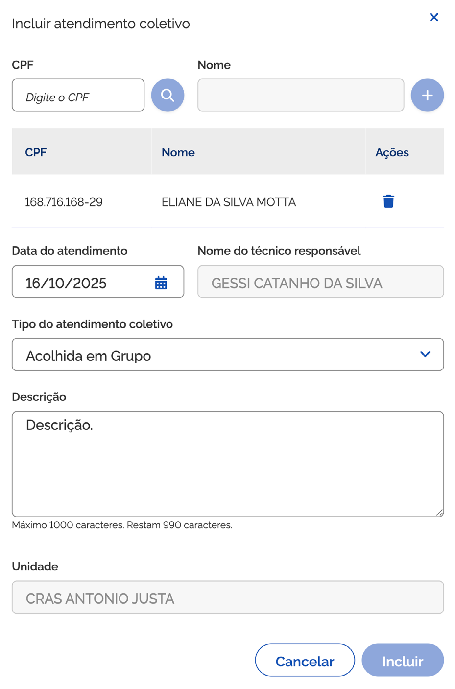

A janela <kbd>11</kbd> **Incluir atendimento coletivo** possui os seguintes campos:

* **CPF** – campo para informar o CPF da pessoa atendida;
* **Buscar pessoa** – opção que ao ser acionada busca a pessoa na base de dados do cadastro único;

---

* **Nome** – campo que informa o nome da pessoa atendida;
* **Adicionar pessoa** – opção que ao ser acionada adiciona a pessoa na lista de pessoas atendidas;
* **Excluir** - opção que ao ser acionada exclui a pessoa da lista de pessoas atendidas;
* **Data do atendimento** – campo para informar a data em que o atendimento foi realizado;
* **Nome do técnico responsável** – campo que informa o nome do técnico responsável pelo registro do atendimento;
* **Tipo de atendimento coletivo** – campo para informar o tipo de atendimento coletivo a ser ofertado. As alternativas são:
    * Oficinas;
    * Acolhida coletiva;
    * Ações comunitárias;
    * Rodas de conversa;
    * Arranjos participativos.
* **Descrição** – campo para informar a descrição do atendimento;
* **Unidade** – campo que informa o nome da unidade de atendimento;
* **Cancelar** – opção que, ao ser acionada, cancela a ação e fecha a janela.
* **Incluir** - opção que, ao ser acionada, salva a alteração realizada para o atendimento.

---

# Prontuário: Migrar Prontuário

---

### Migrar Prontuário

Para visualizar a situação da solicitação de migração de prontuário feito para a Unidade ou realizar a análise de solicitações feitas por outras Unidades, acione o menu <kbd>1</kbd> **Migrar Prontuário**. O sistema apresentará a funcionalidade <kbd>2</kbd> **Selecionar unidade**, listando todas as unidades atribuídas ao usuário conforme perfil (CadSUAS).

A <kbd>3</kbd> **lista de unidades de atendimento** é composta por:

- **Código da Unidade** – coluna que apresenta o código da unidade de atendimento;
- **Nome da Unidade** – coluna que informa o nome da unidade de atendimento;
- **Município/ UF** – coluna que informa o município e UF de localização da unidade de atendimento;
- **Endereço** – coluna que informa o endereço da unidade de atendimento;
- **Telefone** – coluna que informa o telefone da unidade de atendimento.

O refinamento da lista de resultado de unidades pode ser feito informando os parâmetros e acionando a opção <kbd>4</kbd> **Pesquisar**.

Para visualizar solicitações realizadas ou analisar solicitações recebidas, <kbd>5</kbd> **acione o registro na lista**.

---

### Migrar Prontuário

### Aprovação de pedido de migração

O sistema apresentará a funcionalidade <kbd>6</kbd> **Aprovação de pedido de migração** com a lista de prontuários aguardando análise.

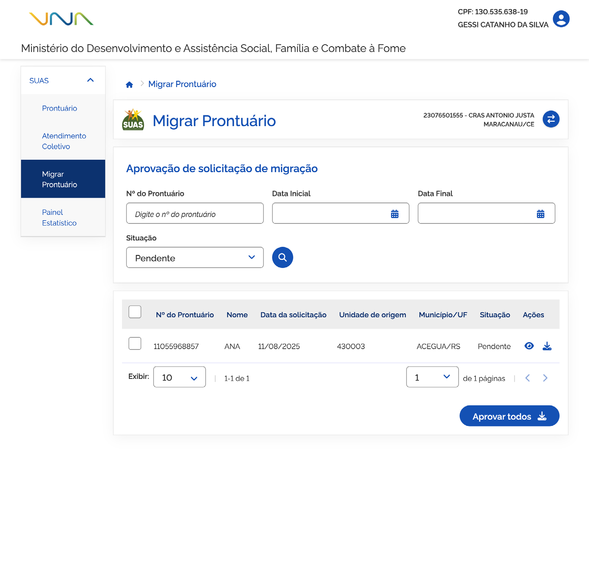

A <kbd>7</kbd> **lista de solicitação de migração de prontuário eletrônico** é composta por:

- **N.º do prontuário** – coluna que informa o número do prontuário eletrônico da pessoa;
- **Nome** – coluna que informa o nome da pessoa vinculada ao prontuário eletrônico;
- **Data da solicitação** – coluna que informa a data da solicitação da migração do prontuário eletrônico;
- **Unidade de origem** – coluna que informa o código da unidade de origem do prontuário eletrônico;
- **Município/ UF** – coluna que informa o município e uf da unidade de origem do prontuário eletrônico;
- **Situação** – coluna que informa a situação da solicitação da migração do prontuário eletrônico;
- **Ações** – coluna que apresenta as opções:
  - Visualizar;
  - Aprovar migração.

### Visualizar solicitação de migração

Para visualizar solicitação de migração, acione a opção <kbd>8</kbd> **Visualizar** na coluna ações, então o sistema vai apresentar a janela com as informações.

---

### Migrar Prontuário

A janela <kbd>8</kbd> **Visualizar solicitação de migração** de prontuário eletrônico é composta por:

### Informações do prontuário

- **N.º do prontuário** – campo que informa o número do prontuário da pessoa;

---

- **Data de abertura** – campo que informa a data da abertura do prontuário da pessoa;
- **Unidade atual** – campo que informa o nome da unidade de atendimento atual;
- **Município** – campo que informa o município e estado da unidade de atendimento atual;

### Identificação da pessoa de referência e endereço da família

- **Nome** – campo que informa o nome da pessoa;
- **CPF** – campo que informa o número do CPF da pessoa;
- **Grau de parentesco** – campo que informa o grau de parentesco da pessoa em relação ao responsável familiar;
- **Situação cadastral** – campo que informa o código da família;
- **Código familiar** – campo que informa o código da família;
- **Data de nascimento** – campo que informa a data de nascimento da pessoa;
- **Nome da mãe** – campo que informa o nome da mãe da pessoa;
- **NIS** – campo que informa o número de identificação social – NIS da pessoa;
- **RG** – campo que informa o número do registro geral - RG (também conhecido como carteira de identidade) da pessoa;
- **Data de emissão do RG** – campo que informa a data de emissão do registro geral;
- **Órgão** – campo que informa o órgão expedidor do registro geral;
- **UF** – campo que informa o estado do órgão expedidor;

---

- **Endereço** – campo que informa o endereço da residência da pessoa/ família;
- **Bairro** – campo que informa o bairro da residência da pessoa/ família;
- **Município/UF** – campo que informa o município/ UF da residência da pessoa/ família;
- **CEP** – campo que informa o número do CEP da residência da pessoa/ família;
- **Motivo** – campo para informar o motivo da solicitação de migração do prontuário da pessoa/ família;
- **Nome do técnico responsável** – campo que informa o nome do técnico responsável pela migração;
- **Situação** – campo que informa a situação da solicitação de migração do prontuário;
- **Prosseguir para aprovação** – opção que ao ser acionada, apresenta a janela <kbd>9</kbd> **Aprovar migração**;
- **Fechar** – opção que, ao ser acionada, fecha a janela.

---

### Migrar Prontuário

### Aprovar migração

Para aprovar a migração, acione a opção <kbd>9</kbd> **Prosseguir para aprovação** na janela <kbd>8</kbd> **Visualizar solicitação de migração** ou na coluna ações.

---

A janela <kbd>9</kbd> **Aprovar migração**, representada na página anterior, de prontuário eletrônico é composta por:

- **Texto informativo** - “_Ao confirmar a operação, o prontuário da pessoa e demais membros da família serão migrados para uma unidade de destino._”

### Informações do Prontuário

- **N.º do prontuário** – campo que informa o número do prontuário da pessoa;
- **Data de abertura** – campo que informa a data da abertura do prontuário da pessoa;
- **Unidade atual** – campo que informa o nome da unidade de atendimento atual;
- **Município** – campo que informa o município e estado da unidade de atendimento atual;

### Identificação da pessoa de referência e endereço da família

- **Nome** – campo que informa o nome da pessoa;
- **CPF** – campo que informa o número do CPF da pessoa;
- **Grau de parentesco** – campo que informa o grau de parentesco da pessoa em relação ao responsável familiar;
- **Situação cadastral** – campo que informa o código da família;
- **Código familiar** – campo que informa o código da família;
- **Data de nascimento** – campo que informa a data de nascimento da pessoa;
- **Nome da mãe** – campo que informa o nome da mãe da pessoa;
- **NIS** – campo que informa o número de identificação social – NIS da pessoa;

---

- **RG** – campo que informa o número do registro geral - RG (também conhecido como carteira de identidade) da pessoa;
- **Data de emissão do RG** – campo que informa a data de emissão do registro geral;
- **Órgão** – campo que informa o órgão expedidor do registro geral;
- **UF** – campo que informa o estado do órgão expedidor;
- **Endereço** – campo que informa o endereço da residência da pessoa/ família;
- **Bairro** – campo que informa o bairro da residência da pessoa/ família;
- **Município/UF** – campo que informa o município/ UF da residência da pessoa/ família;
- **CEP** – campo que informa o número do CEP da residência da pessoa/ família;
- **Motivo** – campo para informar o motivo da solicitação de migração do prontuário da pessoa/ família;
- **Nome do técnico responsável** – campo que informa o município/ UF da residência da pessoa/ família;
- **Aprovar (Sim/ Não)** – campo para informar o resultado da avaliação da solicitação de migração do prontuário;
- **Observação** – campo para informar observações referentes a aprovação ou rejeição da solicitação de migração do prontuário.
- **Cancelar** – opção que, ao ser acionada, cancela a ação e fecha a janela;
- **Confirmar** – opção que, ao ser acionada, salva o resultado da análise da solicitação de migração do prontuário.

---

### Migrar Prontuário

### Aprovar todos

Para aprovar todas as solicitações de migração pendentes, acione a opção <kbd>10</kbd> **Aprovar todos**. O sistema apresentará a janela.

---

A janela <kbd>10</kbd> **Aprovar migração** de prontuário eletrônico é composta por:

- **Texto informativo** - “_Ao confirmar a operação, o prontuário da pessoa e demais membros da família serão migrados para a unidade de destino._”
- **Confirma a aprovação de todas as (quantidade de pessoas) encontradas?** – campo que confirma a aprovação dos registros em situação pendente;
- **Observação** – campo aberto para adição de observação;
- **Cancelar** – opção que, ao ser acionada, cancela a ação e fecha a janela;
- **Confirmar** – opção que, ao ser acionada, salva a solicitação de aprovação selecionada.

---

# Prontuário: Painel Estatístico

---

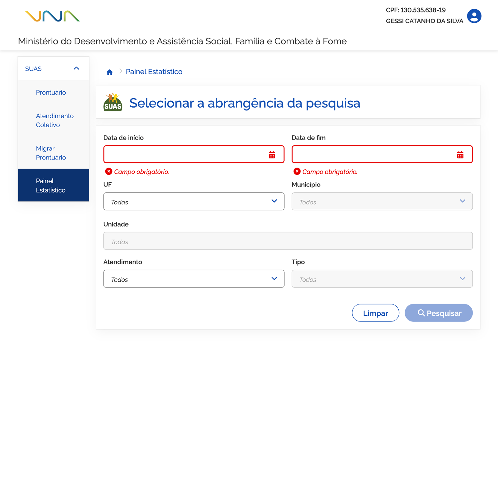

---

### Painel Estatístico

Para acessar o Painel Estatístico, vá até o menu SUAS e selecione o submenu <kbd>1</kbd> **Painel Estatístico**.

Nessa tela, o sistema exibirá os filtros de pesquisa que permitem definir os parâmetros da consulta e gerar os painéis de atendimento.

### Selecionar a abrangência da pesquisa

Preencha os campos conforme as informações que deseja visualizar:

* **Data de início** – campo para informar a data de início do período que deseja consultar; (campo obrigatório)
* **Data de fim** – campo para informar a data final do período da consulta; (campo obrigatório)
* **UF** – campo para informar a unidade da federação referente aos dados que deseja visualizar;
* **Município** – campo para informar o município das Unidades que serão consultadas, conforme uf escolhida no campo anterior;
* **Unidade** – campo para informar uma ou mais unidades para compor o painel;
* **Atendimento** – campo para informar o tipo de atendimento a ser consultado. As alternativas são:
    * Todos;
    * Atendimentos Particularizados;
    * Atendimento Coletivo;
    * Benefícios Eventuais;
    * Encaminhamentos;

---

* Comprimento Histórico de Medidas Socioeducativas;
* Acompanhamento Familiar.
* **Tipo** – coluna para informar o tipo específico de atendimento, conforme escolhido no campo anterior.

### Ações disponíveis

* **Limpar** – opção que ao ser acionada, limpa as informações preenchidas e permanece na mesma tela;
* **Pesquisar** – opção que ao ser acionada, realiza a busca dos atendimentos realizados no período, de acordo com os parâmetros informados, e exibe o Painel Estatístico correspondente.

Quanto mais específicos forem os filtros aplicados, mais precisos serão os resultados apresentados nos painéis. Uma vez indicados os filtros, acione a opção <kbd>2</kbd> **Pesquisar**, e o sistema apresentará o Painel estatístico referente à pesquisa indicada.

---

### Painel Estatístico

O <kbd>3</kbd> **Total de atendimentos** é o indicador que apresenta a quantidade de atendimentos realizados nas unidades selecionadas durante o período informado.

### Sexo

O agrupamento <kbd>4</kbd> **Sexo** traz dados referentes ao sexo dos cidadãos atendidos. Apresenta a quantidade de pessoas atendidas, classificadas por sexo (masculino e feminino), nas unidades selecionadas durante o período informado.

Esse dado permite visualizar de forma clara o perfil de atendimento por gênero, facilitando o acompanhamento e a análise das ações realizadas. O gráfico apresenta as seguintes categorias:

* Homem;
* Mulher.

### Raça/cor

O agrupamento <kbd>7</kbd> **Raça/ Cor** traz dados referentes à raça e cor dos cidadãos atendidos. Esse indicador exibe a quantidade de pessoas atendidas, classificadas por raça/cor nas unidades selecionadas dentro do período informado. O gráfico apresenta as seguintes categorias:

* Branca;
* Preta;
* Amarela;
* Parda;
* Indígena.

Esse indicador auxilia na análise do perfil étnico-racial do público atendido, contribuindo para o planejamento e a implementação de políticas mais inclusivas e equitativas.

---

### Painel Estatístico

### Faixa etária

O agrupamento <kbd>6</kbd> **Faixa Etária** traz dados referentes à faixa etária das pessoas atendidas. Esse indicador mostra a **quantidade de atendimentos**, organizados por **faixa etária**. O gráfico apresenta as seguintes categorias:

* 0 a 6 anos
* 7 a 12 anos
* 13 a 15 anos
* 16 a 17 anos
* 18 a 59 anos
* 60 anos ou mais

Essas informações permitem compreender o perfil etário do público atendido, auxiliando no planejamento e na execução de ações voltadas a cada faixa de idade.

### GPTE

O agrupamento <kbd>7</kbd> **GPTE** traz dados referentes ao Grupo Populacional Tradicional e Específicos das pessoas atendidas. Esse indicador mostra a **quantidade de pessoas atendidas**, classificadas por grupo populacional nas **unidades selecionadas** durante o **período informado**. O gráfico apresenta as seguintes categorias:

* Família Atingida por Empreendimentos de Infraestrutura;
* Desalojados ou desabrigados;
* Família de Catadores de Material Reciclável;
* Família Quilombola;
* Família Indígena;

---

* Família em Situação de Rua;
* Família de pescadores artesanais;
* Família Cigana;
* Família Acampada;
* Família pertencente à comunidade de terreiro;
* Família Ribeirinha;
* Família Assentada da Reforma Agrária;
* Família de Preso do Sistema Carcerário;
* Família beneficiária do Crédito Fundiário;
* Família de Agricultores Familiares.

Esse dado contribui para o **monitoramento da inclusão e da diversidade social**, fortalecendo a atenção a públicos prioritários nas políticas públicas.

### Recebe BF

O agrupamento <kbd>8</kbd> **Recebe PBF** traz dados referentes às pessoas atendidas que fazem parte do Programa Bolsa Família. Esse indicador apresenta as **pessoas atendidas que são beneficiárias do Programa Bolsa Família**.

Mostra a **quantidade de atendimentos realizados** com participantes do programa, considerando as **unidades selecionadas** e o **período informado**.

* Está no PBF;
* Não está no PBF.

---

### Painel Estatístico

O agrupamento <kbd>9</kbd> **Recebe BPC** traz dados referentes às pessoas atendidas que recebem o auxílio BPC. Esse indicador mostra as **pessoas atendidas que recebem o Benefício de Prestação Continuada (BPC)**.

O indicador demonstra a **quantidade de beneficiários atendidos**, conforme as **unidades selecionadas** e o **período informado**.

* Recebe o BPC;
* Não recebe o BPC.

### Baixar informações do painel

Ao selecionar a opção <kbd>10</kbd> **Baixe as informações do painel**, o sistema realiza o **download de um arquivo** (formato CSV) com os dados detalhados **apresentados nos indicadores**.

Utilize a exportação para análises mais aprofundadas ou para integrar os dados com relatórios e planilhas externas.

---
