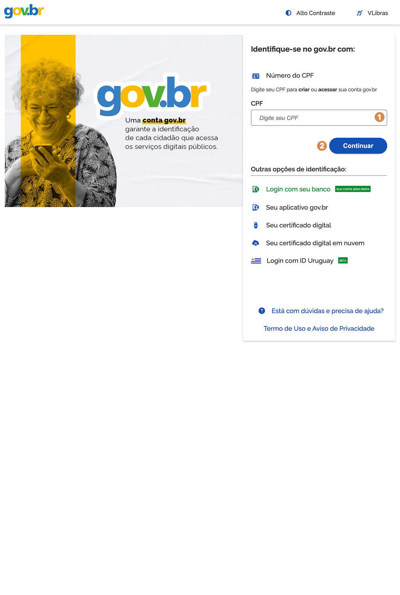

# Login no sistema

O _login_ do sistema é realizado por meio das contas ouro ou prata do sistema gov.br. A conta é gratuita e permite a identificação do usuário para acessar serviços digitais do governo federal.

1. Na tela do _login_ gov.br, informe o número do CPF (número pessoal e único de 11 dígitos), senha e acione a opção <kbd>2</kbd> **Continuar**.

O sistema apresenta a tela Autorização de uso de dados pessoais:

Ao <kbd>3</kbd> **autorizar** o uso dos dados pessoais, o sistema apresenta a janela para seleção da unidade de atendimento e o perfil que você deseja conectar. Ao informar os dados, acione a opção <kbd>4</kbd> **Confirmar**:

---

## Login no sistema (Continuação)

Ao confirmar, o sistema do prontuário eletrônico apresenta a tela inicial conforme permissões atribuídas ao usuário e perfil no CadSUAS.

Uma vez realizada a autenticação no sistema, você pode verificar <kbd>1</kbd> **no canto superior da tela inicial**, o CPF, o nome e o _avatar_ do usuário logado.

Ao acionar o <kbd>2</kbd> **ícone do avatar**, é possível verificar a <kbd>3</kbd> **unidade de atendimento** e o <kbd>4</kbd> **perfil**. Nesta funcionalidade, também é possível <kbd>5</kbd> **trocar de perfil** (caso o usuário possua mais de um perfil) ou <kbd>6</kbd> **sair do sistema** (_logout_).

Do lado esquerdo da tela, você pode visualizar o <kbd>7</kbd> **menu principal** (SUAS) e o(s) <kbd>8</kbd> **submenu(s)**.

---
