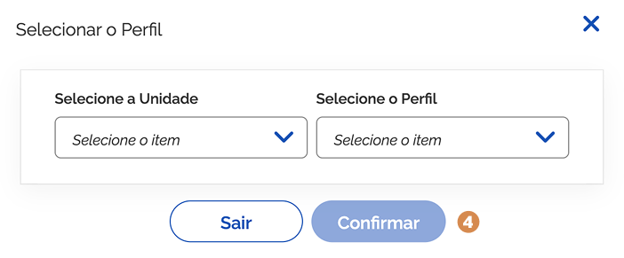
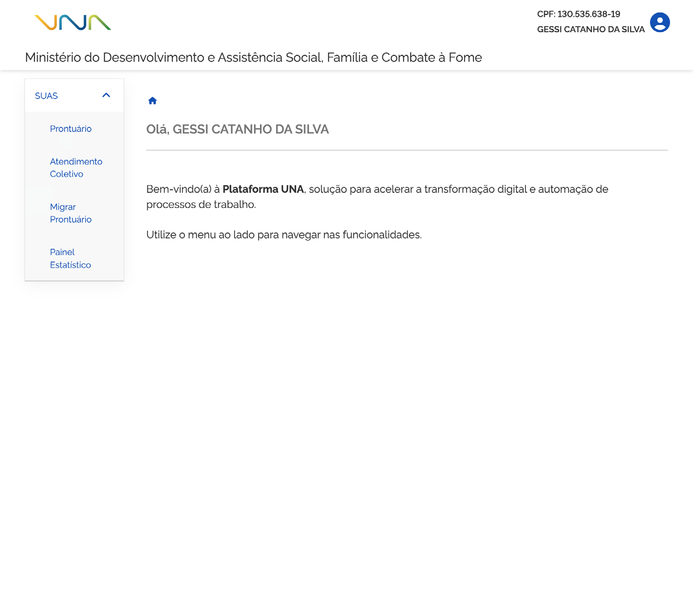
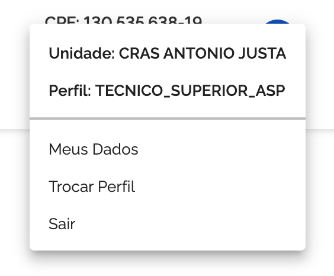

# Login no sistema

O login do sistema é realizado por meio das contas ouro ou prata do sistema **gov.br**. A conta é gratuita e permite a identificação do usuário para acessar serviços digitais do governo federal.

1. Na tela do login gov.br, informe o número do CPF <kbd>1</kbd> (número pessoal e único de 11 dígitos), senha e acione a opção <kbd>2</kbd> **Continuar**.

---

## Autorização de uso de dados e Seleção de Unidade/Perfil

O sistema apresenta a tela **Autorização de uso de dados pessoais**:

Ao ➌ **autorizar** o uso dos dados pessoais, o sistema apresenta a janela para seleção da unidade de atendimento e o perfil que você deseja conectar. Ao informar os dados, acione a opção ➍ **Confirmar**.

---

## Tela inicial e identificação do usuário logado

Ao confirmar, o sistema do prontuário eletrônico apresenta a tela inicial conforme permissões atribuídas ao usuário e perfil no CADSUAS.

Uma vez realizada a autenticação no sistema, você pode verificar ➊ no canto superior da tela inicial, o CPF, o nome e o avatar do usuário logado.

---

## Menu do Usuário (Avatar, Perfis e Logout)

Ao acionar o ➋ **ícone do avatar**, é possível verificar a ➌ **unidade de atendimento** e ➍ **perfil**. Nesta funcionalidade, também é possível ➎ **trocar de perfil** (caso o usuário possua mais de um perfil) ou ➏ **sair do sistema (logout)**.

---

## Menu Principal e Submenus

Do lado esquerdo da tela, você pode visualizar o ➐ **menu principal (SUAS)** e o(s) ➑ **submenu(s)**.
