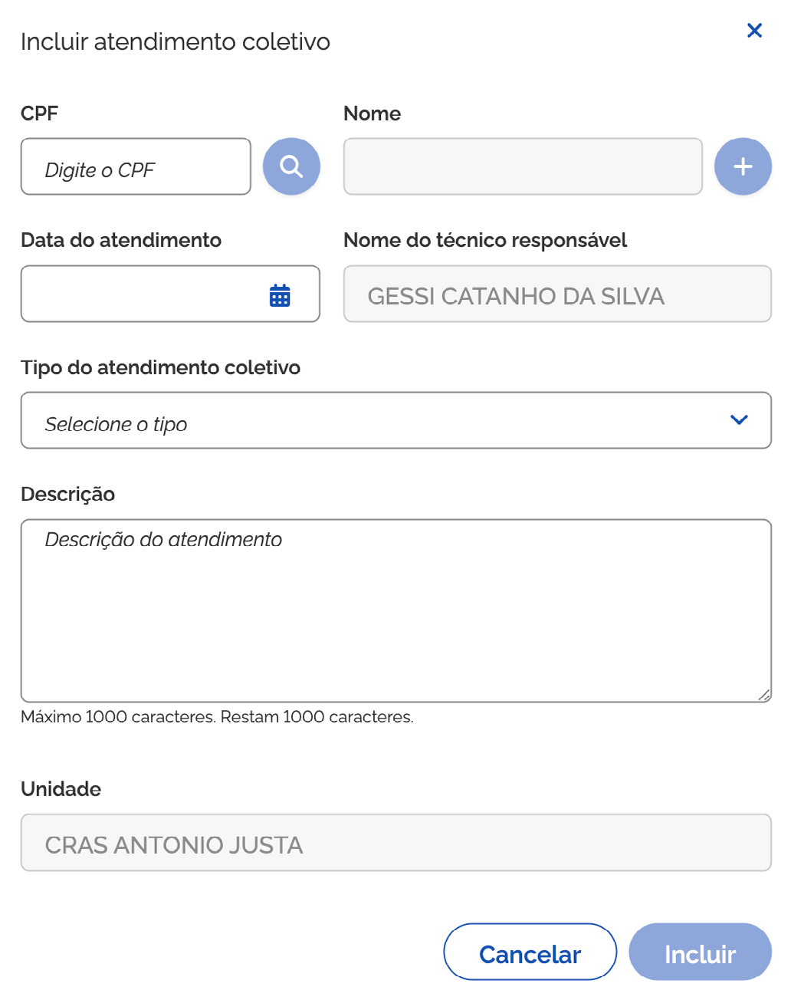
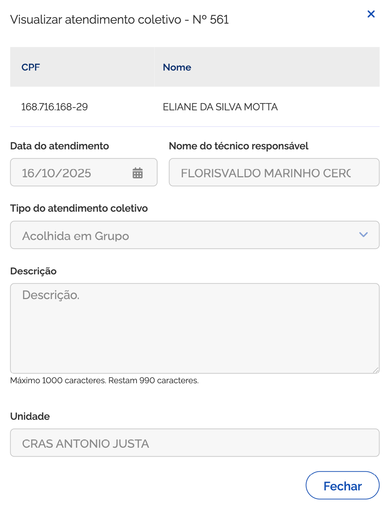

# Prontuário: Atendimento Coletivo

O módulo **Atendimento Coletivo** permite realizar a gestão dos atendimentos coletivos prestados pela unidade às pessoas e famílias acompanhadas no SUAS (como Oficinas do PAIF, Acolhida Coletiva/em Grupo, Ações Comunitárias, Rodas de Conversa e Arranjos Participativos).

***

## Selecionar unidade

Para visualizar ou realizar o atendimento coletivo de uma pessoa ou família, acione o menu ➊ **SUAS** e selecione ➋ **Atendimento coletivo**. O sistema apresentará a funcionalidade **Selecionar unidade**, listando todas as unidades atribuídas ao usuário conforme perfil no CADSUAS.

A ➌ **lista de atendimento coletivo** é composta por:

* **Código da Unidade**: coluna que apresenta o código da unidade de atendimento;
* **Nome da Unidade**: coluna que informa o nome da unidade de atendimento;
* **Município/UF**: coluna que informa o município e UF de localização da unidade;
* **Endereço**: coluna que informa o endereço da unidade de atendimento;
* **Bairro**: coluna que informa o bairro da unidade de atendimento.

***

## Lista de atendimentos coletivos

Ao selecionar a unidade, o sistema apresentará a funcionalidade **Atendimento Coletivo** com a ➏ **lista de atendimentos coletivos** realizados pela unidade.

***

## Incluir atendimento coletivo

Para adicionar um atendimento coletivo, acione a opção ➐ **Incluir atendimento**, então o sistema vai apresentar a janela **Incluir atendimento coletivo**.

A janela ➐ **Incluir atendimento coletivo** contém os seguintes dados:

* **CPF**: campo para informar o CPF da pessoa atendida;
* **Buscar pessoa**: opção que ao ser acionada busca a pessoa na base do CadÚnico/CadSUAS;
* **Adicionar pessoa**: opção que ao ser acionada adiciona a pessoa na lista de pessoas atendidas;
* **Excluir**: opção que ao ser acionada exclui a pessoa da lista de pessoas atendidas;
* **Data do Atendimento**: campo para informar a data de realização do atendimento _(campo obrigatório)_;
* **Turno**: campo para selecionar o turno do atendimento _(campo obrigatório)_;
* **Tipo de Atendimento**: campo para selecionar o tipo de atendimento coletivo _(campo obrigatório)_;
* **Descrição**: campo para detalhar a descrição do atendimento coletivo _(campo obrigatório)_;
* **Técnicos Presentes**: seleção dos profissionais responsáveis pelo atendimento;
* **Incluir**: opção que ao ser acionada salva o novo atendimento coletivo e exibe a mensagem de sucesso;
* **Cancelar**: opção que ao ser acionada cancela a operação e fecha a janela.

***

## Visualizar atendimento coletivo

Para visualizar o atendimento coletivo, acione a opção ➑ **Visualizar atendimento coletivo** na coluna ação, então o sistema vai apresentar a janela correspondente com os dados gravados.

A janela ➑ **Visualizar atendimento coletivo** contém os seguintes dados:

* **CPF**: coluna que informa o CPF da(s) pessoa(s) atendida(s);
* **Nome**: coluna que informa o nome da pessoa atendida;
* **Data do Atendimento**: campo que informa a data de realização do atendimento;
* **Turno**: campo que informa o turno do atendimento;
* **Tipo de Atendimento**: campo que informa a tipologia do atendimento coletivo;
* **Descrição**: campo que traz o detalhamento do atendimento;
* **Unidade**: campo que informa a unidade responsável pelo atendimento;
* **Fechar**: opção que encerra a visualização e fecha a janela.

***

## Editar atendimento coletivo

Para editar o registro de atendimento coletivo, acione a opção ➒ **Alterar atendimento coletivo** na coluna ação, então o sistema vai apresentar a janela com os campos preenchidos para ajuste.

Informe os ajustes necessários e acione a opção **Alterar**. Em seguida, o sistema fecha a janela, atualiza a lista e apresenta a mensagem _"Atendimento coletivo alterado com sucesso"_.

***

## Excluir atendimento coletivo

Para excluir o registro de atendimento coletivo, acione a opção **Excluir atendimento coletivo** na coluna ação. O sistema solicita confirmação e, ao confirmar, remove o registro exibindo a mensagem _"Atendimento coletivo excluído com sucesso"_.

***

## Duplicar atendimento coletivo

Para duplicar o registro de atendimento coletivo, acione a opção **Clonar atendimento coletivo** na coluna ação, permitindo reaproveitar as informações registradas para criar rapidamente um novo atendimento semelhante.
