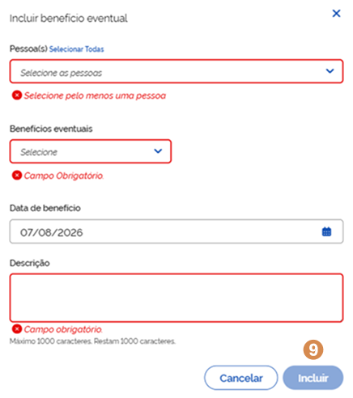
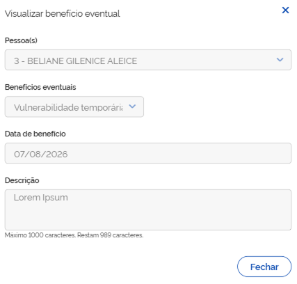
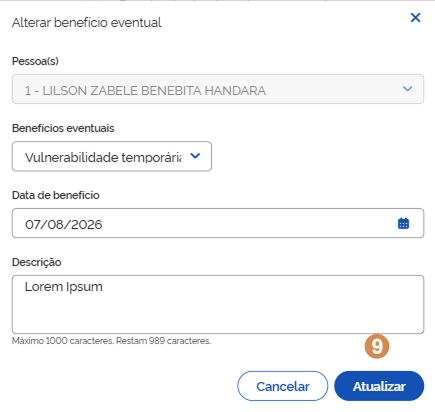
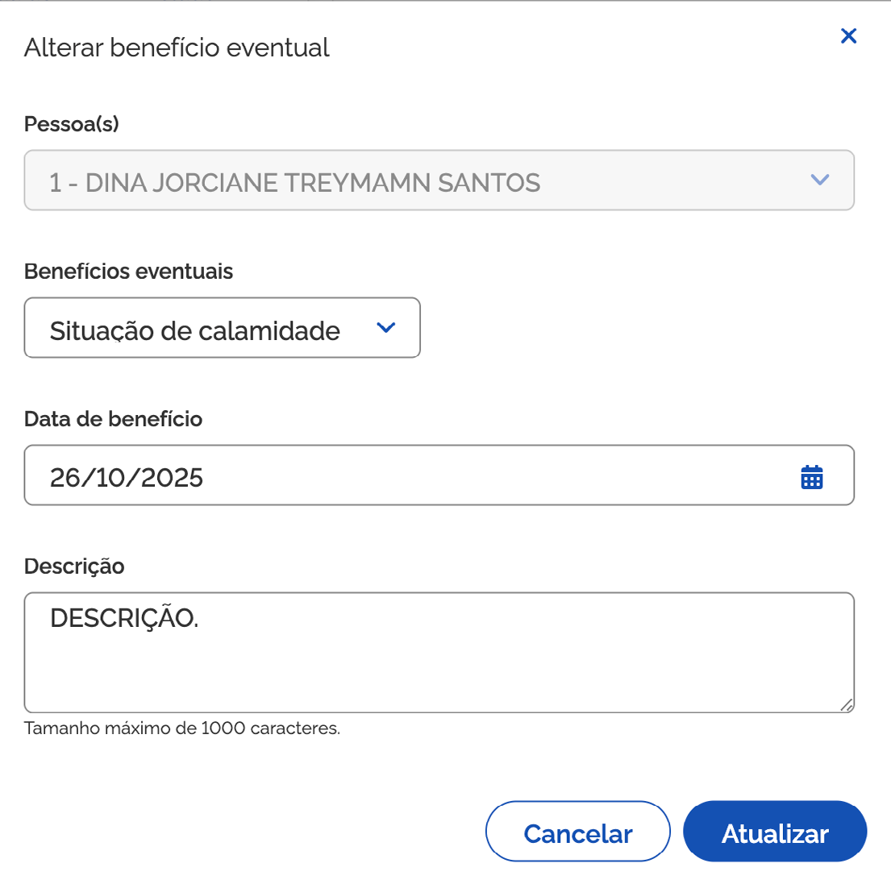

# Acesso a benefícios eventuais

Ao acionar o bloco <kbd>1</kbd> **Acesso a benefícios eventuais**, para expandir as informações, você pode consultar, por membro da composição familiar, os benefícios oferecidos e observações complementares.

## Benefícios eventuais concedidos

A <kbd>2</kbd> **lista dos benefícios eventuais concedidos** à família é composta por:

* **Pessoa** – a coluna informa o nome do membro da composição familiar, solicitante do benefício;
* **Benefício** – a coluna informa o benefício solicitado pelo membro da composição familiar;
* **Descrição** - a coluna informa o descritivo do benefício solicitado.
* **Ações** – coluna que exibe ícones para realizar ações, como por exemplo: Visualizar registro.

.png>)

***

## Incluir benefício eventual

Para **adicionar benefício eventual**, acione a opção <kbd>3</kbd> **Incluir benefício eventual**, então o sistema vai apresentar a janela para cadastro.

Preencha os dados solicitados e acione a opção <kbd>9</kbd> **Incluir**, em seguida o sistema fecha a janela, atualiza a lista de benefícios e apresenta a mensagem _"Benefício eventual incluído com sucesso"_.

***

A janela <kbd>3</kbd> **Incluir benefício eventual**, representada na página anterior, contém os seguintes dados:

* **Pessoa(s)** – campo para informar o(s) nome(s) da(s) pessoa(s) atendida(s);
* **Benefício** – campo para informar o(s) benefício(s) concedido(s). As alternativas são:
  * Situação de morte
  * Situação de nascimento
  * Situação de calamidade
  * Situação de vulnerabilidade temporária
* **Descrição** – campo para registrar informações adicionais;
* **Cancelar** – opção que, ao ser acionada, cancela a ação e fecha a janela.
* **Incluir** - opção que ao ser acionada salva o atendimento.

***

## Visualizar registro do benefício eventual

Para **visualizar o registro do benefício**, acione a opção <kbd>4</kbd> **Visualizar benefício**, então o sistema vai apresentar a janela com as informações.

***

A janela <kbd>4</kbd> **Visualizar benefício eventual**, representada na página anterior, contém os seguintes dados:

* **Pessoa(s)** – campo que informa o(s) nome(s) da(s) pessoa(s) atendida(s);
* **Benefícios eventuais** – campo que informa o(s) benefício(s) eventual(is) concedido(s);
* **Descrição** – campo que apresenta a descrição do(s) benefício(s) concedido(s);
* **Fechar** – opção que, ao ser acionada, fecha a janela.

***

## Editar benefício eventual

Para **editar o registro de benefício eventual**, acione a opção <kbd>5</kbd> **Alterar benefício**, então o sistema vai apresentar a janela com os campos habilitados.

Informe os ajustes e acione a opção <kbd>9</kbd> **Atualizar**, em seguida o sistema fecha a janela, atualiza a lista de benefícios e apresenta a mensagem _"Benefício eventual alterado com sucesso"_.

***

A janela <kbd>5</kbd> **Alterar benefício eventual**, representada na página anterior, contém os seguintes dados:

* **Pessoa(s)** – campo para informar o(s) nome(s) da(s) pessoa(s) atendida(s);
* **Benefícios eventuais** – campo para informar o(s) benefício(s) concedido(s);
* **Descrição** – campo para registrar informações adicionais;
* **Cancelar** – opção que, ao ser acionada, cancela a ação e fecha a janela.
* **Atualizar** – opção que, ao ser acionada, salva a alteração realizada e atualiza a lista.

## Excluir benefício eventual

Para **excluir o benefício da lista**, acione a opção <kbd>6</kbd> **Excluir benefício**, e o sistema solicitará a confirmação da ação. Caso confirmada, o sistema atualiza a lista e apresenta a mensagem _"Benefício eventual excluído com sucesso"_.

## Observações do acesso a benefícios eventuais

Para mais informações sobre o <kbd>7</kbd> **registro de observações**, consulte a página 19 deste manual.

Para **retrair ou reexibir** as informações contidas no bloco, acione o <kbd>8</kbd> **ícone**.

***

