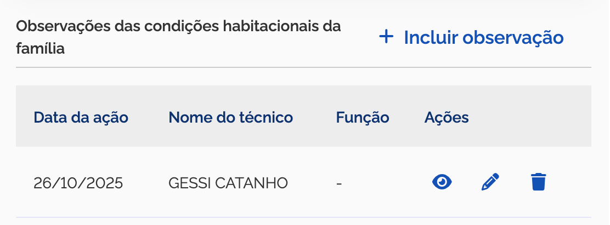
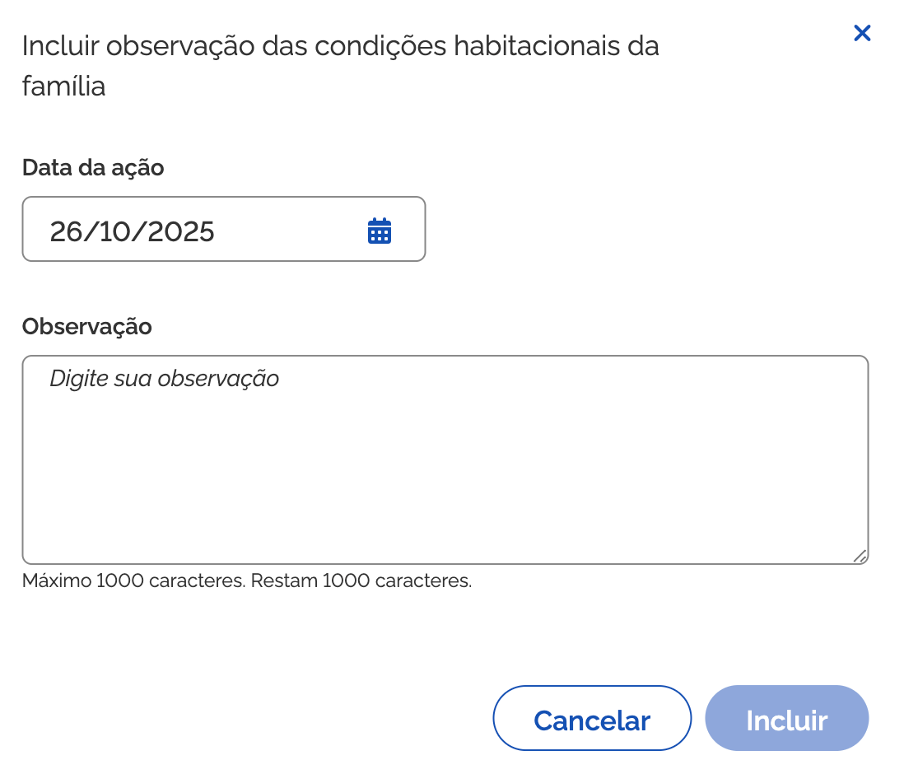
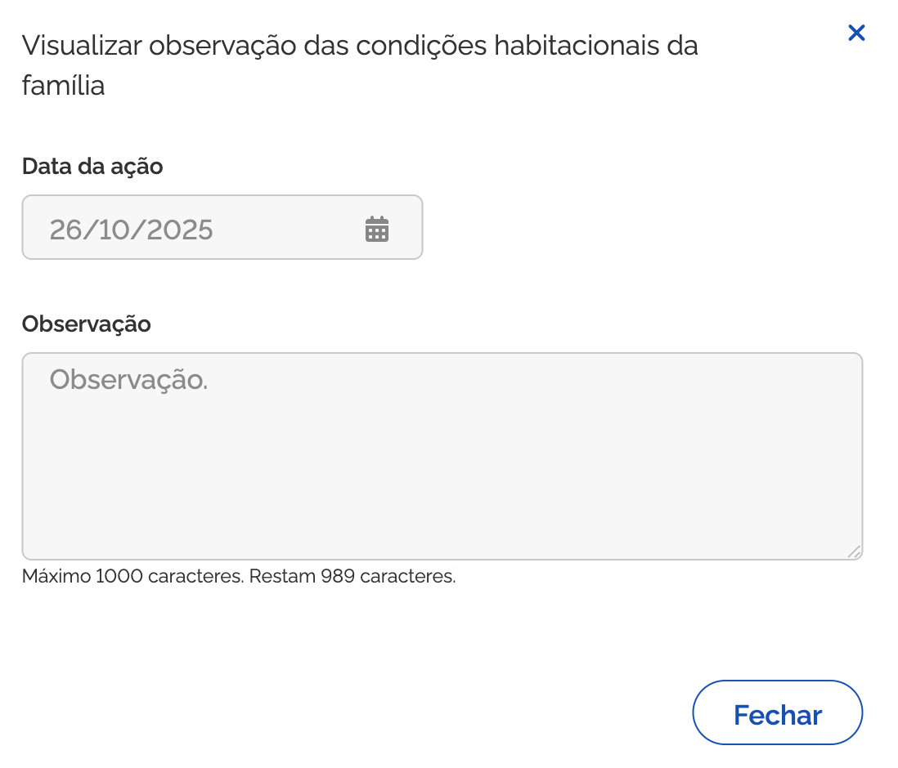
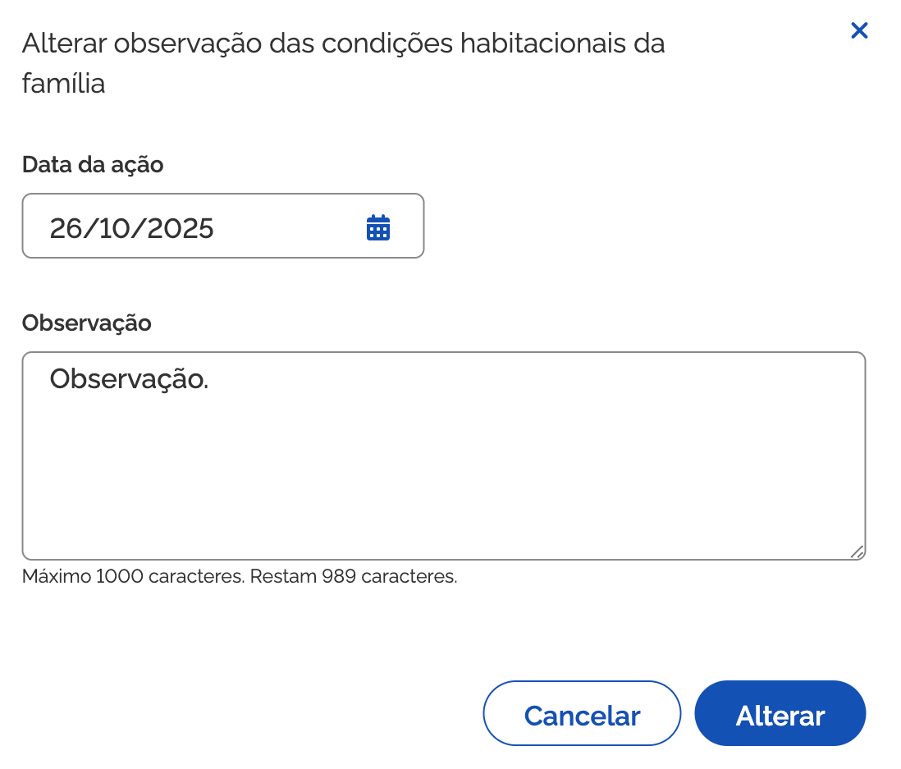
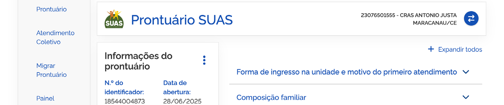

# Aspectos globais do módulo Prontuário

O Prontuário Eletrônico organiza as informações da família e de seus membros em blocos temáticos acessíveis após a seleção do usuário.

## Cabeçalho do Prontuário

No topo do prontuário eletrônico são exibidos os dados principais de identificação da pessoa e da família:
- Nome da pessoa de referência;
- CPF e NIS;
- Endereço residencial e município;
- Número do prontuário e situação do acompanhamento familiar.

---

## Estrutura de Blocos Temáticos

O prontuário é dividido nos seguintes blocos de registro e consulta:

1. **Informações do Prontuário**;
2. **Identificação da Pessoa de Referência e Endereço da Família**;
3. **Informações da Família**;
4. **Composição Familiar**;
5. **Forma de Ingresso na Unidade e Motivo do Primeiro Atendimento**;
6. **Condições Habitacionais da Família**;
7. **Condições Educacionais da Família**;
8. **Condições de Saúde da Família**;
9. **Condições de Trabalho e Rendimento da Família**;
10. **Registro de Atendimentos Socioassistenciais**;
11. **Acesso a Benefícios Eventuais**;
12. **Convivência Familiar e Comunitária**;
13. **Situações de Vulnerabilidades e Desproteções Sociais da Família**;
14. **Situações de Violência e Violação de Direitos**;
15. **Planejamento e Evolução do Acompanhamento Familiar**;
16. **Participação em Serviços, Programas e Projetos**;
17. **Histórico de Cumprimento de Medidas Socioeducativas**;
18. **Histórico de Acolhimento Institucional**;
19. **Formulário de Controle de Encaminhamentos**;
20. **Relatório de Participação em Atendimentos Coletivos**;
21. **Relatório Simplificado dos Atendimentos**.

---

## Expandir e Retrair Blocos

Para facilitar a navegação, cada bloco possui controles individuais e globais:

- **Acionar um bloco específico**: clique sobre o título do bloco para expandir ou recolher suas informações;
- **Expandir todos / Retrair todos**: botões no topo da tela para abrir ou fechar a totalidade dos blocos simultaneamente.

---

## Modos de Leitura e Edição

Os campos do prontuário podem apresentar dados oriundos do Cadastro Único (somente leitura) e campos de preenchimento exclusivo do SUAS (editáveis por técnicos autorizados).

