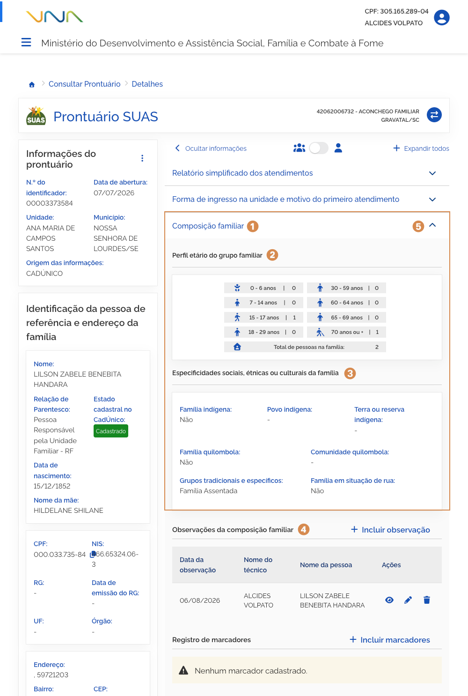
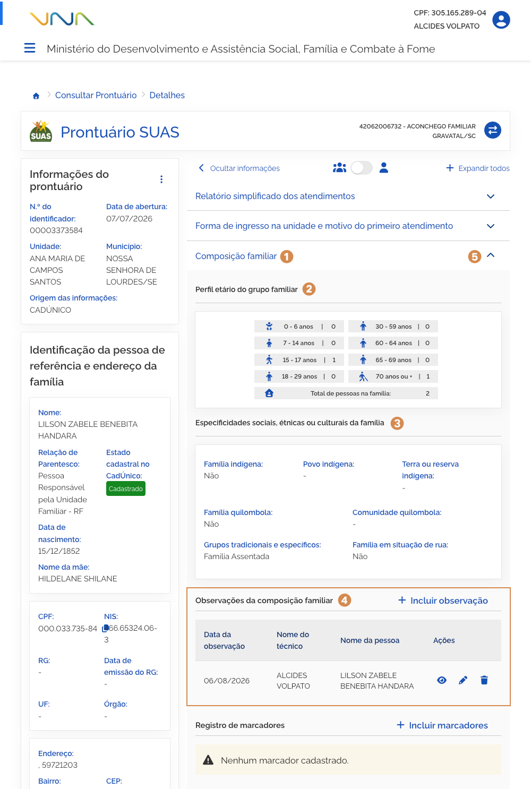

# Composição familiar (Detalhamento)

Ao acionar o bloco <kbd>1</kbd> **Composição familiar**, ao expandir as informações, você pode consultar o perfil etário do grupo familiar, especificidades sociais, étnicas e culturais.

## Perfil etário do grupo familiar

O agrupamento de campos do <kbd>2</kbd> **do perfil etário do grupo familiar** é composto por:

- **Perfil etário do grupo familiar** – campo que informa a quantidade de pessoas por faixa etária e o total de pessoas que compõem a família;

## Especificidades sociais, étnicas ou culturais da família

O agrupamento de campos das <kbd>3</kbd> **especificidades sociais, étnicas ou culturais da família** é composto por:

- **Família indígena** – campo que informa se a família é indígena;
- **Povo indígena** – campo que informa o nome do povo indígena ao qual a família pertence;
- **Terra ou reserva indígena** – campo que informa se a família reside em terra ou reserva indígena;
- **Família quilombola** – campo que informa se a família é quilombola;
- **Comunidade quilombola** – campo que informa o nome da comunidade quilombola ao qual a família pertence;
- **Grupos tradicionais e específicos** – campo que informa o(s) família faz parte de grupos tradicionais e específicos e qual(is) grupo(s);
- **Família em situação de rua** – campo que informa se a família está em situação de rua;

## Observações da composição familiar

Para mais informações sobre <kbd>4</kbd> **registro de observações**, consulte a página 19 deste manual.

Para **retrair ou reexibir** as informações contidas no bloco, acione o <kbd>5</kbd> **ícone**.

---
