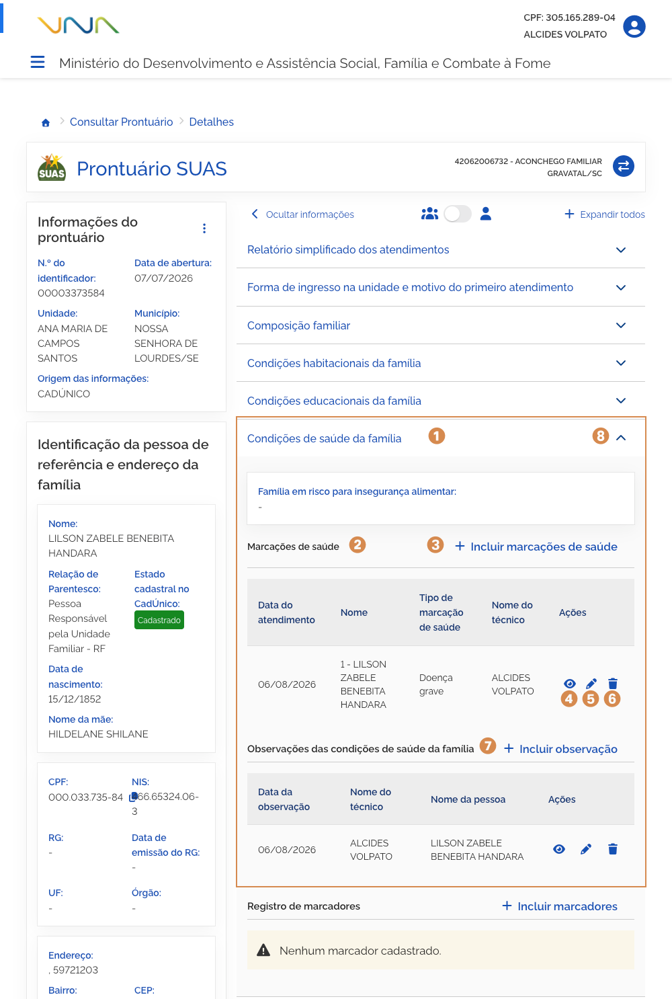
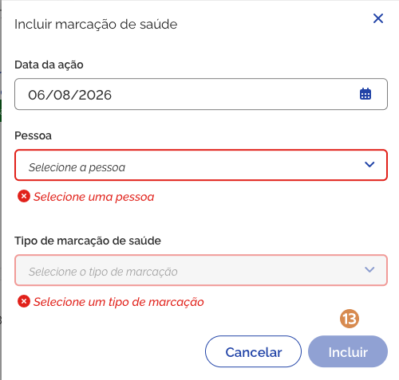
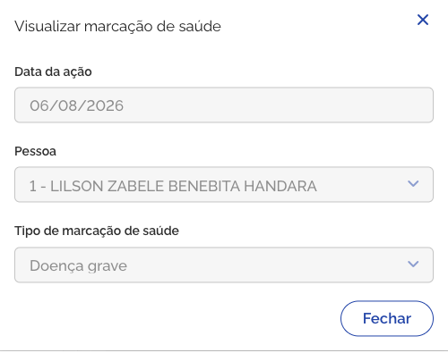
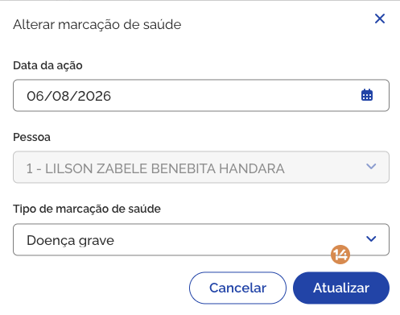

# Condições de saúde da família

Ao acionar o bloco <kbd>1</kbd> **Condições de saúde da família**, para expandir as informações, você pode consultar, por membro da composição familiar, as marcações de saúde e observações complementares.

## Marcações de saúde

A <kbd>2</kbd> **lista das marcações de saúde da família** é composta por:

- **Data do atendimento** – a coluna informa a data em que a marcação foi incluída;
- **Nome** – a coluna informa o nome do membro da composição familiar ao qual a marcação de saúde pertence;
- **Tipo de marcação de saúde** – a coluna informa o tipo da marcação de saúde. Os tipos são:
  - Doença grave
  - Remédios controlados para transtornos mentais
  - Uso abusivo de álcool
  - Uso abusivo de drogas
- **Nome do técnico** – a coluna informa o nome do técnico responsável pelo atendimento.
- **Ações** – coluna que exibe ícones para realizar ações, como por exemplo: Visualizar registro.

---

## Incluir marcações de saúde

Para **adicionar marcação de saúde para a família**, acione a opção <kbd>3</kbd> **Incluir marcações de saúde**, então o sistema vai apresentar a janela para cadastro.

Preencha os dados solicitados e acione a opção <kbd>9</kbd> **Incluir**, em seguida o sistema fecha a janela, atualiza a lista de marcações e apresenta a mensagem _"Condição de saúde incluída com sucesso"_.

A janela <kbd>3</kbd> **Incluir marcação de saúde**, representada na página anterior, contém os seguintes dados:

- **Data da ação** – campo para informar a data em que o atendimento foi realizado;
- **Pessoa** – campo para informar o nome da pessoa atendida;
- **Tipo de marcação de saúde** – campo para informar o tipo da marcação de saúde;
- **Cancelar** – opção que, ao ser acionada, cancela a ação e fecha a janela.
- **Incluir** – opção que, ao ser acionada, salva o atendimento.

---

## Visualizar marcações de saúde

Para **visualizar o registro marcação de saúde**, acione a opção <kbd>4</kbd> **Visualizar marcação**, então o sistema vai apresentar a janela com as informações.

A janela <kbd>4</kbd> **Visualizar marcação de saúde**, representada na página anterior, contém os seguintes dados:

- **Data da ação** – campo que informa a data em que o atendimento foi realizado;
- **Pessoa** – campo que informa o nome da pessoa atendida;
- **Tipo de marcação de saúde** – campo que apresenta o tipo da marcação de saúde;
- **Fechar** – opção que, ao ser acionada, fecha a janela.

---

## Editar marcações de saúde

Para **editar o registro marcação de saúde**, acione a opção <kbd>4</kbd> **Alterar marcação**, então o sistema vai apresentar a janela com os campos habilitados.

Informe os ajustes e acione a opção <kbd>9</kbd> **Atualizar**, em seguida o sistema fecha a janela, atualiza a lista de marcações e apresenta a mensagem _"Condição de saúde alterada com sucesso"_.

A janela <kbd>5</kbd> **Alterar marcação de saúde**, representada na página anterior, contém os seguintes dados:

- **Data da ação** – campo para informar a data em que o atendimento foi realizado;
- **Pessoa** – campo para informar o nome da pessoa atendida;
- **Tipo de marcação de saúde** – campo para informar o tipo da marcação de saúde;
- **Cancelar** – opção que, ao ser acionada, cancela a ação e fecha a janela.
- **Atualizar** – opção que, ao ser acionada, salva a alteração realizada para o atendimento.

---

## Excluir marcação de saúde

Para **excluir marcação de saúde**, acione a opção <kbd>6</kbd> **Excluir marcação**, e o sistema solicitará a confirmação da ação. Caso confirmada, o sistema atualiza a lista e apresenta a mensagem _"Marcação excluída com sucesso."_.

## Observações das condições de saúde da família

Para mais informações sobre o <kbd>7</kbd> **registro de observações**, consulte a página 19 deste manual.

Para **retrair ou reexibir** as informações contidas no bloco, acione o <kbd>8</kbd> **ícone**.
