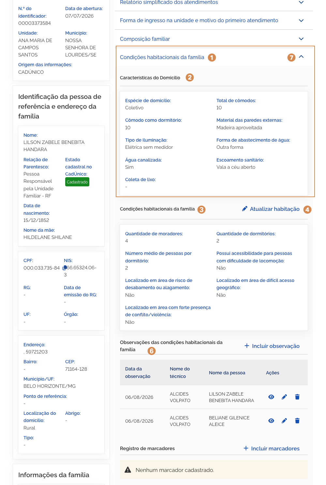
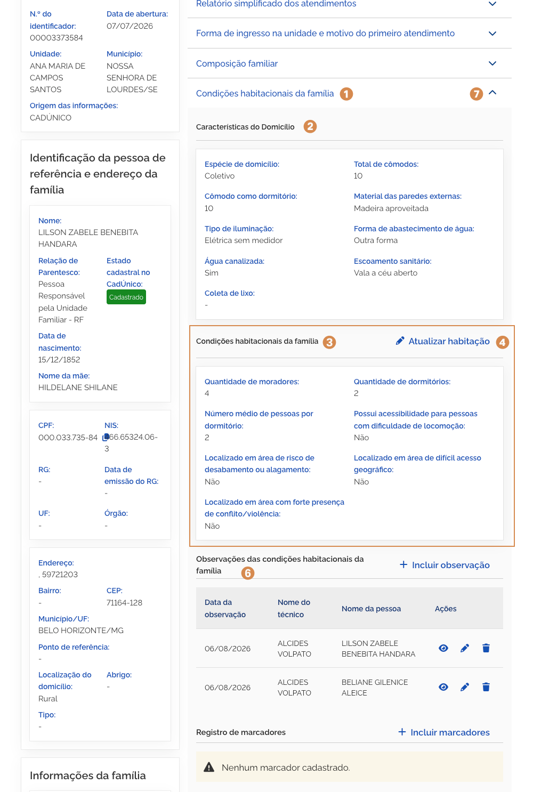
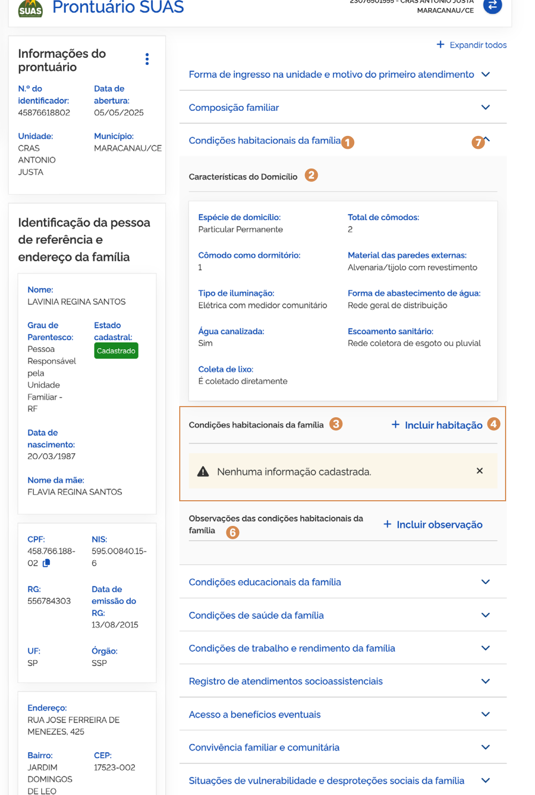
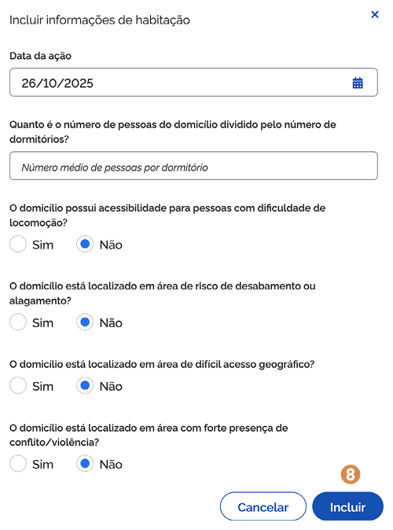
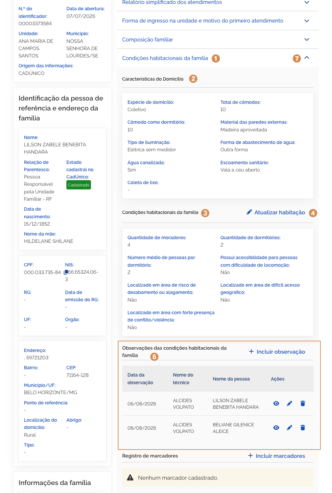
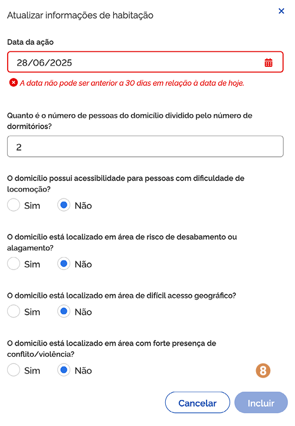

# Condições habitacionais da família

No bloco <kbd>1</kbd> **Condições habitacionais da família**, ao acionar para expandir as informações, você pode consultar as características do domicílio, adicionar condições habitacionais da família e observações complementares.

## Características do Domicílio

O agrupamento de campos <kbd>2</kbd> **características do domicílio**, é composto por:

- **Espécie de domicílio** – campo que informa a espécie de habitação;
- **Total de cômodos** – campo que informa o total de cômodos da habitação;
- **Comodo como dormitório** – campo que informa a quantidade de dormitórios da habitação;
- **Material das paredes externas** – campo que informa o material das paredes externas da habitação;
- **Tipo de iluminação** – campo que informa o tipo de iluminação da habitação;
- **Forma de abastecimento de água** – campo que informa a forma de abastecimento de água da habitação;
- **Água canalizada** – campo que informa se a habitação possui água canalizada;
- **Escoamento sanitário** – campo que informa se a habitação possui escoamento sanitário;
- **Coleta de lixo** – campo que informa se a habitação possui coleta de lixo.

---

O agrupamento de campos <kbd>3</kbd> **condições habitacionais da família** é composto por:

- **Número médio de pessoas por dormitório** – campo que informa a média de pessoas da composição família por dormitório;
- **Possui acessibilidade para pessoas com dificuldade de locomoção** – campo que informa se a habitação está localizada em área de locomoção;
- **Localizado em área de risco de desabamento ou alagamento** – campo que informa se a habitação está localizada em área de risco de desabamento ou alagamento;
- **Localizado em área de difícil acesso geográfico** – campo que informa se a habitação está localizada em área de difícil acesso geográfico;
- **Localizado em área com forte presença de conflito/violência** – campo que informa se a habitação está localizada em área com forte presença de conflito/violência.

---

## Incluir habitação

Para **adicionar informações de habitação**, acione a opção <kbd>4</kbd> **Incluir habitação**, então o sistema vai apresentar a janela para cadastro. Preencha os dados solicitados e acione a opção <kbd>8</kbd> **Incluir**, em seguida o sistema fecha a janela, apresenta as Condições habitacionais da família e a mensagem _"Condições habitacionais incluída com sucesso"_.

A janela <kbd>4</kbd> **Incluir informações de habitação**, representada na página anterior, contém os seguintes dados:

- **Data do atendimento** – campo para informar a data em que o atendimento foi realizado;
- **Quanto é o número de pessoas do domicílio dividido pelo número de dormitórios?** – campo para informar a quantidade de pessoas por dormitório;
- **O domicílio possui acessibilidade para pessoas com dificuldade de locomoção?** – campo para informar se o domicílio possui acessibilidade para pessoas com dificuldade de locomoção;
- **O domicílio está localizado em área de risco de desabamento ou alagamento?** – campo para informar se o domicílio está localizado em área de risco de desabamento ou alagamento;
- **O domicílio está localizado em área de difícil acesso geográfico?** – campo para informar se o domicílio está localizado em área de difícil acesso geográfico;
- **O domicílio está localizado em área com forte presença de conflito/violência?** – campo para informar se o domicílio está localizado em área com forte presença de conflito/violência;
- **Cancelar** – opção que, ao ser acionada, cancela a ação e fecha a janela.
- **Incluir** – opção que, ao ser acionada, salva o atendimento.

---

## Atualizar habitação

Para **editar as informações de habitação**, acione a opção <kbd>5</kbd> **Atualizar habitação**, então o sistema vai apresentar a janela com os campos habilitados. Informe os ajustes e acione a opção <kbd>8</kbd> **Incluir**, em seguida o sistema fecha a janela, atualiza as Condições habitacionais da família e apresenta a mensagem _"Condições habitacionais atualizadas com sucesso"_.

A janela <kbd>5</kbd> **Atualizar informações de habitação**, representada na página anterior, contém os seguintes dados:

- **Data do atendimento** – campo para informar a data em que o atendimento foi realizado;
- **Quanto é o número de pessoas do domicílio dividido pelo número de dormitórios?** – campo para informar a quantidade de pessoas por dormitório;
- **O domicílio possui acessibilidade para pessoas com dificuldade de locomoção?** – campo para informar se o domicílio possui acessibilidade para pessoas com dificuldade de locomoção;
- **O domicílio está localizado em área de risco de desabamento ou alagamento?** – campo para informar se o domicílio está localizado em área de risco de desabamento ou alagamento;
- **O domicílio está localizado em área de difícil acesso geográfico?** – campo para informar se o domicílio está localizado em área de difícil acesso geográfico;
- **O domicílio está localizado em área com forte presença de conflito/violência?** – campo para informar se o domicílio está localizado em área com forte presença de conflito/violência;
- **Cancelar** – opção que, ao ser acionada, cancela a ação e fecha a janela.
- **Incluir** – opção que, ao ser acionada, salva o atendimento.

---

## Observações das condições habitacionais da família

Para mais informações sobre <kbd>6</kbd> **registro de observações**, consulte a página 19 deste manual.

Para **retrair ou reexibir** as informações contidas no bloco, acione o <kbd>7</kbd> **ícone**.

---
