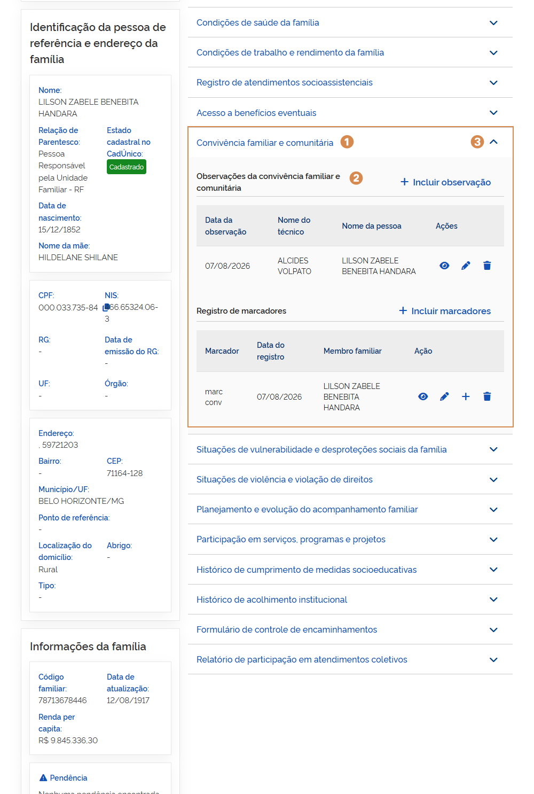

# Convivência familiar e comunitária

No bloco ➊ **Convivência Familiar e Comunitária**, ao expandir as informações, você pode consultar as observações registradas sobre a convivência familiar e comunitária.

A ➋ **lista de observações da convivência familiar e comunitária** apresenta as seguintes informações:

- **Data da ação**: indica a data em que a observação foi registrada ou atualizada;
- **Nome do técnico**: identifica o técnico responsável pelo atendimento e pelo registro da informação;
- **Função**: apresenta a função do técnico que realizou o registro.

---

## Incluir observação

Para adicionar uma nova observação, acione a opção ➌ **Incluir observação**, então o sistema vai apresentar a janela para cadastro. Preencha os dados solicitados e acione a opção ➑ **Incluir**, em seguida o sistema fecha a janela, atualiza a lista de atendimento coletivo e apresenta a mensagem _"Observação incluída com sucesso."_.

A janela ➌ **Incluir observação da convivência familiar e comunitária** apresenta os seguintes campos e opções:

- **Data da ação**: indica a data em que o atendimento foi realizado;
- **Observação**: indica a observação para a convivência familiar e comunitária;
- **Cancelar**: opção que ao ser acionada cancela a ação e fecha a janela;
- **Incluir**: opção que, ao ser acionada, salva o registro e atualiza a lista de observações.

---

## Visualizar observação

Para visualizar o registro de observação, acione a opção ➍ **Visualizar observação**, então o sistema vai apresentar a janela com as informações.

A janela ➍ **Visualizar observação da convivência familiar e comunitária** apresenta os seguintes campos e opções:

- **Data da ação**: indica a data em que a observação foi registrada ou atualizada;
- **Observação**: exibe o texto referente à convivência familiar e comunitária;
- **Fechar**: opção que ao ser acionada fecha a janela.

---

## Alterar observação

Para editar o registro de observação da convivência familiar e comunitária, acione a opção ➎ **Alterar observação**, então o sistema vai apresentar a janela com as informações registradas anteriormente, permitindo a edição dos dados necessários.

Informe os ajustes e acione a opção ➑ **Alterar**, em seguida o sistema fecha a janela, atualiza a lista e apresenta a mensagem _"Observação alterada com sucesso"_.

A janela ➎ **Alterar observação da convivência familiar e comunitária** apresenta os seguintes campos e opções:

- **Data da ação**: indica a data em que a observação foi registrada ou atualizada;
- **Observação**: exibe o texto referente à convivência familiar e comunitária, permitindo a edição das informações;
- **Cancelar**: opção que ao ser acionada cancela a ação e fecha a janela;
- **Alterar**: opção que, ao ser acionada, salva a alteração realizada.

---

## Excluir observação

Para excluir o registro de observação da lista, acione a opção ➏ **Excluir observação**, e o sistema solicitará a confirmação da ação. Caso confirmada, o sistema atualiza a lista e apresenta a mensagem _"Observação excluída com sucesso."_.

Para ➐ **retrair ou reexibir** as informações contidas no bloco, acione o ícone.
