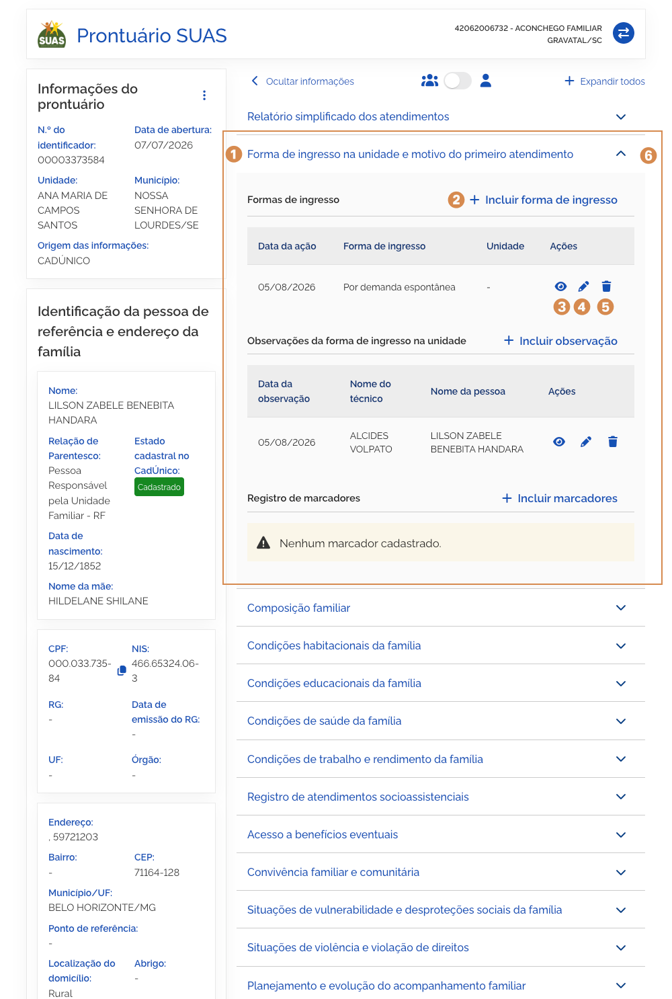
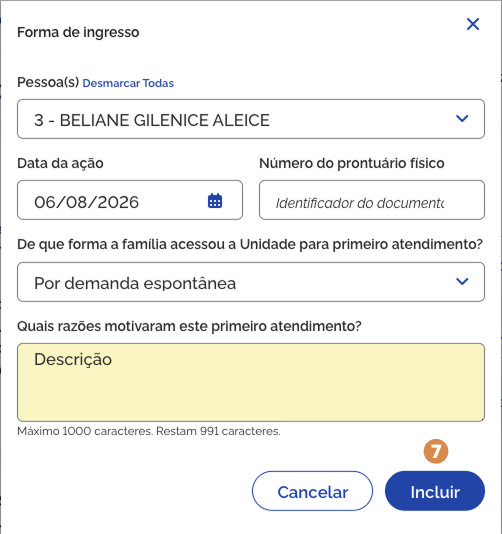
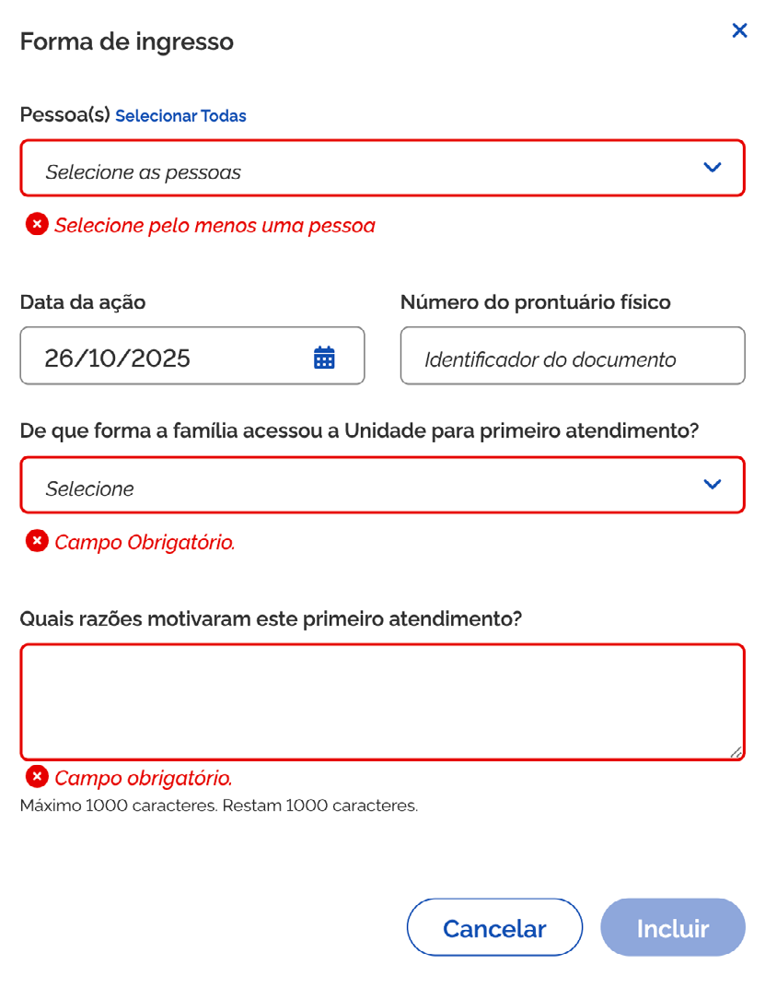
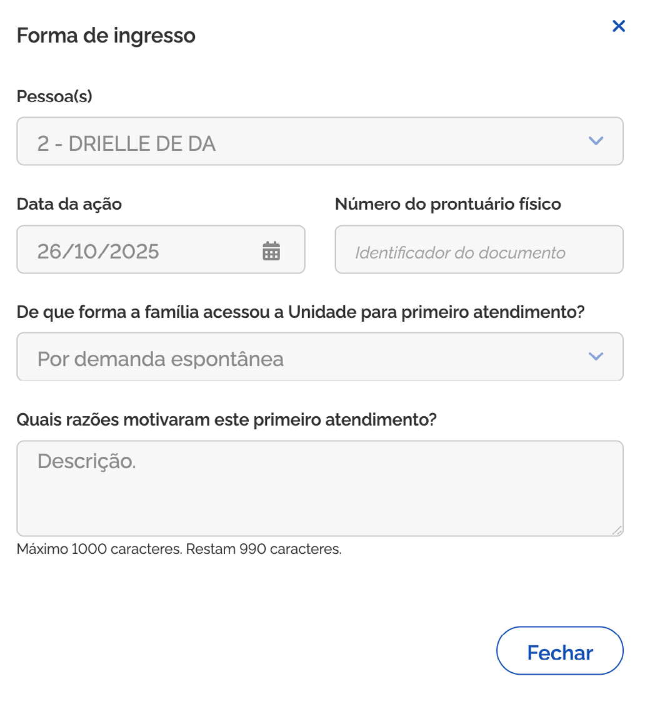
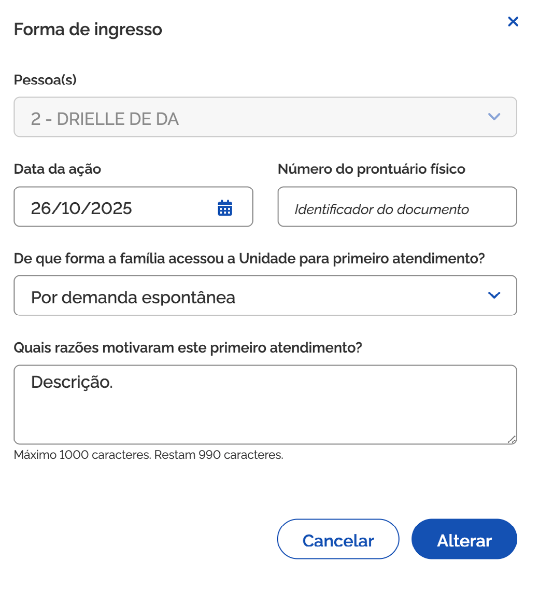

# Forma de ingresso na unidade e motivo do primeiro atendimento

Ao acionar o bloco <kbd>1</kbd> **Forma de ingresso na unidade e motivo do primeiro atendimento**, para expandir as informações, você pode consultar e cadastrar a forma de acesso da pessoa na unidade CRAS, com o objetivo de subsidiar o trabalho social a ser realizado.

A **lista de registro de atendimentos** é composta por:

- **Data da ação** – a coluna informa a data em que a pessoa buscou atendimento na unidade;
- **Forma de ingresso** – a coluna informa como a pessoa acessou a unidade para seu primeiro atendimento;
- **Unidade** – a coluna informa o nome da unidade onde o atendimento foi realizado.
- **Ações** – coluna que exibe ícones para realizar ações, como por exemplo: Visualizar registro.

## Adicionar registro

Para **adicionar novo registro**, acione a opção <kbd>2</kbd> **Incluir forma de ingresso**, então o sistema vai apresentar a janela para cadastro.

Preencha os dados solicitados e acione a opção <kbd>7</kbd> **Incluir**, em seguida o sistema fecha a janela, atualiza a lista de atendimentos e apresenta a mensagem _"Registro de atendimento incluído com sucesso"_.

A janela <kbd>2</kbd> **Incluir forma de ingresso**, contém os seguintes dados:

- **Pessoa(s)** – campo que informa o(s) nome(s) da(s) pessoa(s) atendida(s);
- **Data do atendimento** – campo que informa a data em que o atendimento foi realizado;
- **Número do prontuário físico** – informa o número do prontuário físico da pessoa/família;
- **De que forma a família acessou a unidade para o primeiro atendimento** – informa como a pessoa/família acessou a unidade para o primeiro atendimento;
- **Razões que motivaram o primeiro atendimento** – campo que apresenta as informações adicionais ao atendimento;
- **Cancelar** – opção que, ao ser acionada, cancela a ação e fecha a janela.
- **Incluir** – opção que, ao ser acionada, salva o registro e atualiza a lista.

---

## Visualizar registro

Para **visualizar o registro do atendimento**, acione a opção <kbd>3</kbd> **Visualizar forma de ingresso**, então o sistema vai apresentar a janela com as informações.

A janela <kbd>3</kbd> **Visualizar forma de ingresso**, contém os seguintes dados:

- **Pessoa(s)** – campo que informa o(s) nome(s) da(s) pessoa(s) atendida(s);
- **Data do atendimento** – campo que informa a data em que o atendimento foi realizado;
- **Número do prontuário físico** – informa o número do prontuário físico da pessoa/família;
- **De que forma a família acessou a Unidade para primeiro atendimento?** – informa como a pessoa/família acessou a Unidade para primeiro atendimento;
- **Razões que motivaram o primeiro atendimento** – campo que apresenta as informações adicionais ao atendimento;
- **Cancelar** – opção que, ao ser acionada, cancela a ação e fecha a janela.
- **Alterar** – opção que, ao ser acionada, salva a alteração realizada para o atendimento.

---

## Editar registro

Para **editar o registro de atendimento**, acione a opção <kbd>4</kbd> **Alterar forma de ingresso**, então o sistema vai apresentar a janela com os campos habilitados.

Informe os ajustes e acione a opção <kbd>7</kbd> **Alterar**, em seguida o sistema fecha a janela, atualiza a lista de atendimentos e apresenta a mensagem _"Forma de ingresso na unidade alterada com sucesso"_.

A janela <kbd>4</kbd> **Alterar forma de ingresso**, contém os seguintes dados:

- **Pessoa(s)** – campo que informa o(s) nome(s) da(s) pessoa(s) atendida(s);
- **Data do atendimento** – campo que informa a data em que o atendimento foi realizado;
- **Número do prontuário físico** – informa o número do prontuário físico da pessoa/família;
- **De que forma a família acessou a Unidade para o primeiro atendimento?**
  - Por demanda espontânea
  - Em decorrência de Busca Ativa realizada pela equipe da unidade
  - Em decorrência de encaminhamento realizado por outros serviços/unidades da Proteção Social Básica
  - Em decorrência de encaminhamento realizado por outros serviços/unidades da Proteção Social Especial
  - Em decorrência de encaminhamento realizado pela área da saúde
  - Em decorrência de encaminhamento realizado pela área da educação
  - Em decorrência de encaminhamento realizado por outras políticas setoriais
  - Em decorrência de encaminhamento realizado pelo Conselho Tutelar
  - Em decorrência de encaminhamento realizado pelo Poder Judiciário
  - Em decorrência de encaminhamento realizado pelo Sistema de Garantia de Direitos (Defensoria Pública, Ministério Público, Delegacias)
  - Outros encaminhamentos
- **Razões que motivaram o primeiro atendimento** – campo que apresenta as informações adicionais ao atendimento;
- **Cancelar** – opção que, ao ser acionada, cancela a ação e fecha a janela.
- **Alterar** – opção que, ao ser acionada, salva a alteração realizada para o atendimento.

## Excluir registro

Para **excluir o registro da lista**, acione a opção <kbd>5</kbd> **Excluir forma de ingresso**, e o sistema solicitará a confirmação da ação. Caso confirmada, o sistema atualiza a lista e apresenta a mensagem _"Forma de ingresso excluída com sucesso"_.

---

