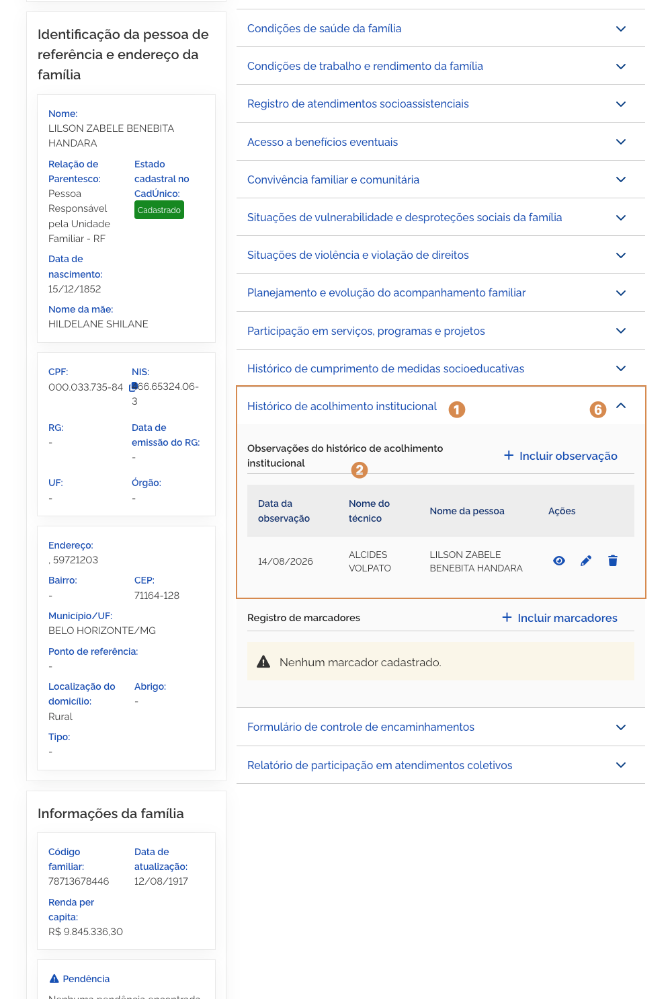

# Histórico de acolhimento institucional

Ao acionar o bloco <kbd>1</kbd> **Histórico de acolhimento institucional**, para expandir as informações, você pode consultar observações do histórico de acolhimento institucional registrado para a família ou membro da composição.

## Observações do histórico de acolhimento institucional

Para mais informações sobre o <kbd>7</kbd> **registro de observações**, consulte a página 19 deste manual.

Para **retrair ou reexibir** as informações contidas no bloco, acione o <kbd>8</kbd> **ícone**.
