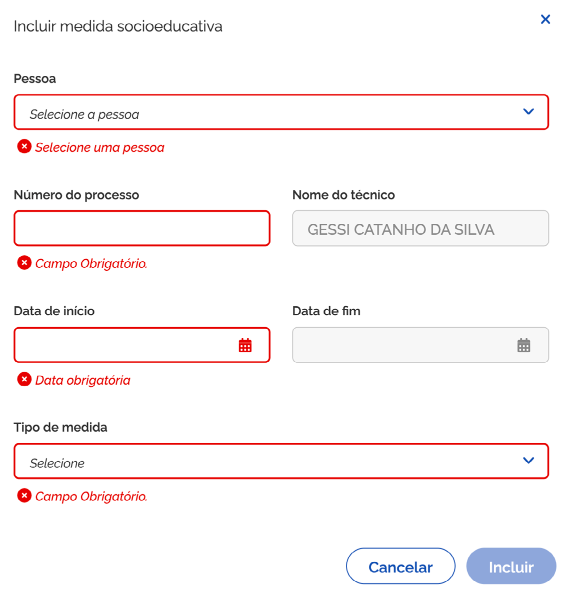
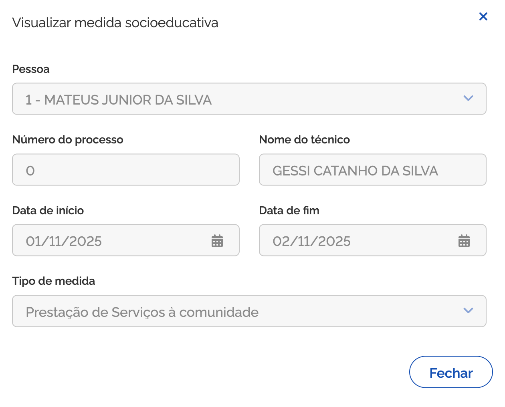
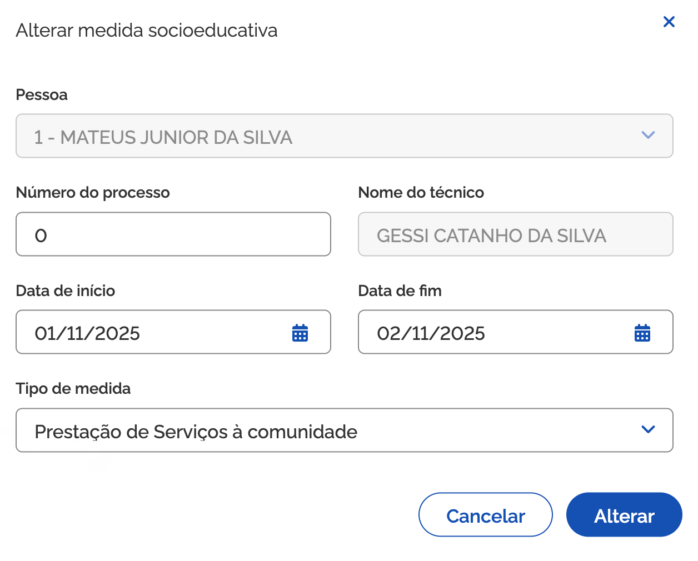

# Histórico de cumprimento de medidas socioeducativas

Ao acionar o bloco <kbd>1</kbd> **Histórico de cumprimento de medidas socioeducativas**, para expandir as informações, você pode consultar as medidas socioeducativas para adolescentes (cumpridas e/ou em acompanhamento).

## Medidas Socioeducativas para adolescentes (cumpridas e/ou em acompanhamento)

A <kbd>2</kbd> **lista de medidas socioeducativas para adolescentes (cumpridas e/ou em acompanhamento)** é composta por:

* **Data do atendimento** – coluna que informa a data do atendimento em que foi relatada a medida socioeducativa para o adolescente;
* **Nome** – coluna que informa o nome do adolescente (membro da composição familiar) que está cumprindo e/ ou em acompanhamento de medida socioeducativa;
* **Tipo de medida** – coluna que informa o tipo de medida socioeducativa a ser cumprida;
* **Nome do técnico** – coluna que informa o nome do técnico responsável pelo registro do encaminhamento no Prontuário Eletrônico;
* **Unidade** – coluna que informa o nome da unidade em que o atendimento foi realizado;
* **Ações** – coluna que exibe ícones para realizar ações, como por exemplo: Visualizar registro.

## Incluir medida socioeducativa

Para adicionar medidas socioeducativas para adolescentes, acione a opção <kbd>3</kbd> **Incluir medida**, então o sistema vai apresentar a janela para cadastro.

Preencha os dados solicitados e acione a opção <kbd>9</kbd> **Incluir**, em seguida o sistema fecha a janela, atualiza a lista de observações e apresenta a mensagem “_Medida socioeducativa incluída com sucesso_”.

A janela <kbd>3</kbd> **Incluir medida socioeducativa**, representada na página anterior, contém os seguintes dados:

* **Pessoa** – campo para informar a pessoa (adolescente) atendida;
* **Número do processo** – campo para informar o número do processo da medida socioeducativa;
* **Nome do técnico responsável** – campo que informa o nome do técnico responsável pelo registro do atendimento;
* **Data de início** – campo para informar a data de início do cumprimento da medida socioeducativa;
* **Data de fim** – campo para informar a data fim do cumprimento da medida socioeducativa;
* **Tipo de medida** – campo para informar o tipo de medida socioeducativa a ser cumprida;
* **Cancelar** – opção que, ao ser acionada, cancela a ação e fecha a janela.
* **Incluir** – opção que, ao ser acionada, salva o atendimento.

## Visualizar medida socioeducativa

Para **visualizar o registro da medida socioeducativa**, acione a opção <kbd>4</kbd> **Visualizar medida**, então o sistema vai apresentar a janela com as informações.

* **Fechar** – opção que, ao ser acionada, fecha a janela.

## Editar medida socioeducativa

Para **editar o registro da medida socioeducativa**, acione a opção <kbd>5</kbd> **Alterar medida**, então o sistema vai apresentar a janela com os campos habilitados.

Informe os ajustes e acione a opção <kbd>9</kbd> **Alterar**, em seguida o sistema fecha a janela, atualiza a lista e apresenta a mensagem “_Medida socioeducativa alterada com sucesso_”.

A janela <kbd>5</kbd> **Alterar medida socioeducativa**, representada na página anterior, contém os seguintes dados:

* **Pessoa** – campo para informar a pessoa (adolescente) atendida;
* **Número do processo** – campo para informar o número do processo da medida socioeducativa;
* **Nome do técnico responsável** – campo que informa o nome do técnico responsável pelo registro do atendimento;
* **Data de início** – campo para informar a data de início do cumprimento da medida socioeducativa;
* **Data de fim** – campo para informar a data fim do cumprimento da medida socioeducativa;
* **Tipo de medida** – campo para informar o tipo de medida socioeducativa a ser cumprida;
* **Cancelar** – opção que, ao ser acionada, cancela a ação e fecha a janela.
* **Alterar** – opção que, ao ser acionada, salva a alteração realizada para o atendimento.

## Excluir medida socioeducativa

Para **excluir o registro de medida socioeducativa**, acione a opção <kbd>6</kbd> **Excluir medida**, e o sistema solicitará a confirmação da ação. Caso confirmada, o sistema atualiza a lista e apresenta a mensagem “_Medida socioeducativa excluída com sucesso_”.

## Observações das medidas socioeducativas

Para mais informações sobre o <kbd>7</kbd> **registro de observações**, consulte a página 19 deste manual.

Para **retrair ou reexibir** as informações contidas no bloco, acione o <kbd>8</kbd> **ícone**.

***

