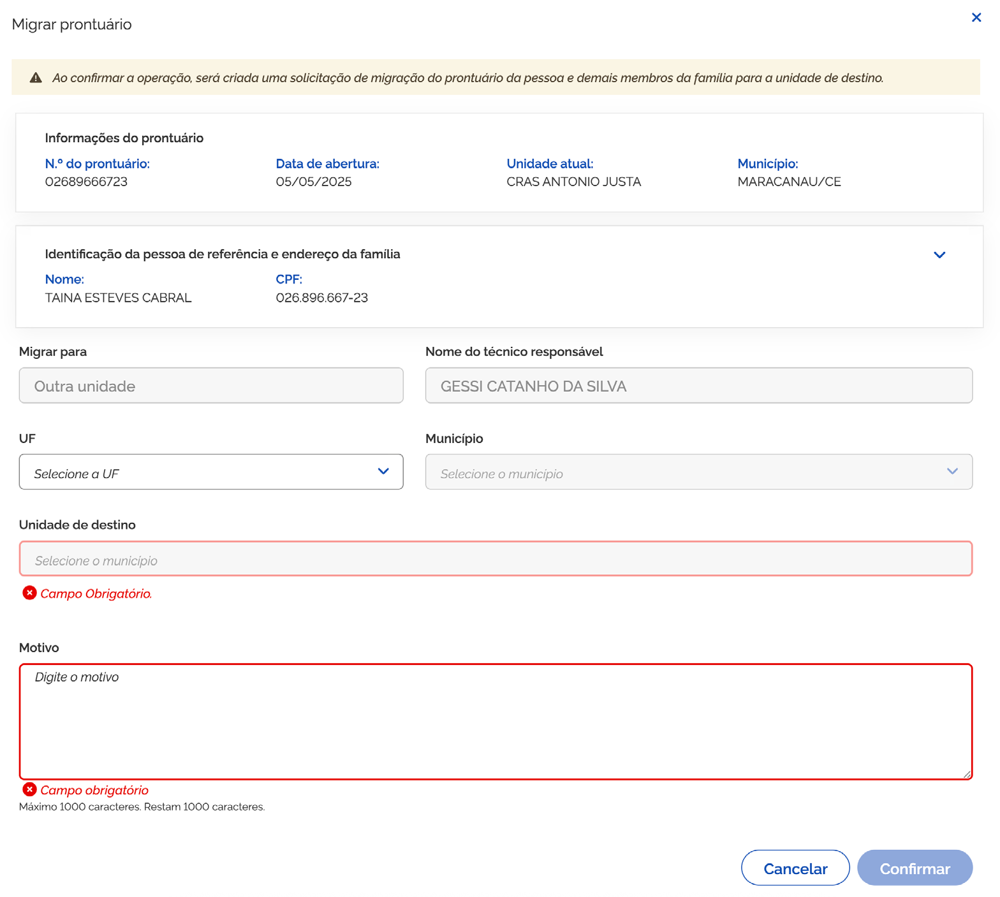

# Migrar Prontuário

Para migrar o prontuário eletrônico para outra unidade de atendimento, acione o ícone <kbd>2</kbd> **opções** e em seguida <kbd>3</kbd> **Migrar prontuário**, então o sistema vai apresentar a janela:

Conforme representado na janela representada na página anterior, o agrupamento é composto pelos campos:

* **Texto informativo** – Ao confirmar a operação, será criada uma solicitação de migração do prontuário da pessoa e demais membros da família para a unidade de destino.

#### Informações do Prontuário

* **N.º do prontuário** – campo que informa o número do prontuário da pessoa;
* **Data de abertura** – campo que informa a data da abertura do prontuário da pessoa;
* **Unidade atual** – campo que informa o nome da unidade de atendimento atual;
* **Município** – campo que informa o município e estado da unidade de atendimento atual;

***

### Identificação da pessoa de referência e endereço da família

* **Nome** – campo que informa o nome da pessoa;
* **CPF** – campo que informa o número do CPF da pessoa;
* **Grau de parentesco** – campo que informa o grau de parentesco da pessoa em relação ao responsável familiar;
* **Situação cadastral** – campo que informa o código da família;
* **Código familiar** – campo que informa o código da família;
* **Data de nascimento** – campo que informa a data de nascimento da pessoa;
* **Nome da mãe** – campo que informa o nome da mãe da pessoa;
* **NIS** – campo que informa o número de identificação social – NIS da pessoa;
* **RG** – campo que informa o número do registro geral - RG (também conhecido como carteira de identidade) da pessoa;
* **Data de emissão do RG** – campo que informa a data de emissão do registro geral;
* **Órgão** – campo que informa o órgão expedidor do registro geral;
* **UF** – campo que informa o estado do órgão expedidor;
* **Endereço** – campo que informa o endereço da residência da pessoa/ família;
* **Bairro** – campo que informa o bairro da residência da pessoa/ família;
* **Município/UF** – campo que informa o município/ UF da residência da pessoa/ família;
* **CEP** – campo que informa o número do CEP da residência da pessoa/ família;

***

#### Campos de preenchimento

* **Migrar para** – campo que informa a migração para outra unidade;
* **Nome do técnico responsável** – campo que informa o nome do técnico responsável pela solicitação;
* **UF** – campo para informar a uf da unidade de destino;
* **Município** – campo para informar o município conforme uf da unidade de destino;
* **Motivo** – campo para informar o motivo da solicitação de migração do prontuário da pessoa/ família. O sistema listará as unidades conforme UF/ município informado anteriormente;
* **Cancelar** – opção que ao ser acionada, cancela a ação e fecha a janela;
* **Confirmar** – opção que, ao ser acionada, salva a solicitação de migração do prontuário eletrônico.

***

