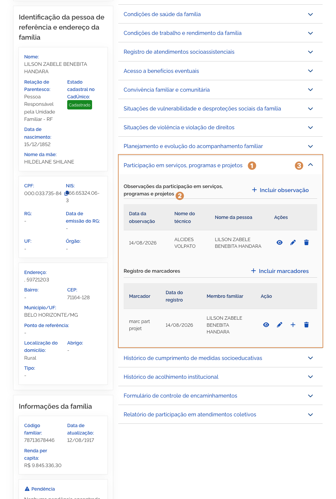

# Participação em serviços, programas e projetos

Ao acionar o bloco <kbd>1</kbd> **Participação em serviços, programas e projetos**, para expandir as informações, você pode consultar observações de participação dos membros da família em serviços, programas e projetos.

---

## Observações do planejamento e evolução do acompanhamento familiar

Para mais informações sobre o <kbd>7</kbd> **registro de observações**, consulte a página 19 deste manual.

> **Observação:** As <kbd>7</kbd> **Observações Planejamento e evolução do acompanhamento familiar** estão disponíveis apenas para a equipe técnica de nível superior.

Para **retrair ou reexibir** as informações contidas no bloco, acione o <kbd>8</kbd> **ícone**.
