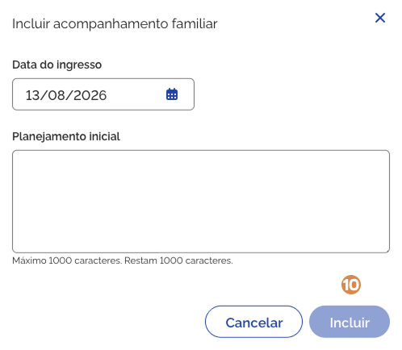
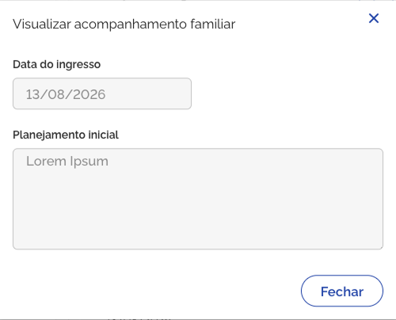
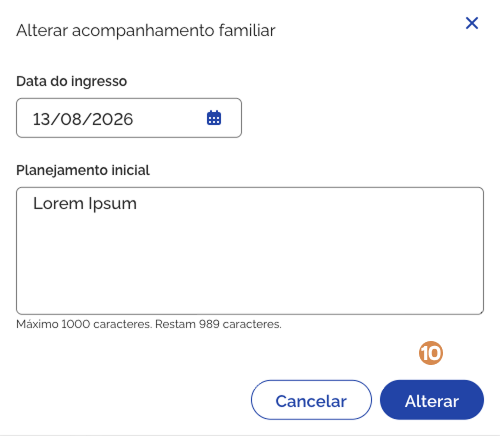

# Planejamento e evolução do acompanhamento familiar

No bloco <kbd>1</kbd> **Planejamento e evolução do acompanhamento familiar**, ao expandir as informações, você pode consultar os registros de acompanhamento da família.

.png>)

## Inserção e desligamento da família no acompanhamento familiar

A lista <kbd>2</kbd> **Inserção e desligamento da família no acompanhamento familiar**, apresenta as seguintes informações:

* **Data do ingresso** – indica a data em que a composição familiar foi incluída no acompanhamento.
* **Nome** – indica o nome dos membros da composição familiar que estão em acompanhamento.
* **Data do desligamento** – indica a data em que a família foi desvinculada do acompanhamento.
* **Razão do desligamento** – indica o motivo pelo qual a família foi desvinculada do acompanhamento.

***

## Incluir acompanhamento

Para **adicionar a família ao acompanhamento**, acione a opção <kbd>3</kbd> **Incluir acompanhamento**. Então, o sistema vai apresentar a janela para cadastro. Preencha os dados solicitados e acione a opção <kbd>9</kbd> **Incluir**. Em seguida, o sistema salva o registro, fecha a janela, atualiza a lista e apresenta a mensagem _"Acompanhamento familiar incluído com sucesso"_.

***

A janela <kbd>3</kbd> **Incluir acompanhamento familiar**, apresenta os seguintes campos e opções:

* **Data do ingresso** – indica a data em que a composição familiar foi incluída no acompanhamento.
* **Planejamento inicial** – registra como o técnico pretende organizar e acompanhar as ações planejadas para o atendimento da família, definindo os passos e estratégias que orientarão o acompanhamento.
* **Data do desligamento** – indica a data em que a família foi desvinculada do acompanhamento.
* **Razão do desligamento** – indica o motivo pelo qual a família foi desvinculada do acompanhamento.\
  Valores possíveis:
  * Avaliação técnica;
  * Evasão ou recusa da família;
  * Mudança de Município;
  * Outros.
* **Cancelar** – opção que, ao ser acionada, cancela a ação e fecha a janela.
* **Incluir** – opção que, ao ser acionada, salva o registro e atualiza a lista.

***

## Visualizar acompanhamento

Para **visualizar** o registro de acompanhamento da família, acione a opção <kbd>4</kbd> **Visualizar acompanhamento**, então o sistema vai apresentar a janela com as informações:

A janela <kbd>4</kbd> **Visualizar acompanhamento familiar**, apresenta os seguintes campos:

* **Data do ingresso** – indica a data em que a composição familiar foi incluída no acompanhamento.
* **Planejamento inicial** – registra como o técnico pretende organizar e acompanhar as ações planejadas para o atendimento da família, definindo os passos e estratégias que orientarão o acompanhamento.
* **Data do desligamento** – indica a data em que a família foi desvinculada do acompanhamento.
* **Razão do desligamento** – indica o motivo pelo qual a família foi desvinculada do acompanhamento.
* **Fechar** – opção que, ao ser acionada, fecha a janela.

## Editar acompanhamento

Para **editar** o registro de acompanhamento da lista, acione a opção <kbd>5</kbd> **Alterar acompanhamento**, então o sistema vai apresentar a janela com as informações registradas anteriormente, permitindo a edição dos dados necessários.

Informe os ajustes e acione a opção <kbd>9</kbd> **Alterar**, em seguida o sistema salva a alteração do registro, fecha a janela, atualiza a lista e apresenta a mensagem _"Acompanhamento familiar alterado com sucesso"_.

A janela <kbd>5</kbd> **Alterar acompanhamento familiar**, apresenta os seguintes campos e opções:

* **Data do ingresso** – indica a data em que a composição familiar foi incluída no acompanhamento.
* **Planejamento inicial** – registra como o técnico pretende organizar e acompanhar as ações planejadas para o atendimento da família.
* **Data do desligamento** – indica a data em que a família foi desvinculada do acompanhamento.
* **Razão do desligamento** – indica o motivo pelo qual a família foi desvinculada do acompanhamento.
  * Valores possíveis:
    * Avaliação técnica;
    * Evasão ou recusa da família;
    * Mudança de Município;
    * Outros.
* **Cancelar** – opção que, ao ser acionada, cancela a ação e fecha a janela.
* **Atualizar** – opção que, ao ser acionada, salva a alteração realizada e atualiza a lista.

## Excluir acompanhamento

Para **excluir o registro** de acompanhamento familiar da lista, acione a opção <kbd>6</kbd> **Excluir acompanhamento**. O sistema solicitará a confirmação da ação e, caso confirmada, o sistema exclui o registro, atualiza a lista e apresenta a mensagem _"Acompanhamento familiar excluído com sucesso"_.

***

## Observações do planejamento e evolução do acompanhamento familiar

Para mais informações sobre o <kbd>7</kbd> **registro de observações**, consulte a página 19 deste manual.

> **Observação:** As <kbd>7</kbd> **Observações Planejamento e evolução do acompanhamento familiar** estão disponíveis apenas para a equipe técnica de nível superior.

Para **retrair ou reexibir** as informações contidas no bloco, acione o <kbd>8</kbd> **ícone**.
