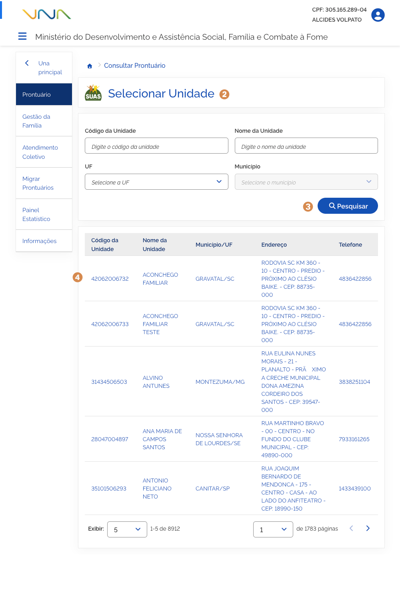
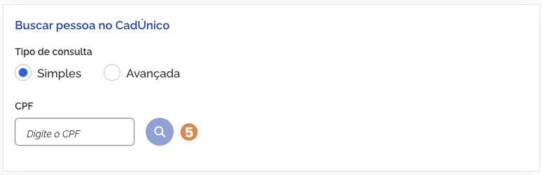
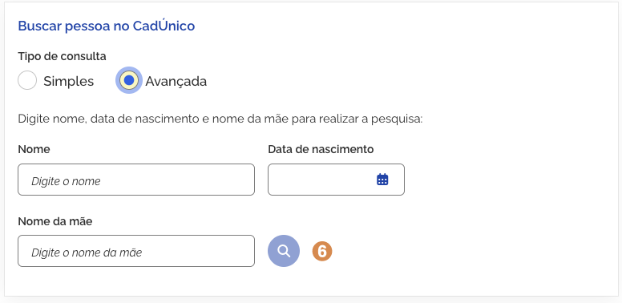

# Realizar atendimento

Para visualizar ou realizar o atendimento de uma pessoa e/ou família, acione o menu <kbd>1</kbd> **Prontuário**. O sistema apresentará a funcionalidade <kbd>2</kbd> **Selecionar unidade**, listando todas as unidades atribuídas ao usuário conforme perfil no CADSUAS.

O refinamento da lista de resultados de unidades pode ser feito informando os parâmetros e acionando a opção <kbd>3</kbd> **Pesquisar**.

Para selecionar a unidade responsável pelo atendimento da pessoa, acione o <kbd>4</kbd> **registro na lista**. O sistema apresenta a funcionalidade para busca do Cadastro Único da pessoa atendida.

---

## Consulta Simples

Para consultar o Cadastro Único da pessoa atendida na consulta simples, informe o CPF e acione a opção <kbd>5</kbd> **Pesquisar**.

---

## Consulta Avançada

Caso não possua o CPF do usuário, acione a opção <kbd>6</kbd> **Consulta avançada**.

Informe um ou mais parâmetros de busca (como Nome, Data de Nascimento, Nome da Mãe, NIS, etc.) e acione a opção <kbd>7</kbd> **Pesquisar**.

---

## Resultado da Busca

O sistema exibirá a lista com os registros encontrados conforme os parâmetros informados.

Para selecionar a pessoa e abrir o prontuário eletrônico para atendimento, acione a opção <kbd>8</kbd> **Visualizar Prontuário**.
