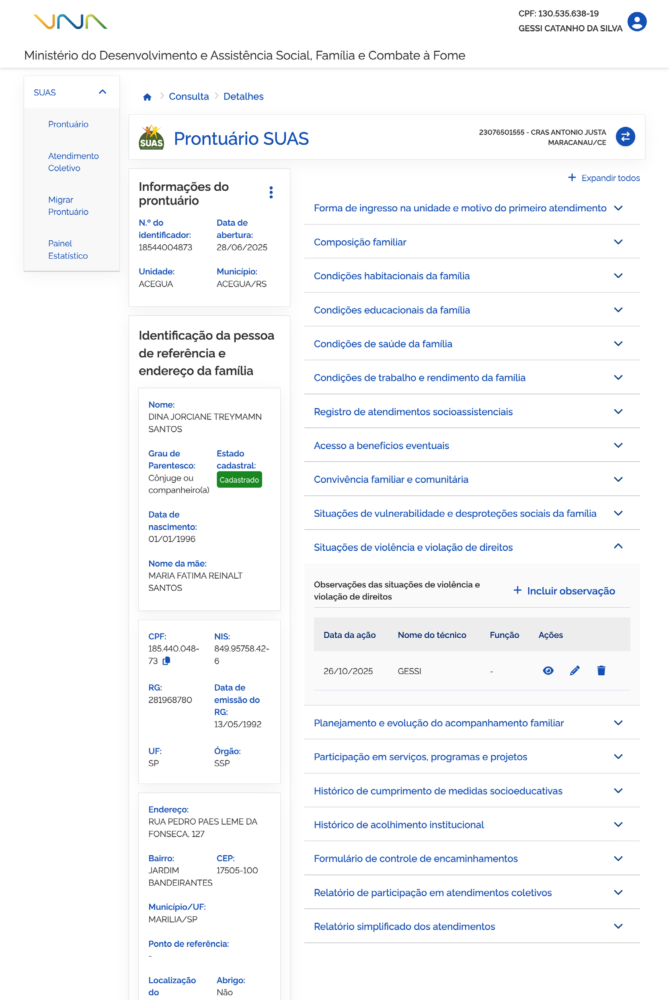

# Situações de violência e violação de direitos

No bloco ➊ **Situação de violência e violação de direitos**, ao acionar para expandir as informações, você pode consultar observações de situação de violência e violação de direitos ocorridas com a família ou membro da composição familiar.

A ➋ **lista de observações de situações de violência e violação de direitos** é composta por:

- **Data do registro**: a coluna informa a data do registro da observação;
- **Nome**: a coluna informa o membro da composição familiar ao qual a observação se destina;
- **Função**: apresenta a função do técnico responsável;
- **Ações**: coluna que exibe ícones para realizar ações, como por exemplo: Visualizar registro.

---

## Incluir observação

Para adicionar observação sobre situação de violência e violação de direitos, acione a opção ➌ **Incluir observação**, então o sistema vai apresentar a janela para cadastro.

Preencha os dados solicitados e acione a opção ➏ **Incluir**, em seguida o sistema fecha a janela, atualiza a lista de observações e apresenta a mensagem *"Observação incluída com sucesso"*.

A janela ➌ **Incluir observação das situações de violência e violação de direitos** contém os seguintes dados:

- **Data da ação**: campo para informar a data em que o atendimento foi realizado;
- **Pessoa(s)**: campo para informar o(s) nome(s) da(s) pessoa(s) atendida(s);
- **Observação**: campo para registrar informações adicionais;
- **Cancelar**: opção que ao ser acionada cancela a ação e fecha a janela;
- **Incluir**: opção que, ao ser acionada, salva o registro.

---

## Visualizar observação

Para visualizar o registro de observação, acione a opção ➍ **Visualizar observação**, então o sistema vai apresentar a janela com as informações.

A janela ➍ **Visualizar observação das situações de violência e violação de direitos** contém os seguintes dados:

- **Data da ação**: campo para informar a data em que o atendimento foi realizado;
- **Pessoa(s)**: campo para informar o(s) nome(s) da(s) pessoa(s) atendida(s);
- **Observação**: campo para registrar informações adicionais;
- **Fechar**: opção que, ao ser acionada, fecha a janela.

---

## Alterar observação

Para editar o registro de observação das situações de violência e violação de direitos, acione a opção ➎ **Alterar observação**, então o sistema vai apresentar a janela com as informações registradas anteriormente, permitindo a edição dos dados necessários.

Informe os ajustes e acione a opção ➑ **Alterar**, em seguida o sistema fecha a janela, atualiza a lista e apresenta a mensagem *"Observação alterada com sucesso"*.

A janela ➎ **Alterar observação das situações de violência e violação de direitos** apresenta os seguintes campos e opções:

- **Data da ação**: indica a data em que a observação foi registrada ou atualizada;
- **Pessoa(s)**: indica o(s) nome(s) da(s) pessoa(s) registrada(s) na observação;
- **Observação**: exibe o texto referente à situação de violência e violação de direitos, permitindo a edição das informações;
- **Cancelar**: opção que ao ser acionada cancela a ação e fecha a janela;
- **Alterar**: opção que, ao ser acionada, salva a alteração realizada.

---

## Excluir observação

Para excluir o registro de observação da lista, acione a opção ➏ **Excluir observação**, e o sistema solicitará a confirmação da ação. Caso confirmada, o sistema atualiza a lista e apresenta a mensagem *"Observação excluída com sucesso."*.

Para **retrair e reexibir** as informações contidas no bloco, acione o ➐ **ícone**.
