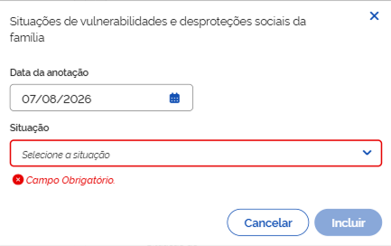
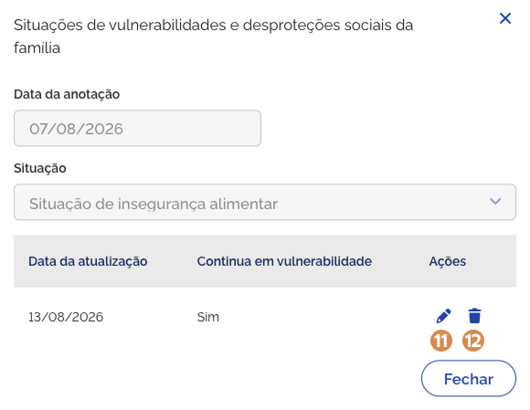
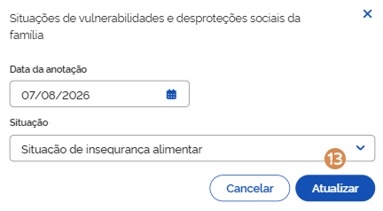

# Situações de vulnerabilidades e desproteções sociais da família

No bloco <kbd>1</kbd> **Situações de vulnerabilidades e desproteções sociais da família**, ao expandir as informações, você pode **consultar os indicadores** de vulnerabilidade social identificados para a família.

Os indicadores podem ser gerados automaticamente pelo sistema, com base em informações já registradas ou adicionados manualmente pelo técnico, conforme a escuta e análise técnica realizadas durante o atendimento.

.png>)

## Indicadores automáticos

Os <kbd>2</kbd> **indicadores automáticos** mostram, de forma rápida, algumas condições que podem representar situações de vulnerabilidade social:

* **Família com pessoas com deficiência** – informa se existe membro da composição familiar com deficiência. As alternativas são:
  * Sim
  * Não
* **Família com pessoa idosa** – informa se existe membro da composição familiar com idade igual ou maior que 60 anos. As alternativas são:
  * Sim
  * Não

***

## Situações de vulnerabilidade e desproteção social da família

A lista <kbd>3</kbd> **Situações de vulnerabilidade e desproteção social da família** apresenta os registros inseridos manualmente pelo técnico responsável, com base na escuta e na análise da realidade familiar. Cada registro contém as seguintes informações:

* **Data da anotação** – mostra a data em que a vulnerabilidade foi registrada ou atualizada.
* **Vulnerabilidade** – indica o tipo de vulnerabilidade identificada para a família.
* **Nome do técnico** – exibe o nome do profissional responsável pelo atendimento e pelo registro das informações.
* **Continua na vulnerabilidade** – informa se a família permanece na situação de vulnerabilidade identificada.

***

## Incluir vulnerabilidade

Para **adicionar uma nova vulnerabilidade**, acione a opção <kbd>4</kbd> **Incluir vulnerabilidade**, então o sistema vai apresentar a janela para cadastro. Preencha os dados solicitados e acione a opção <kbd>11</kbd> **Incluir**, em seguida o sistema salva o registro, fecha a janela, atualiza a lista e apresenta a mensagem _"Situação de vulnerabilidade incluída com sucesso"_.

A janela <kbd>4</kbd> **Situações de vulnerabilidades e desproteções sociais da família**, apresenta os seguintes campos e opções:

* **Data da anotação** – indica a data em que o atendimento foi realizado.
* **Situação** – indica a vulnerabilidade e desproteção social verificada. Valores possíveis:
  * Situação de insegurança alimentar;
  * Situação de vulnerabilidades ou desproteções relacionais;
  * Família com gestante ou criança na primeira infância.
* **Cancelar** – opção que, ao ser acionada, cancela a ação e fecha a janela.
* **Incluir** – opção que, ao ser acionada, salva o registro e atualiza a lista de observações.

***

## Visualizar registro

Para **visualizar o registro de vulnerabilidade**, acione a opção <kbd>5</kbd> **Visualizar vulnerabilidade**, então o sistema vai apresentar a janela com as informações:

A janela <kbd>5</kbd> **Situações de vulnerabilidades e desproteções sociais da família**, representada acima, apresenta os seguintes campos e opções:

* **Data da anotação** – indica a data em que o atendimento foi realizado.
* **Situação** – indica a vulnerabilidade e desproteção social verificada.
* **Data da atualização** – indica a data em que o registro de vulnerabilidade foi editado.
* **Continua em vulnerabilidade** – indica se a família permanece em situação de vulnerabilidade e desproteção social.
* **Fechar** – opção que, ao ser acionada, fecha a janela.

***

## Editar registro de vulnerabilidade

Para **editar o registro de atualização da lista na janela**, acione a opção <kbd>6</kbd> **Alterar**, então o sistema vai apresentar a janela com as informações registradas anteriormente, permitindo a adição dos dados necessários.

Informe os ajustes e acione a opção <kbd>13</kbd> **Alterar**, em seguida o sistema salva a alteração do registro, atualiza a lista e apresenta a mensagem _"Atualização incluída com sucesso"_.

A janela <kbd>7</kbd> **Situações de vulnerabilidades e desproteções sociais da família**, apresenta os seguintes campos e opções:

* **Data da anotação** – indica a data em que o atendimento foi realizado.
* **Situação** – indica a vulnerabilidade e desproteção social verificada, sem possibilidade de edição.
* **Data da atualização** – campo para inclusão da data em que o registro foi atualizado.
* **Continua em vulnerabilidade** – campo para indicar se a família permanece em situação de vulnerabilidade e desproteção social.
* **Cancelar** – opção que, ao ser acionada, cancela a ação e fecha a janela.
* **Atualizar** – opção que, ao ser acionada, salva a alteração realizada e atualiza a lista.

***

## Excluir registro

Para **excluir o registro** de vulnerabilidade da lista, acione a opção <kbd>8</kbd> **Excluir vulnerabilidade**, e o sistema solicitará a confirmação da ação. Caso confirmada, o sistema atualiza a lista e apresenta a mensagem _"Atualização excluída com sucesso"_.

## Observações das situações de vulnerabilidades e desproteções sociais da família

Para mais informações sobre o <kbd>9</kbd> **registro de observações**, consulte [aspectos-globais.md](aspectos-globais.md).

Para **retrair ou reexibir** as informações contidas no bloco, acione o <kbd>10</kbd> **ícone**.
