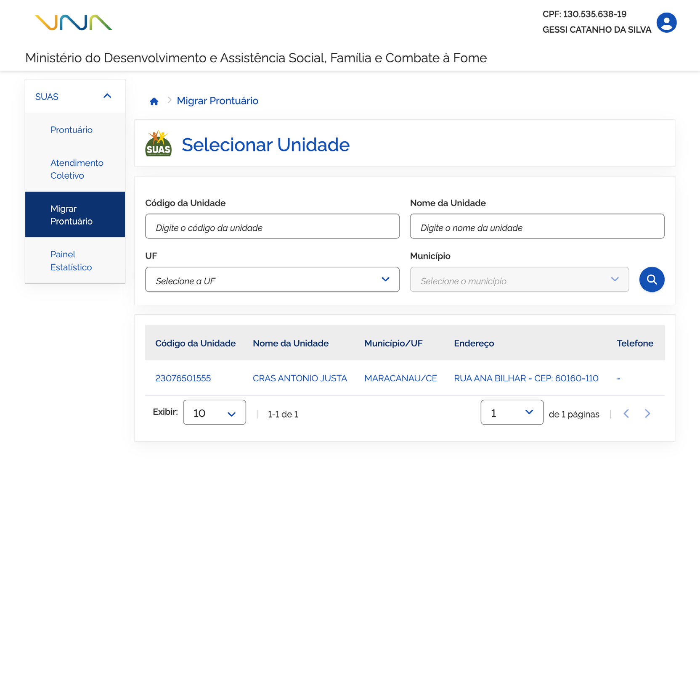

# Prontuário: Migrar Prontuário

O módulo **Migrar Prontuário** permite realizar a gestão e aprovação das solicitações de migração de prontuários eletrônicos de pessoas e famílias entre unidades de atendimento.

## Funcionalidades do Módulo

- **[Informações do Prontuário](informacoes-do-prontuario.md)**: Consulta das unidades de atendimento e dados do prontuário para análise.
- **[Identificação da pessoa de referência e endereço da família](identificacao-da-pessoa-de-referencia-e-endereco.md)**: Detalhamento dos dados da pessoa de referência, composição familiar e endereço.
- **[Campos de preenchimento](campos-de-preenchimento.md)**: Procedimentos para aprovação individual ou coletiva (Aprovar todos) e inclusão de pareceres sobre a migração.
