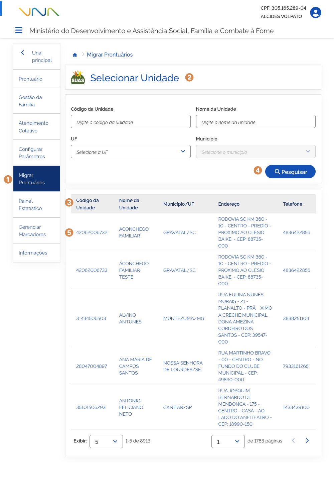
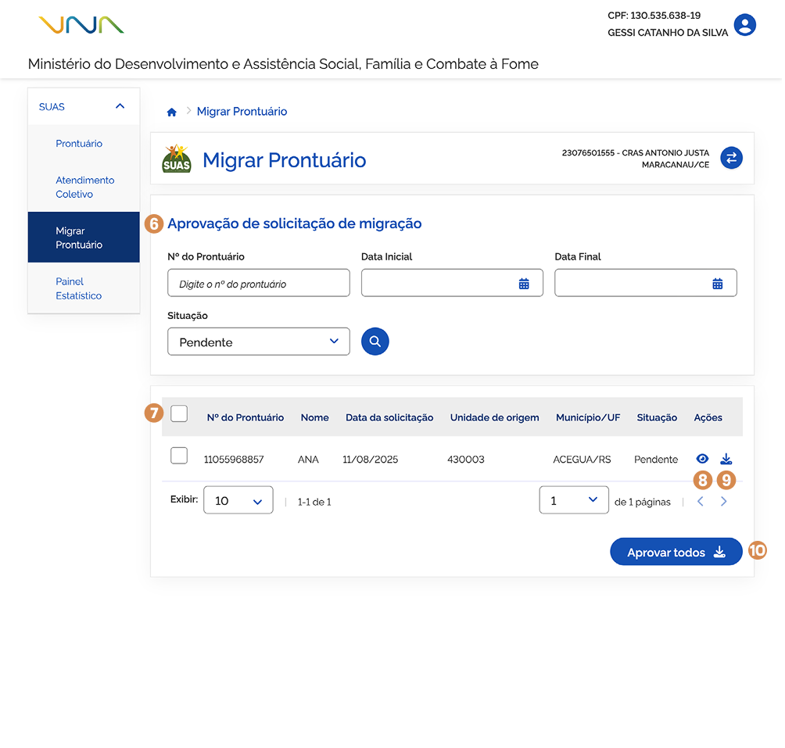
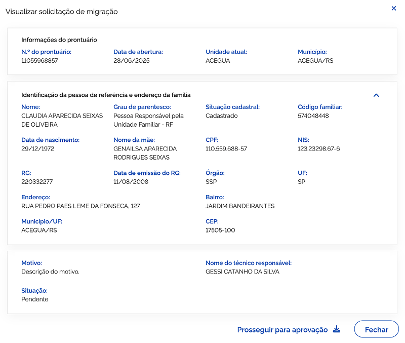
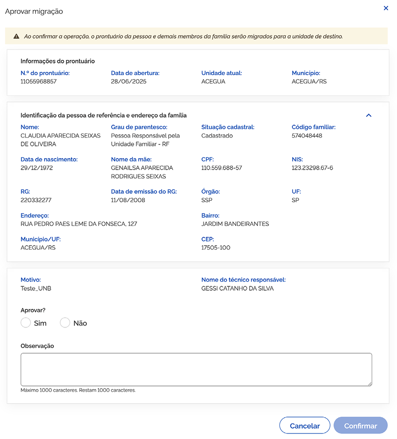
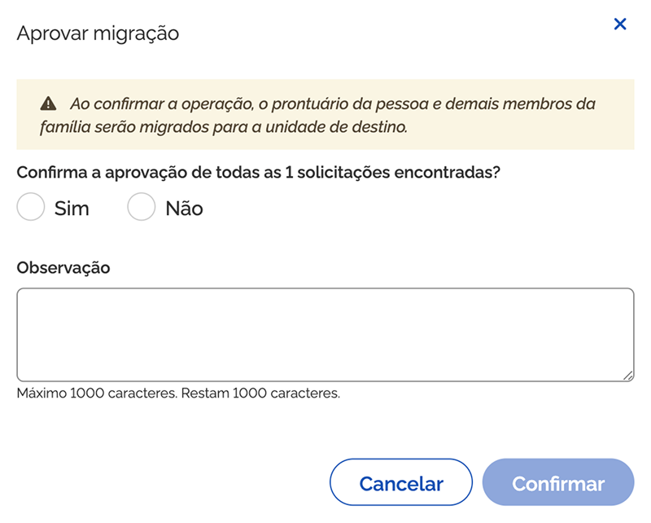

# Prontuário: Migrar Prontuário

Para visualizar a situação da solicitação de migração de Prontuário feito para a Unidade ou realizar a análise de solicitações feitas por outras Unidades, acione o menu ➊ **Migrar Prontuário**.

O sistema apresentará a funcionalidade ➋ **Selecionar unidade**, listando todas as unidades atribuídas ao usuário conforme perfil (CadSUAS).

A ➌ **lista de unidades de atendimento** é composta por:

* **Código da Unidade** – coluna que apresenta o código da unidade de atendimento;
* **Nome da Unidade** – coluna que informa o nome da unidade de atendimento;
* **Município/UF** – coluna que informa o município e UF de localização da unidade de atendimento;
* **Endereço** – coluna que informa o endereço da unidade de atendimento;
* **Telefone** – coluna que informa o telefone da unidade de atendimento.

O refinamento da lista de resultado de unidades pode ser feito informando os parâmetros e acionando a opção ➍ **Pesquisar**.

Para visualizar solicitações realizadas ou analisar solicitações recebidas, ➎ **acione o registro na lista**.

---

## Aprovação de pedido de migração

O sistema apresentará a funcionalidade ➏ **Aprovação de pedido de migração** com a lista de prontuários aguardando análise.

A ➐ **lista de solicitação de migração de prontuário eletrônico** é composta por:

* **N.º do prontuário** – coluna que informa o número do prontuário eletrônico da pessoa;
* **Nome** – coluna que informa o nome da pessoa vinculada ao prontuário eletrônico;
* **Data da solicitação** – coluna que informa a data da solicitação da migração do prontuário eletrônico;
* **Unidade de origem** – coluna que informa o código da unidade de origem do prontuário eletrônico;
* **Município/UF** – coluna que informa o município e UF da unidade de origem do prontuário eletrônico;
* **Situação** – coluna que informa a situação da solicitação da migração do prontuário eletrônico;
* **Ações** – coluna que apresenta as opções:
  * ➑ **Visualizar**;
  * ➒ **Aprovar migração**.

---

## Visualizar solicitação de migração

Para visualizar solicitação de migração, acione a opção ➑ **Visualizar** na coluna ações, então o sistema vai apresentar a janela com as informações.

A janela ➑ **Visualizar solicitação de migração de prontuário eletrônico** é composta por:

### Informações do prontuário

* **N.º do prontuário** – campo que informa o número do prontuário da pessoa;
* **Data de abertura** – campo que informa a data da abertura do prontuário da pessoa;
* **Unidade atual** – campo que informa o nome da unidade de atendimento atual;
* **Município** – campo que informa o município e estado da unidade de atendimento atual.

### Identificação da pessoa de referência e endereço da família

* **Nome** – campo que informa o nome da pessoa;
* **CPF** – campo que informa o número do CPF da pessoa;
* **Grau de parentesco** – campo que informa o grau de parentesco da pessoa em relação ao responsável familiar;
* **Situação cadastral** – campo que informa o código da família;
* **Código familiar** – campo que informa o código da família;
* **Data de nascimento** – campo que informa a data de nascimento da pessoa;
* **Nome da mãe** – campo que informa no nome da mãe da pessoa;
* **NIS** – campo que informa o número de identificação social – NIS da pessoa;
* **RG** – campo que informa o número do registro geral - RG (também conhecido como carteira de identidade) da pessoa;
* **Data de emissão do RG** – campo que informa a data de emissão do registro geral;
* **Órgão** – campo que informa o órgão expedidor do registro geral;
* **UF** – campo que informa o estado do órgão expedidor;
* **Endereço** – campo que informa o endereço da residência da pessoa/família;
* **Bairro** – campo que informa o bairro da residência da pessoa/família;
* **Município/UF** – campo que informa o município/UF da residência da pessoa/família;
* **CEP** – campo que informa o número do CEP da residência da pessoa/família;
* **Motivo** – campo para informar o motivo da solicitação de migração do prontuário da pessoa/família;
* **Nome do técnico responsável** – campo que informa o nome do técnico responsável pela migração;
* **Situação** – campo que informa a situação da solicitação de migração do prontuário;
* **Prosseguir para aprovação** – opção que, ao ser acionada, apresenta a janela ➒ **Aprovar migração**;
* **Fechar** – opção que, ao ser acionada, fecha a janela.

---

## Aprovar migração

Para aprovar a migração, acione a opção ➒ **Prosseguir para aprovação** na janela ➑ **Visualizar solicitação de migração** ou na coluna ações.

A janela ➒ **Aprovar migração** de prontuário eletrônico é composta por:

* **Texto informativo** – _"Ao confirmar a operação, o prontuário da pessoa e demais membros da família serão migrados para unidade de destino."_

### Informações do Prontuário

* **N.º do prontuário** – campo que informa o número do prontuário da pessoa;
* **Data de abertura** – campo que informa a data da abertura do prontuário da pessoa;
* **Unidade atual** – campo que informa o nome da unidade de atendimento atual;
* **Município** – campo que informa o município e estado da unidade de atendimento atual.

### Identificação da pessoa de referência e endereço da família

* **Nome** – campo que informa o nome da pessoa;
* **CPF** – campo que informa o número do CPF da pessoa;
* **Grau de parentesco** – campo que informa o grau de parentesco da pessoa em relação ao responsável familiar;
* **Situação cadastral** – campo que informa o código da família;
* **Código familiar** – campo que informa o código da família;
* **Data de nascimento** – campo que informa a data de nascimento da pessoa;
* **Nome da mãe** – campo que informa no nome da mãe da pessoa;
* **NIS** – campo que informa o número de identificação social – NIS da pessoa;
* **RG** – campo que informa o número do registro geral - RG (também conhecido como carteira de identidade) da pessoa;
* **Data de emissão do RG** – campo que informa a data de emissão do registro geral;
* **Órgão** – campo que informa o órgão expedidor do registro geral;
* **UF** – campo que informa o estado do órgão expedidor;
* **Endereço** – campo que informa o endereço da residência da pessoa/família;
* **Bairro** – campo que informa o bairro da residência da pessoa/família;
* **Município/UF** – campo que informa o município/UF da residência da pessoa/família;
* **CEP** – campo que informa o número do CEP da residência da pessoa/família;
* **Motivo** – campo que informa o motivo da migração do prontuário da pessoa/família;
* **Nome do técnico responsável** – campo que informa o nome do técnico responsável;
* **Aprovar (Sim/Não)** – campo para informar o resultado da avaliação da solicitação de migração do prontuário;
* **Observação** – campo para informar observações referentes a aprovação ou rejeição da solicitação de migração do prontuário;
* **Cancelar** – opção que, ao ser acionada, cancela a ação e fecha a janela;
* **Confirmar** – opção que, ao ser acionada, salva o resultado da análise da solicitação de migração do prontuário.

---

## Aprovar todos

Para aprovar todas as solicitações de migração pendentes, acione a opção ➓ **Aprovar todos**. O sistema apresentará a janela.

A janela **Aprovar migração de prontuário eletrônico** é composta por:

* **Texto informativo** – _"Ao confirmar a operação, o prontuário da pessoa e demais membros da família serão migrados para a unidade de destino."_
* **Confirma a aprovação de todas as (quantidade de pessoas) encontradas?** – campo que confirma a aprovação dos registros em situação pendente;
* **Observação** – campo aberto para adição de observação;
* **Cancelar** – opção que, ao ser acionada, cancela a ação e fecha a janela;
* **Confirmar** – opção que, ao ser acionada, salva a solicitação de aprovação selecionada.
