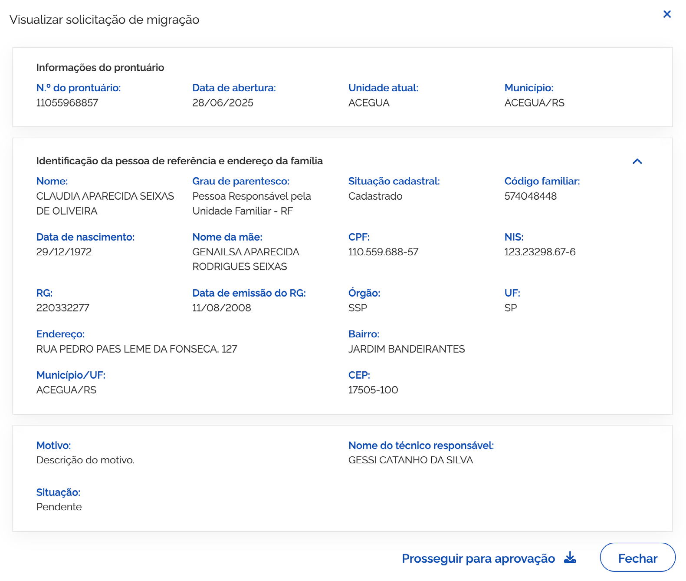

# Prontuário: Migrar Prontuário

O módulo **Migrar Prontuário** permite realizar a gestão e aprovação das solicitações de migração de prontuários eletrônicos de pessoas e famílias entre unidades de atendimento.

***

## Selecionar unidade

Para visualizar a situação da solicitação de migração de Prontuário feita para a Unidade ou realizar a análise de solicitações feitas por outras Unidades, acione o menu ➊ **Migrar Prontuário**. O sistema apresentará a funcionalidade **Selecionar unidade**, listando as unidades atribuídas ao usuário conforme perfil no CadSUAS.

A ➌ **lista de unidades de atendimento** é composta por:

* **Código da Unidade**: coluna que apresenta o código da unidade de atendimento;
* **Nome da Unidade**: coluna que informa o nome da unidade de atendimento;
* **Município/UF**: coluna que informa o município e UF de localização da unidade de atendimento;
* **Endereço**: coluna que informa o endereço da unidade de atendimento;
* **Bairro**: coluna que informa o bairro da unidade de atendimento.

***

## Aprovação de pedido de migração

Ao selecionar a unidade, o sistema apresentará a funcionalidade ➏ **Aprovação de pedido de migração** com a lista de prontuários aguardando análise.

### Visualizar solicitação de migração

A janela ➑ **Visualizar solicitação de migração de prontuário eletrônico** é composta por:

#### Informações do prontuário

* **Código do Prontuário**: campo que informa o número de identificação do prontuário;
* **Data de abertura**: campo que informa a data da abertura do prontuário da pessoa;
* **Unidade atual**: campo que informa o nome da unidade de atendimento onde o prontuário está localizado;
* **Unidade solicitante**: campo que informa o nome da unidade que solicitou a migração.

#### Identificação da pessoa de referência e endereço da família

* **CPF**: campo que informa o número do Cadastro de Pessoa Física da pessoa de referência;
* **NIS**: campo que informa o Número de Identificação Social da pessoa de referência;
* **Nome completo**: campo que apresenta o nome completo da pessoa de referência;
* **Data de nascimento**: campo que informa a data de nascimento da pessoa de referência;
* **Nome da mãe**: campo que apresenta o nome completo da mãe da pessoa de referência;
* **CEP**: campo que informa o Código de Endereçamento Postal da residência;
* **UF**: campo que informa o estado (Unidade da Federação) onde a família reside;
* **Município**: campo que informa o município da residência;
* **Tipo de logradouro**: campo que informa o tipo de logradouro (Rua, Avenida, Alameda, etc.);
* **Logradouro**: campo que informa o nome do logradouro;
* **Número**: campo que informa o número da residência;
* **Complemento**: campo para informações adicionais do endereço;
* **Bairro**: campo que informa o bairro da residência da pessoa/família.

***

## Aprovar migração

Para aprovar a migração, acione a opção ➒ **Prosseguir para aprovação** na janela ➑ **Visualizar solicitação de migração** ou na coluna ações.

A janela ➒ **Aprovar migração** é composta por:

* **Texto informativo**: _"Ao confirmar a operação, o prontuário da pessoa/família será migrado para a unidade solicitante"_;
* **Aprovar**: opção que ao ser acionada confirma a migração e transfere o prontuário;
* **Rejeitar**: opção que ao ser acionada rejeita o pedido de migração;
* **Cancelar**: opção que ao ser acionada cancela a ação e fecha a janela.

***

## Aprovar todos

Para aprovar todas as solicitações de migração pendentes de uma só vez, acione a opção **Aprovar todos**. O sistema apresentará janela de confirmação para validar a operação em lote.
