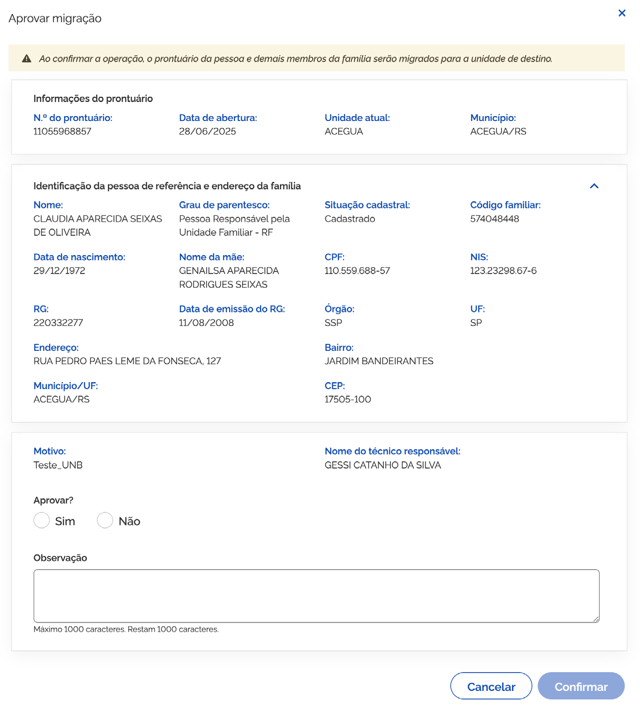
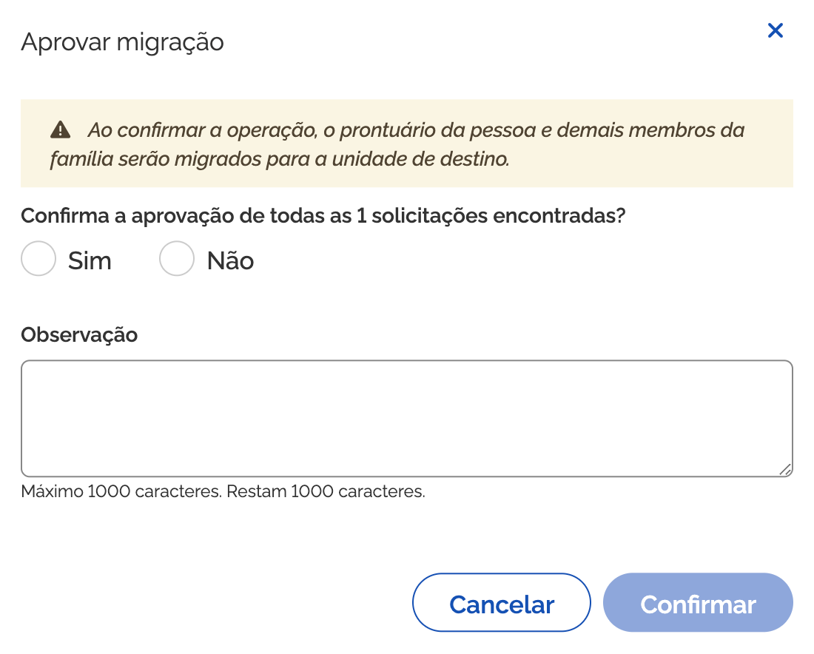

# Campos de preenchimento

## Aprovar migração

Para aprovar a migração, acione a opção ➒ **Prosseguir para aprovação** na janela **Visualizar solicitação de migração** ou na coluna ações da lista.

A janela ➒ **Aprovar migração** é composta pelos seguintes elementos e campos:

- **Texto informativo**: *"Ao confirmar a operação, o prontuário da pessoa e demais membros da família serão migrados para a unidade de destino."*

### Informações do Prontuário
- **Nº do prontuário**: campo que informa o número do prontuário da pessoa;
- **Data de abertura**: campo que informa a data da abertura do prontuário da pessoa;
- **Unidade atual**: campo que informa o nome da unidade de atendimento atual;
- **Município**: campo que informa o município e estado da unidade de atendimento atual;

### Identificação da pessoa de referência e endereço
- **Nome, CPF, Grau de parentesco, Situação cadastral, Código familiar, Data de nascimento, Nome da mãe, NIS, RG, Data de emissão do RG, Órgão, UF, Endereço, Bairro, Município/UF, CEP, Motivo, Nome do técnico responsável**;

### Avaliação da Migração
- **Aprovar (Sim/Não)**: campo para informar o resultado da avaliação da solicitação de migração do prontuário;
- **Observação**: campo para informar observações referentes à aprovação ou rejeição da solicitação de migração do prontuário;
- **Cancelar**: opção que ao ser acionada cancela a ação e fecha a janela;
- **Confirmar**: opção que ao ser acionada salva o resultado da análise da solicitação de migração do prontuário.

---

## Aprovar todos

Para aprovar todas as solicitações de migração pendentes de uma só vez, acione a opção **Aprovar todos**. O sistema apresentará a janela de confirmação em lote.

A janela **Aprovar migração de prontuário eletrônico** contém:

- **Texto informativo**: *"Ao confirmar a operação, o prontuário da pessoa e demais membros da família serão migrados para a unidade de destino."*
- **Confirma a aprovação de todas as (quantidade de pessoas) encontradas?**: campo que confirma a aprovação em lote dos registros em situação pendente;
- **Observação**: campo aberto para adição de parecer ou observação geral;
- **Cancelar**: opção que ao ser acionada cancela a ação e fecha a janela;
- **Confirmar**: opção que ao ser acionada salva a solicitação de aprovação de todos os registros selecionados.
