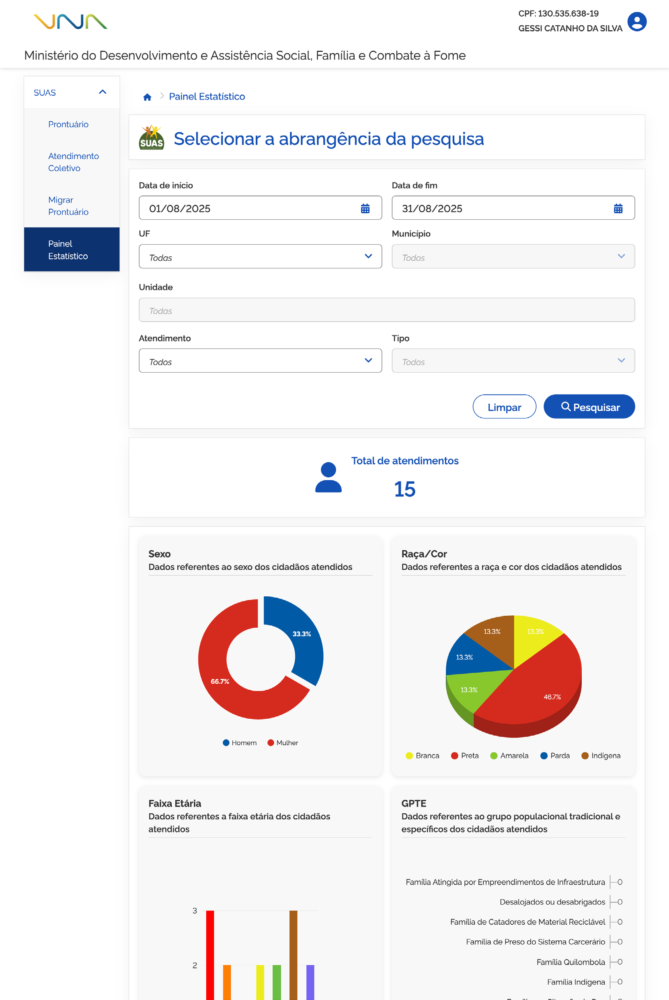
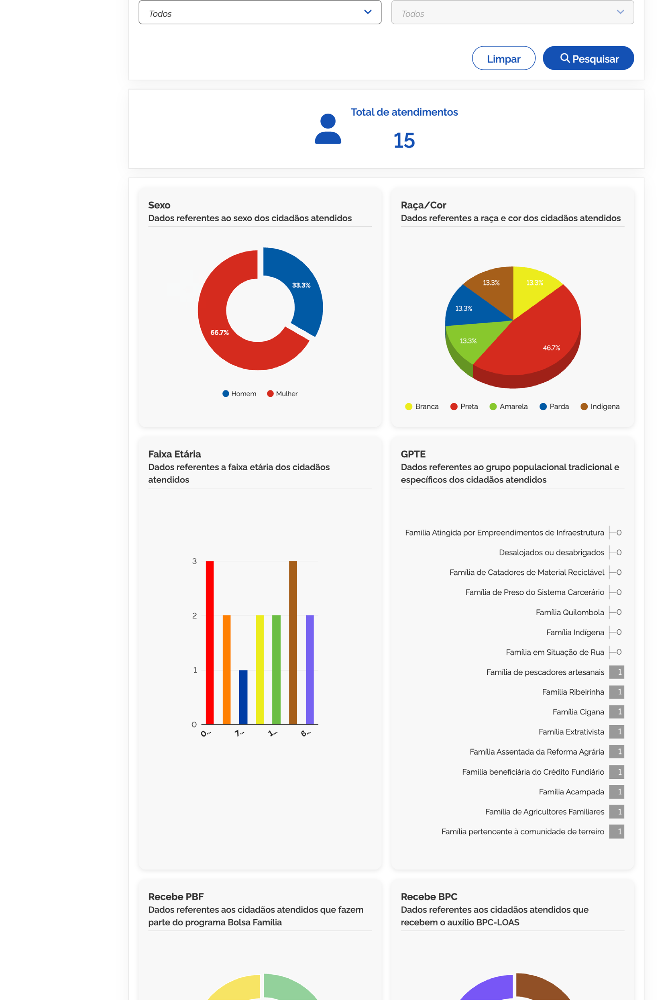
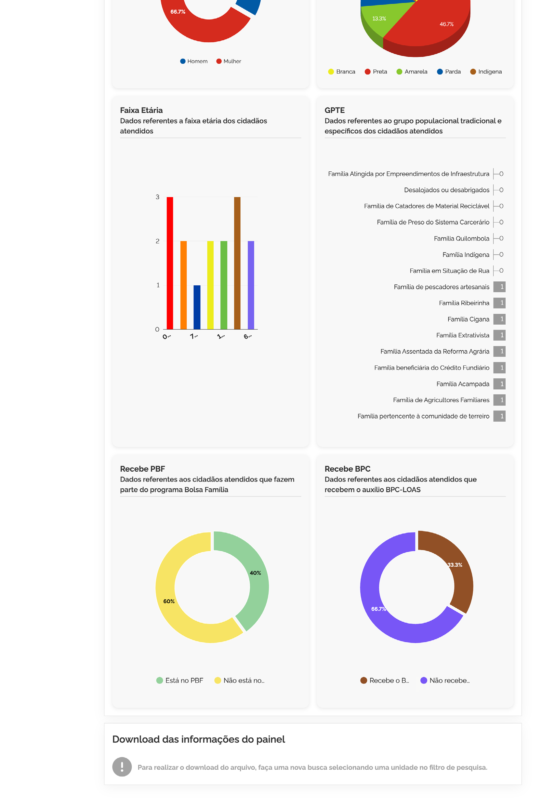

# Prontuário: Painel Estatístico

Para acessar o **Painel Estatístico**, vá até o menu **SUAS** e selecione o submenu ➊ **Painel Estatístico**.

Nessa tela, o sistema exibirá os filtros de pesquisa que permitem definir os parâmetros da consulta e gerar os painéis consolidados de atendimento.

## Selecionar a abrangência da pesquisa

Preencha os campos conforme as informações que deseja visualizar:

- **Data de início**: campo para informar a data de início do período que deseja consultar *(campo obrigatório)*;
- **Data de fim**: campo para informar a data final do período da consulta *(campo obrigatório)*;
- **UF**: campo para informar a Unidade da Federação referente aos dados que deseja visualizar;
- **Município**: campo para informar o município das Unidades que serão consultadas, conforme UF escolhida no campo anterior;
- **Unidade**: campo para informar uma ou mais unidades para compor o painel;
- **Atendimento**: campo para informar o tipo de atendimento a ser consultado. As alternativas são:
  - Todos;
  - Atendimentos Particularizados;
  - Atendimento Coletivo;
  - Benefícios Eventuais;
  - Encaminhamentos;
  - Cumprimento Histórico de Medidas Socioeducativas;
  - Acompanhamento Familiar.
- **Tipo**: coluna para informar o tipo específico de atendimento, conforme escolhido no campo anterior.

### Ações disponíveis

- **Limpar**: opção que, ao ser acionada, limpa as informações preenchidas nos filtros e permanece na mesma tela;
- **Pesquisar**: opção que, ao ser acionada, realiza a busca dos atendimentos realizados no período, de acordo com os parâmetros informados, e exibe o Painel Estatístico correspondente.

Quanto mais específicos forem os filtros aplicados, mais precisos serão os resultados apresentados nos painéis. Uma vez indicados os filtros, acione a opção ➋ **Pesquisar**, e o sistema apresentará o Painel Estatístico referente à pesquisa indicada.

---

## Indicadores e Agrupamentos do Painel

### Total de atendimentos
O ➌ **Total de atendimentos** é o indicador que apresenta a quantidade consolidada de atendimentos realizados nas unidades selecionadas durante o período informado.

### Sexo
O agrupamento ➍ **Sexo** traz dados referentes ao sexo dos cidadãos atendidos, promovendo a classificação por sexo nas unidades selecionadas no período. Categorias:
- Homem;
- Mulher.

### Raça/Cor
O agrupamento ➎ **Raça/Cor** exibe a quantidade de pessoas atendidas, classificadas por raça/cor nas unidades selecionadas dentro do período informado. Categorias:
- Branca;
- Preta;
- Amarela;
- Parda;
- Indígena.

Esse indicador auxilia na análise do perfil étnico-racial do público atendido, contribuindo para o planejamento e a implementação de políticas mais inclusivas e equitativas.

---

### Faixa Etária

O agrupamento ➏ **Faixa Etária** traz dados referentes à faixa etária das pessoas atendidas, organizados por:
- 0 a 6 anos;
- 7 a 12 anos;
- 13 a 15 anos;
- 16 a 17 anos;
- 18 a 59 anos;
- 60 anos ou mais.

Essas informações permitem compreender o perfil etário do público atendido, auxiliando no planejamento e na execução de ações voltadas a cada ciclo de vida.

---

### GPTE (Grupos Populacionais Tradicionais e Específicos)

O agrupamento ➐ **GPTE** exibe a quantidade de pessoas atendidas pertencentes a Grupos Populacionais Tradicionais e Específicos nas unidades selecionadas durante o período informado. Categorias monitoradas:
- Família Atingida por Empreendimentos de Infraestrutura;
- Desalojados ou desabrigados;
- Família de Catadores de Material Reciclável;
- Família Quilombola;
- Família Indígena;
- Família em Situação de Rua;
- Família de Pescadores Artesanais;
- Família Cigana;
- Família Extrativista;
- Família Acampada;
- Família pertencente à comunidade de terreiro;
- Família Ribeirinha;
- Família Assentada da Reforma Agrária;
- Família de Preso do Sistema Carcerário;
- Família beneficiária do Crédito Fundiário;
- Família de Agricultores Familiares.

Esse dado contribui para o monitoramento da inclusão e da diversidade social, fortalecendo a atenção a públicos prioritários nas políticas públicas.

---

### Beneficiários de Programas Sociais (PBF e BPC)

#### Recebe PBF (Programa Bolsa Família)
O agrupamento ➑ **Recebe PBF** indica as pessoas atendidas que são beneficiárias do Programa Bolsa Família:
- Está no PBF;
- Não está no PBF.

#### Recebe BPC (Benefício de Prestação Continuada)
O agrupamento ➒ **Recebe BPC** demonstra as pessoas atendidas que recebem o Benefício de Prestação Continuada:
- Recebe o BPC;
- Não recebe o BPC.

---

## Exportação de Dados (CSV)

Ao selecionar a opção **Baixe as informações do painel**, o sistema realiza o download de um arquivo no formato **CSV** com a totalidade dos dados detalhados apresentados nos indicadores.

Utilize a exportação para análises mais aprofundadas ou para integrar os dados com relatórios e planilhas externas.

