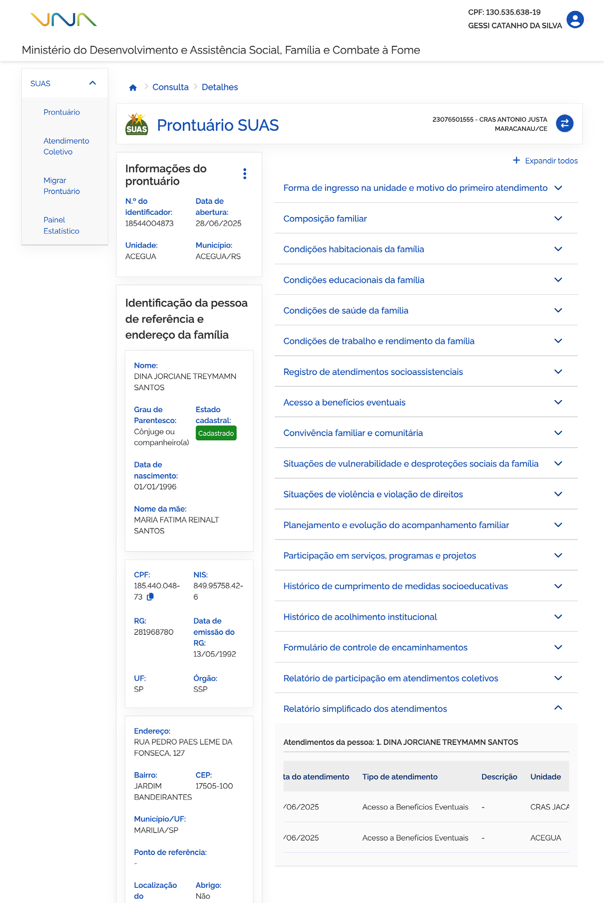

## Relatório simplificado dos atendimentos

Ao acionar o bloco <kbd>1</kbd> **Relatório simplificado dos atendimentos**, para expandir as informações, você pode consultar os atendimentos coletivos ao qual a família participou.

### Atendimentos da pessoa

A <kbd>2</kbd> **lista atendimentos da pessoa** é composta por:

* **Data do atendimento** – coluna que informa a data do atendimento individual ou coletivo em que o membro da composição familiar ou a família participou;
* **Tipo de atendimento** – coluna que informa o tipo de atendimento recebido pelo membro da composição familiar ou pela família;
* **Descrição** – campo que descreve o tipo de atendimento recebido;
* **Unidade** – coluna que informa o nome da unidade em que o atendimento foi realizado;
* **Nome do técnico** – campo que informa o nome do técnico responsável pelo atendimento;
* **Município/ UF** – coluna que informa o município e o estado onde a unidade de atendimento está localizada;

Para **retrair ou reexibir** as informações contidas no bloco, acione o <kbd>3</kbd> **ícone**.

---